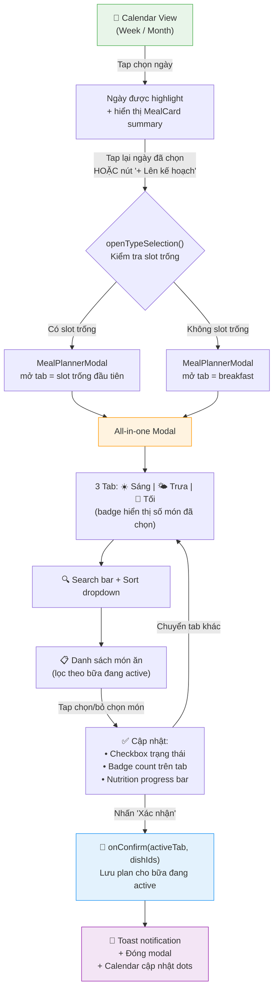
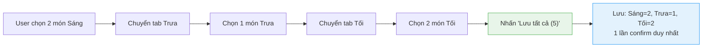
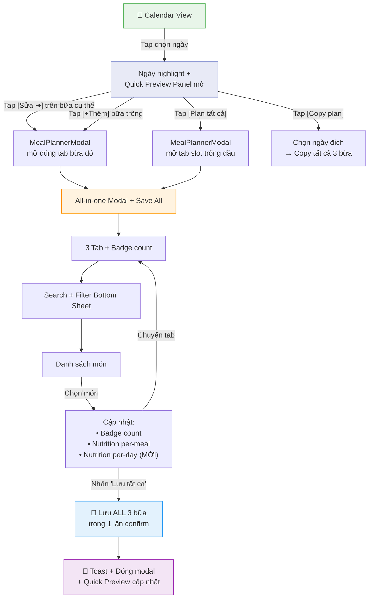

# UX Flow: Lên kế hoạch bữa ăn (Meal Planning)

> **Ngày tạo**: 07/03/2026  
> **Phiên bản**: 1.0  
> **Scope**: Mobile-first, hỗ trợ responsive Desktop

---

## Mục lục

1. [Tổng quan Flow hiện tại](#1-tổng-quan-flow-hiện-tại)
2. [Wireframe UI hiện tại](#2-wireframe-ui-hiện-tại)
3. [Đánh giá chi tiết](#3-đánh-giá-chi-tiết)
4. [Đề xuất cải tiến](#4-đề-xuất-cải-tiến)
5. [Wireframe UI cải tiến](#5-wireframe-ui-cải-tiến)
6. [Kế hoạch triển khai](#6-kế-hoạch-triển-khai)
7. [Phụ lục: File liên quan](#7-phụ-lục-file-liên-quan)

---

## 1. Tổng quan Flow hiện tại

### 1.1. Flow diagram



### 1.2. User Journey (step-by-step)

| Bước | Hành động | Phản hồi UI | Số tap |
|------|-----------|-------------|--------|
| 1 | Mở app, vào tab Calendar | Calendar hiển thị (week/month), ngày hôm nay được highlight | 0 |
| 2 | Tap chọn ngày 10/03 | Ngày 10 highlight xanh, MealCard summary hiển thị 3 bữa bên dưới | 1 |
| 3 | Tap nút "**+ Lên kế hoạch**" | `openTypeSelection()` detect slot trống → mở `MealPlannerModal` đúng tab | 2 |
| 4 | Modal mở, tab "Sáng" đang active | Hiển thị danh sách món sáng, search bar, sort | — |
| 5 | Tap chọn "Phở bò" | Checkbox ✅, badge tab Sáng hiện "1", nutrition bar cập nhật | 3 |
| 6 | Tap chọn "Bánh mì" | Badge hiện "2", nutrition bar cập nhật calo+protein | 4 |
| 7 | Tap "**Xác nhận (2)**" | Lưu plan bữa sáng, toast thông báo, modal đóng | 5 |

**Tổng: 5 taps** để plan 1 bữa (2 món). Plan 3 bữa cần mở modal 3 lần = **~13 taps**.

### 1.3. Cách vào MealPlannerModal (Entry points)

| Entry point | Khu vực | Behavior |
|-------------|---------|----------|
| Tap lại ngày đã chọn | Calendar grid (week/month) | `onPlanClick()` → `openTypeSelection()` |
| Double-click ngày (desktop) | Calendar grid (month view) | Select ngày + `onPlanClick()` |
| Nút "**+ Lên kế hoạch**" | Planning section header | `openTypeSelection()` |
| Nút "**+ Lên kế hoạch**" | Empty state placeholder | `openTypeSelection()` |
| Nhấn "Sửa" trên MealCard | MealCard component | `onPlanMeal(type)` → mở đúng tab |

---

## 2. Wireframe UI hiện tại

### 2.1. Calendar View (Mobile - Week mode)

```
┌─────────────────────────────────────────────┐
│  ☰  Smart Meal Planner                      │
├─────────────────────────────────────────────┤
│                                             │
│  📅 Chọn ngày                   T5, 10/03  │
│                                             │
│  ┌──────────────────────────────────────┐   │
│  │  📅  03/03 - 09/03    ◀  ▶  📆  🏠 │   │
│  │                                      │   │
│  │  T2    T3    T4    T5    T6    T7  CN │   │
│  │ ┌──┐ ┌──┐ ┌──┐ ┌████┐ ┌──┐ ┌──┐┌──┐│   │
│  │ │ 3│ │ 4│ │ 5│ │ 6  │ │ 7│ │ 8││ 9││   │
│  │ │  │ │  │ │  │ │    │ │  │ │  ││  ││   │
│  │ │●●│ │  │ │● │ │    │ │  │ │●●││  ││   │
│  │ └──┘ └──┘ └──┘ └████┘ └──┘ └──┘└──┘│   │
│  │                                      │   │
│  │  ● Sáng  ● Trưa  ● Tối             │   │
│  └──────────────────────────────────────┘   │
│                                             │
│  ══════ Tóm tắt dinh dưỡng ════════════    │
│  ┌──────────────────────────────────────┐   │
│  │  Calories   ████████░░  1200/2000    │   │
│  │  Protein    ██████░░░░    80/120g    │   │
│  └──────────────────────────────────────┘   │
│                                             │
│  ══════ Kế hoạch bữa ăn ═══════════════    │
│  [+ Lên kế hoạch]  [✨ AI]  [🗑️]         │
│                                             │
│  ┌──────────┐ ┌──────────┐ ┌──────────┐   │
│  │ ☀️ Sáng  │ │ 🌤️ Trưa │ │ 🌙 Tối  │   │
│  │          │ │          │ │          │   │
│  │ Phở bò   │ │ Cơm gà  │ │ (Trống) │   │
│  │ Bánh mì  │ │          │ │          │   │
│  │          │ │          │ │          │   │
│  │ [Sửa]   │ │ [Sửa]   │ │ [+Thêm] │   │
│  └──────────┘ └──────────┘ └──────────┘   │
│                                             │
├─────────────────────────────────────────────┤
│  📅     🛒     📦     🤖     ⚙️           │
│ Lịch  Mua sắm  QL   AI     Cài đặt       │
└─────────────────────────────────────────────┘
```

### 2.2. MealPlannerModal (All-in-one)

```
┌─────────────────────────────────────────────┐
│                                             │
│  Lên kế hoạch                          ✕   │
│  Chọn buổi bạn muốn lên kế hoạch           │
│                                             │
│  ┌─────────────────────────────────────┐    │
│  │ [☀️ Sáng 2] [🌤️ Trưa 1] [🌙 Tối●]│    │
│  └─────────────────────────────────────┘    │
│                                             │
│  ┌──────────────────────┐ ┌──────────┐     │
│  │ 🔍 Tìm kiếm món...   │ │ Tên A-Z ▼│     │
│  └──────────────────────┘ └──────────┘     │
│                                             │
│  ┌─────────────────────────────────────┐    │
│  │ ┌───┐                          ┌─┐ │    │
│  │ │ 🍳│ Phở bò             ✅  │✓│ │    │
│  │ │   │ 🔥 350kcal  💪 25g Pro  └─┘ │    │
│  │ └───┘                               │    │
│  ├─────────────────────────────────────┤    │
│  │ ┌───┐                          ┌─┐ │    │
│  │ │ 🍳│ Bánh mì trứng      ✅  │✓│ │    │
│  │ │   │ 🔥 280kcal  💪 15g Pro  └─┘ │    │
│  │ └───┘                               │    │
│  ├─────────────────────────────────────┤    │
│  │ ┌───┐                          ┌─┐ │    │
│  │ │ 🍳│ Xôi gà                  │ │ │    │
│  │ │   │ 🔥 400kcal  💪 20g Pro  └─┘ │    │
│  │ └───┘                               │    │
│  ├─────────────────────────────────────┤    │
│  │ ┌───┐                          ┌─┐ │    │
│  │ │ 🍳│ Cháo gà                 │ │ │    │
│  │ │   │ 🔥 200kcal  💪 18g Pro  └─┘ │    │
│  │ └───┘                               │    │
│  └─────────────────────────────────────┘    │
│                                             │
│  Calories  ████████░░░  630 / 700           │
│  Protein   █████░░░░░░  40g / 50g           │
│                                             │
│  Đã chọn: 2 món            630kcal · 40g    │
│  ┌─────────────────────────────────────┐    │
│  │        ✅ Xác nhận (2)              │    │
│  └─────────────────────────────────────┘    │
│                                             │
└─────────────────────────────────────────────┘
```

---

## 3. Đánh giá chi tiết

### 3.1. Bảng chấm điểm (thang 10)

| Tiêu chí | Điểm | Nhận xét |
|----------|:-----:|----------|
| **Tap Efficiency** | 7/10 | 5 taps cho 1 bữa, nhưng plan 3 bữa phải mở modal 3 lần do `onConfirm` chỉ lưu tab đang active |
| **Cognitive Load** | 8/10 | 1 modal duy nhất, tab navigation quen thuộc (Material Design pattern) |
| **Error Recovery** | 9/10 | Chuyển tab không mất selection, có thể sửa trước khi confirm |
| **Information Density** | 8/10 | Search + Sort + Nutrition bar + Dish list hiệu quả |
| **Multi-meal Planning** | 5/10 | **Điểm yếu lớn nhất**: `onConfirm` chỉ lưu 1 bữa → phải lặp flow 3 lần |
| **Discoverability** | 6/10 | "Tap lại ngày đã chọn" để mở modal là hidden gesture, nhiều user không biết |
| **Visual Feedback** | 9/10 | Dots trên calendar, badge count, nutrition progress rất trực quan |
| **Mobile Ergonomics** | 7/10 | Modal chiếm 92dvh tốt, nhưng Sort dropdown khó tap trên mobile |

### 3.2. Vấn đề chính

| # | Vấn đề | Mức độ | Chi tiết |
|---|--------|--------|----------|
| P1 | **Plan 1 bữa / lần confirm** | 🔴 Cao | `handleConfirm` gọi `onConfirm(activeTab, ...)` chỉ lưu bữa đang active. User phải mở modal 3 lần → **13+ taps** cho 3 bữa |
| P2 | **Hidden gesture** | 🟡 Trung bình | "Tap lại ngày đã chọn" không có visual affordance rõ ràng |
| P3 | **Không có Quick Preview** | 🟡 Trung bình | Phải scroll xuống MealCard section mới thấy plan hiện tại |
| P4 | **Sort dropdown mobile** | 🟢 Thấp | `<select>` native khó tap, không có filter nâng cao (theo calo, tags...) |
| P5 | **Dead code** | 🟢 Thấp | `TypeSelectionModal.tsx` và `PlanningModal.tsx` không được import trong App, gây confusion |

---

## 4. Đề xuất cải tiến

### 4.1. Cải tiến Cấp 1: "Save All" — Lưu tất cả bữa một lần

**Vấn đề giải quyết**: P1 — Plan 1 bữa / lần confirm

**Mô tả**: Thay đổi nút "Xác nhận" để lưu selections của **tất cả 3 tab** thay vì chỉ tab đang active.



**Thay đổi code**:
- `MealPlannerModal.tsx` → `handleConfirm`: gọi `onConfirm` cho từng bữa đã thay đổi
- `App.tsx` → `onConfirm` callback: nhận `Record<MealType, string[]>` thay vì `(type, dishIds)`
- Footer: hiển thị tổng số món across all tabs

### 4.2. Cải tiến Cấp 2: Calendar Quick Preview

**Vấn đề giải quyết**: P2, P3 — Hidden gesture + Không có Quick Preview

**Mô tả**: Khi tap chọn ngày, hiển thị inline expandable panel ngay dưới calendar (trước MealCard section) với tóm tắt 3 bữa và nút action nhanh.

```
┌─────────────────────────────────────────────┐
│  📅 Calendar grid                           │
│  ... [10] ...                               │
├─────────────────────────────────────────────┤
│  ┌─────────────────────────────────────┐    │
│  │  📋 Ngày 10/03 - Thứ Năm           │    │
│  │                                     │    │
│  │  ☀️ Sáng: Phở bò, Bánh mì   [Sửa] │    │
│  │  🌤️ Trưa: Cơm gà           [Sửa] │    │
│  │  🌙 Tối: (trống)          [+Thêm] │    │
│  │                                     │    │
│  │  Cal: 1200/2000  Pro: 80/120g      │    │
│  │  [🗓️ Lên kế hoạch tất cả]          │    │
│  └─────────────────────────────────────┘    │
│                                             │
│  ══════ Chi tiết bữa ăn ═══════════════    │
```

### 4.3. Cải tiến Cấp 3: Filter nâng cao

**Vấn đề giải quyết**: P4 — Sort dropdown mobile

**Mô tả**: Thay thế `<select>` bằng Filter bottom sheet modal trên mobile.

```
┌─────────────────────────────────────────────┐
│  [🔍 Tìm kiếm...]           [⚡ Lọc & Sắp] │
└─────────────────────────────────────────────┘
                    │
         Tap "Lọc & Sắp" →
                    ▼
┌─────────────────────────────────────────────┐
│                                             │
│  Lọc & Sắp xếp                        ✕   │
│                                             │
│  ── Sắp xếp theo ──                        │
│  ( ) Tên A-Z    ( ) Tên Z-A                │
│  (●) Calo thấp  ( ) Calo cao               │
│  ( ) Protein ↑  ( ) Protein ↓              │
│                                             │
│  ── Lọc nhanh ──                            │
│  [< 300 kcal]  [High Protein]  [Chay]      │
│  [Đã dùng gần đây]  [Yêu thích ❤️]        │
│                                             │
│  [Áp dụng]                                  │
│                                             │
└─────────────────────────────────────────────┘
```

### 4.4. Cải tiến Cấp 4: Copy Plan & Template

**Mô tả**: 
- **Copy plan**: Long-press ngày A → menu "Copy plan" → chọn ngày đích
- **Template**: Lưu combo bữa ăn yêu thích, áp dụng 1 tap

### 4.5. Tổng hợp so sánh Before / After

| Tiêu chí | Hiện tại | Sau cải tiến |
|----------|:--------:|:------------:|
| Plan 3 bữa (taps) | ~13 | ~7 (Save All) |
| Xem tóm tắt nhanh | Scroll xuống | Inline panel |
| Filter trên mobile | `<select>` native | Bottom sheet |
| Lưu combo yêu thích | Không có | Template feature |
| Copy plan sang ngày khác | Không có | Long-press menu |

---

## 5. Wireframe UI cải tiến

### 5.1. Calendar View + Quick Preview Panel

```
┌─────────────────────────────────────────────┐
│  ☰  Smart Meal Planner                      │
├─────────────────────────────────────────────┤
│                                             │
│  📅 Chọn ngày                   T5, 10/03  │
│                                             │
│  ┌──────────────────────────────────────┐   │
│  │  📅  03/03 - 09/03    ◀  ▶  📆  🏠 │   │
│  │                                      │   │
│  │  T2    T3    T4    T5    T6    T7  CN │   │
│  │ ┌──┐ ┌──┐ ┌──┐ ┌████┐ ┌──┐ ┌──┐┌──┐│   │
│  │ │ 3│ │ 4│ │ 5│ │ 6  │ │ 7│ │ 8││ 9││   │
│  │ │●●│ │  │ │● │ │    │ │  │ │●●││  ││   │
│  │ └──┘ └──┘ └──┘ └████┘ └──┘ └──┘└──┘│   │
│  └──────────────────────────────────────┘   │
│                                             │
│  ╔═══════════════════════════════════════╗   │  ← MỚI
│  ║  📋 Thứ Năm, 10/03/2026              ║   │
│  ║                                       ║   │
│  ║  ☀️ Phở bò, Bánh mì         [Sửa ➜] ║   │
│  ║  🌤️ Cơm gà xối mỡ          [Sửa ➜] ║   │
│  ║  🌙 ── chưa có ──          [+Thêm]  ║   │
│  ║                                       ║   │
│  ║  ████████░░ 1200/2000 cal             ║   │
│  ║  ██████░░░░  80/120g pro              ║   │
│  ║                                       ║   │
│  ║  [🗓️ Plan tất cả]   [🔄 Copy plan]   ║   │
│  ╚═══════════════════════════════════════╝   │
│                                             │
│  ══════ Chi tiết dinh dưỡng ════════════    │
│  ...                                        │
├─────────────────────────────────────────────┤
│  📅     🛒     📦     🤖     ⚙️           │
└─────────────────────────────────────────────┘
```

### 5.2. MealPlannerModal cải tiến (Save All)

```
┌─────────────────────────────────────────────┐
│                                             │
│  Kế hoạch ngày 10/03                   ✕   │
│  Chọn món cho từng bữa                      │
│                                             │
│  ┌─────────────────────────────────────┐    │
│  │ [☀️ Sáng 2] [🌤️ Trưa 1] [🌙 Tối●]│    │
│  └─────────────────────────────────────┘    │
│                                             │
│  ┌──────────────────────┐ ┌──────────┐     │
│  │ 🔍 Tìm kiếm...       │ │ ⚡ Lọc   │     │
│  └──────────────────────┘ └──────────┘     │
│                                             │
│  ┌─ Danh sách món (scroll) ────────────┐    │
│  │                                      │    │
│  │  ✅ Phở bò          🔥350  💪25g   │    │
│  │  ✅ Bánh mì trứng   🔥280  💪15g   │    │
│  │  ⬜ Xôi gà          🔥400  💪20g   │    │
│  │  ⬜ Cháo gà         🔥200  💪18g   │    │
│  │  ⬜ Bún bò          🔥450  💪30g   │    │
│  │                                      │    │
│  └──────────────────────────────────────┘    │
│                                             │
│  ┌── Tổng ngày (across all tabs) ──────┐    │  ← MỚI
│  │ Tổng ngày:  4 món                   │    │
│  │ Cal: ████████░░ 1530/2000           │    │
│  │ Pro: ██████░░░░  88/120g            │    │
│  └──────────────────────────────────────┘    │
│                                             │
│  Bữa này: 2 món            630 kcal        │
│  ┌─────────────────────────────────────┐    │
│  │    ✅ Lưu tất cả (4 món · 3 bữa)   │    │  ← MỚI
│  └─────────────────────────────────────┘    │
│                                             │
└─────────────────────────────────────────────┘
```

### 5.3. Filter Bottom Sheet (Mobile)

```
┌─────────────────────────────────────────────┐
│                                             │
│  ░░░░░░░░░░░░░░░░░░░░░░░░░░░░░░░░░░░░░░   │ ← Backdrop mờ
│  ░░░░░░░░░░░░░░░░░░░░░░░░░░░░░░░░░░░░░░   │
│  ░░░░░░░░░░░░░░░░░░░░░░░░░░░░░░░░░░░░░░   │
│                                             │
│  ┌─────────────────────────────────────┐    │
│  │            ── ── ──                 │    │ ← Drag handle
│  │                                     │    │
│  │  Lọc & Sắp xếp                ✕   │    │
│  │                                     │    │
│  │  ── Sắp xếp ──                     │    │
│  │  ┌────────┐ ┌────────┐             │    │
│  │  │ Tên↑  │ │ Tên↓  │             │    │
│  │  └────────┘ └────────┘             │    │
│  │  ┌────────┐ ┌────────┐             │    │
│  │  │ Cal↑  │ │ Cal↓  │             │    │
│  │  └────────┘ └────────┘             │    │
│  │  ┌────────┐ ┌────────┐             │    │
│  │  │ Pro↑  │ │ Pro↓  │             │    │
│  │  └────────┘ └────────┘             │    │
│  │                                     │    │
│  │  ── Lọc nhanh ──                    │    │
│  │  ┌──────────┐ ┌─────────────┐      │    │
│  │  │< 300 kcal│ │High Protein │      │    │
│  │  └──────────┘ └─────────────┘      │    │
│  │  ┌──────┐ ┌──────────────┐         │    │
│  │  │ Chay │ │ Yêu thích ❤️ │         │    │
│  │  └──────┘ └──────────────┘         │    │
│  │                                     │    │
│  │  ┌─────────────────────────────┐   │    │
│  │  │       Áp dụng (3 bộ lọc)    │   │    │
│  │  └─────────────────────────────┘   │    │
│  └─────────────────────────────────────┘    │
└─────────────────────────────────────────────┘
```

### 5.4. Flow cải tiến tổng thể



---

## 6. Kế hoạch triển khai

### Phase 1: Save All — Lưu tất cả bữa (Priority: 🔴 Cao)

> **Mục tiêu**: Giảm số lần mở modal từ 3 → 1 khi plan cả ngày

| Task | File | Mô tả | Effort |
|------|------|--------|--------|
| 1.1 | `MealPlannerModal.tsx` | Thay đổi `handleConfirm` để iterate qua `selections` object và gọi `onConfirm` cho mỗi bữa đã thay đổi (so sánh với `currentPlan`) | S |
| 1.2 | `MealPlannerModal.tsx` | Cập nhật props: `onConfirm: (changes: Record<MealType, string[]>) => void` thay vì `(type, dishIds)` | S |
| 1.3 | `App.tsx` | Cập nhật callback trong `<MealPlannerModal onConfirm={...}>` để xử lý `Record<MealType, string[]>` | S |
| 1.4 | `MealPlannerModal.tsx` | Thêm **"Total Day Summary"** section: tổng món + tổng calo + tổng protein across all tabs | M |
| 1.5 | `MealPlannerModal.tsx` | Đổi label nút từ "Xác nhận (2)" → "Lưu tất cả (4 món · 3 bữa)" khi có thay đổi ở nhiều tab | S |
| 1.6 | `MealPlannerModal.tsx` | Thêm visual indicator trên tab để phân biệt "đã thay đổi" vs "không thay đổi" (VD: dot nhỏ) | S |
| 1.7 | Unit tests | Cập nhật tests cho `MealPlannerModal`, `App.tsx` với Save All behavior | M |
| 1.8 | i18n | Thêm translation keys: `planning.saveAll`, `planning.totalDay`, `planning.mealsChanged` | S |

**Tổng effort Phase 1**: ~3-4 story points

---

### Phase 2: Quick Preview Panel (Priority: 🟡 Trung bình)

> **Mục tiêu**: Hiển thị tóm tắt ngày inline, tăng discoverability

| Task | File | Mô tả | Effort |
|------|------|--------|--------|
| 2.1 | `components/QuickPreviewPanel.tsx` | **Tạo mới** component hiển thị 3 bữa tóm tắt + nút action | M |
| 2.2 | `CalendarTab.tsx` | Đặt `QuickPreviewPanel` giữa `DateSelector` và `Summary` section | S |
| 2.3 | `QuickPreviewPanel.tsx` | Mỗi dòng bữa: hiển thị tên món (max 2, "...+N"), nút [Sửa] hoặc [+Thêm] | M |
| 2.4 | `QuickPreviewPanel.tsx` | Mini nutrition bar (calo + protein) dạng inline progress | S |
| 2.5 | `QuickPreviewPanel.tsx` | Nút "Plan tất cả" → gọi `onOpenTypeSelection` | S |
| 2.6 | `QuickPreviewPanel.tsx` | Animation: slide-down khi chọn ngày mới (framer-motion hoặc CSS transition) | S |
| 2.7 | Unit tests | Test component rendering, callbacks, edge cases (ngày trống, đã đầy) | M |
| 2.8 | i18n | Thêm keys: `quickPreview.title`, `quickPreview.empty`, `quickPreview.planAll` | S |

**Tổng effort Phase 2**: ~5 story points

---

### Phase 3: Filter Bottom Sheet (Priority: 🟢 Thấp)

> **Mục tiêu**: Thay thế `<select>` native bằng filter UI tốt hơn trên mobile

| Task | File | Mô tả | Effort |
|------|------|--------|--------|
| 3.1 | `components/shared/FilterBottomSheet.tsx` | **Tạo mới** bottom sheet component (reusable) | M |
| 3.2 | `FilterBottomSheet.tsx` | Sort options: toggle chips thay vì radio buttons | S |
| 3.3 | `FilterBottomSheet.tsx` | Quick filter tags: `< 300 kcal`, `High Protein`, `Chay`, `Yêu thích` | M |
| 3.4 | `types.ts` | Thêm `FilterConfig` type: `{ sortBy, maxCalories?, minProtein?, tags?, favorites? }` | S |
| 3.5 | `MealPlannerModal.tsx` | Thay `<select>` bằng nút "⚡ Lọc" → mở `FilterBottomSheet` | S |
| 3.6 | `MealPlannerModal.tsx` | Cập nhật `filteredDishes` logic để apply filter config | M |
| 3.7 | `Dish` type | Thêm `isFavorite?: boolean` field (nếu chưa có) | S |
| 3.8 | Unit tests | Test filter logic, bottom sheet open/close, active filter badge | M |
| 3.9 | i18n | Thêm keys cho filter labels | S |

**Tổng effort Phase 3**: ~5-6 story points

---

### Phase 4: Copy Plan & Template (Priority: 🟢 Thấp)

> **Mục tiêu**: Tăng tốc plan cho nhiều ngày giống nhau

| Task | File | Mô tả | Effort |
|------|------|--------|--------|
| 4.1 | `hooks/useCopyPlan.ts` | Hook xử lý copy plan: source date → target date(s) | M |
| 4.2 | `QuickPreviewPanel.tsx` | Nút "Copy plan" → mở date picker chọn ngày đích | M |
| 4.3 | `components/modals/CopyPlanModal.tsx` | Modal chọn ngày đích: single day / range / cả tuần | L |
| 4.4 | `hooks/useMealTemplate.ts` | Hook CRUD template: lưu/load/xóa combo bữa ăn | M |
| 4.5 | `MealPlannerModal.tsx` | Nút "📦 Từ template" trong header → dropdown chọn template | M |
| 4.6 | `components/modals/TemplateManager.tsx` | Modal quản lý template: danh sách + xóa + rename | M |
| 4.7 | `utils/storage.ts` | Hàm serialize/deserialize template vào localStorage | S |
| 4.8 | Unit tests | Full coverage cho hooks và modals mới | L |

**Tổng effort Phase 4**: ~8-10 story points

---

### Phase 5: Cleanup Dead Code (Priority: 🟢 Thấp)

| Task | File | Mô tả | Effort |
|------|------|--------|--------|
| 5.1 | `modals/TypeSelectionModal.tsx` | Xóa file (không được import trong App.tsx) | S |
| 5.2 | `modals/PlanningModal.tsx` | Xóa file (không được import trong App.tsx) | S |
| 5.3 | Tests + imports | Xóa references/mocks liên quan | S |
| 5.4 | Docs | Cập nhật SAD.md component tree | S |

**Tổng effort Phase 5**: ~1 story point

---

### Tổng timeline ước tính

```
Phase 1 (Save All)          ████░░░░░░░░░░░░░░░░  ~3-4 SP
Phase 2 (Quick Preview)     ████████░░░░░░░░░░░░  ~5 SP
Phase 3 (Filter Sheet)      ████████░░░░░░░░░░░░  ~5-6 SP
Phase 4 (Copy & Template)   ████████████████░░░░  ~8-10 SP
Phase 5 (Cleanup)           ██░░░░░░░░░░░░░░░░░░  ~1 SP
                            ──────────────────────
                            Tổng: ~22-26 SP
```

**Thứ tự ưu tiên**: Phase 1 → Phase 5 → Phase 2 → Phase 3 → Phase 4

> Phase 5 nên làm ngay sau Phase 1 vì effort thấp và giảm confusion cho developer.

---

## 7. Phụ lục: File liên quan

| File | Vai trò |
|------|---------|
| `src/App.tsx` | Root component, quản lý modal state, callbacks |
| `src/components/CalendarTab.tsx` | Tab lịch, chứa DateSelector + MealCard |
| `src/components/DateSelector.tsx` | Calendar grid (week/month), indicator dots |
| `src/components/modals/MealPlannerModal.tsx` | **Modal chính** — all-in-one planner |
| `src/components/modals/TypeSelectionModal.tsx` | ⚠️ Dead code — modal chọn bữa (không dùng) |
| `src/components/modals/PlanningModal.tsx` | ⚠️ Dead code — modal chọn món (không dùng) |
| `src/hooks/useModalManager.ts` | Quản lý state open/close các modal |
| `src/types.ts` | Type definitions: `MealType`, `DayPlan`, `Dish` |
| `src/locales/vi.json`, `en.json` | i18n translations |
