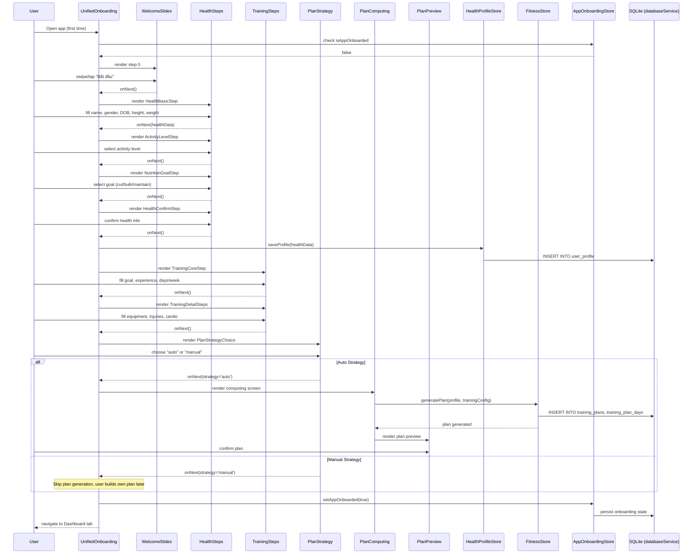
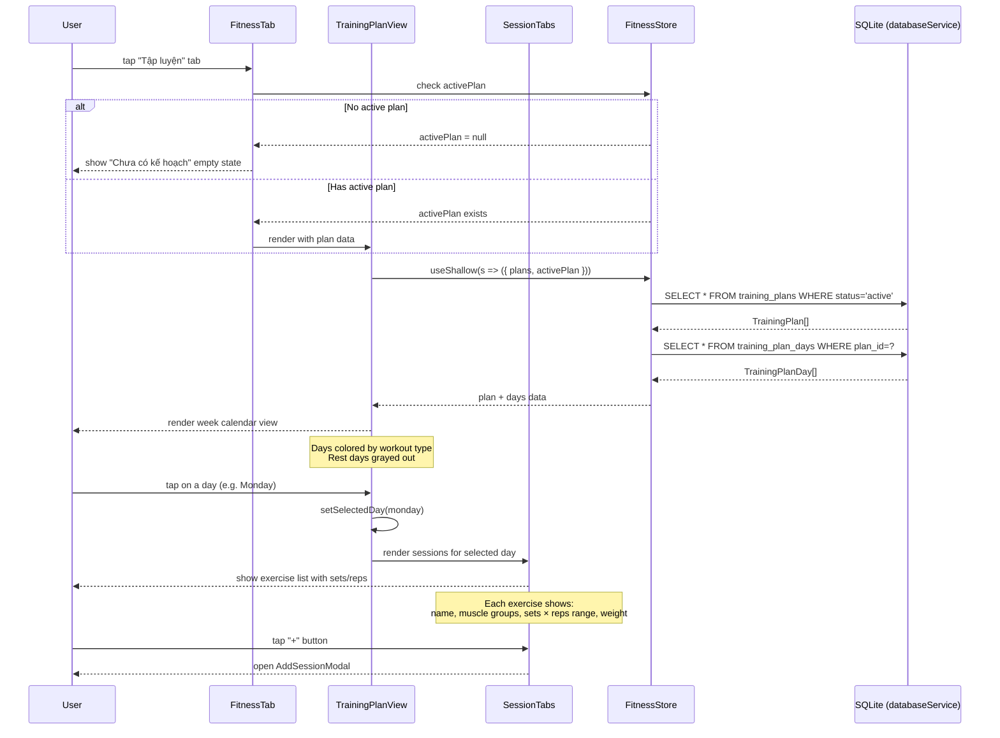
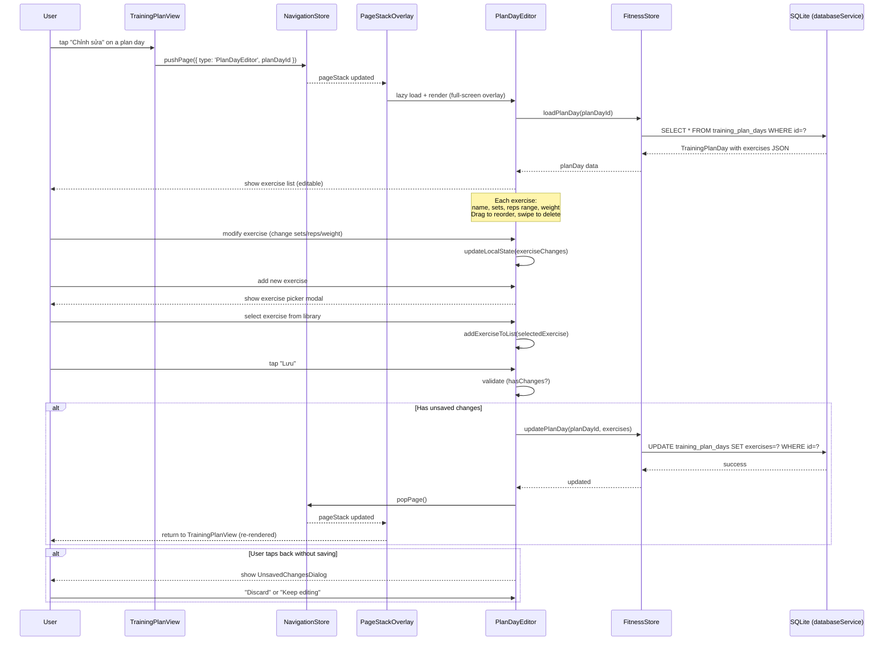
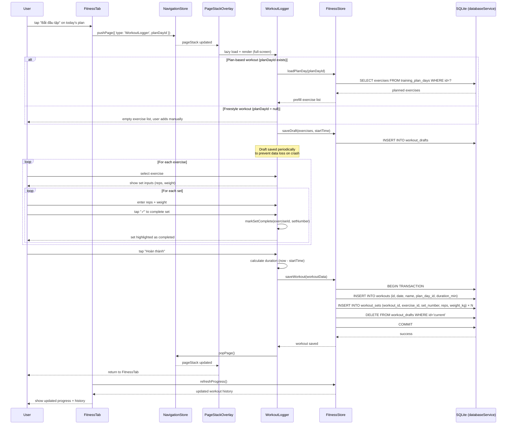

# Sequence Diagrams — Smart Meal Planner

**Version:** 3.0  
**Date:** 2026-07-16

---

## SD-01: Phân tích ảnh thức ăn bằng AI

```
User          AIImageAnalyzer    ImageCapture   geminiService      Gemini API    App.tsx
 │                  │                │               │                  │           │
 │──open AI tab────►│                │               │                  │           │
 │                  │──render───────►│               │                  │           │
 │                  │                │               │                  │           │
 │──chụp/chọn ảnh──►│                │               │                  │           │
 │                  │──onCapture────►│               │                  │           │
 │                  │◄──imageData────│               │                  │           │
 │                  │                │               │                  │           │
 │                  │───compress(imageData)──────────►               │           │
 │                  │◄───compressedBase64─────────────               │           │
 │                  │                │               │                  │           │
 │                  │               analyzeDishImage(base64)──────────►│           │
 │                  │               withRetry()       │                  │           │
 │                  │               callWithTimeout(30s)                │           │
 │                  │               │               │──POST /generate──►│           │
 │                  │               │               │◄──JSON response───│           │
 │                  │               │               isAnalyzedDishResult()          │
 │                  │               │               │                  │           │
 │                  │◄──AnalyzedDishResult──────────│                  │           │
 │                  │                │               │                  │           │
 │◄──show preview────│ (AnalysisResultView)           │                  │           │
 │                  │                │               │                  │           │
 │──"Lưu"──────────►│ onSaveResult() │               │                  │           │
 │                  │───────────────────────────────────────────────────────────────►│
 │                  │                │           App.tsx: handleSaveAnalyzedDish()  │
 │                  │                │               │            processAnalyzedDish()
 │                  │                │               │            setIngredients()   │
 │                  │                │               │            setDishes()        │
 │◄──toast success──────────────────────────────────────────────────────────────────│
```

**Error flows:**
- `isFood = false` → show NotFoodImageError toast, không crash
- timeout (>30s) → toast "Phân tích thất bại"
- network error → withRetry (2 lần) → toast error

---

## SD-02: Gợi ý thực đơn AI

```
User         CalendarTab    useAISuggestion   geminiService    Gemini API    AISuggestionPreviewModal
 │                │                │                │               │                │
 │──"AI Gợi ý"──►│                │                │               │                │
 │                │──suggest()────►│                │               │                │
 │                │                │─buildContext()─│               │                │
 │                │                │ (dishes, target)               │                │
 │                │                │──suggestMealPlan()─────────────►               │
 │                │                │                │──POST /generate (ThinkingHigh)►│
 │                │                │                │◄──MealPlanSuggestion───────────│
 │                │                │                isMealPlanSuggestion()           │
 │                │                │◄──suggestion──────────          │               │
 │                │◄──setSuggestion│                                 │               │
 │                │──────────────────────────────────────────────────────────────────►│
 │                │                │         open AISuggestionPreviewModal            │
 │◄──show preview─────────────────────────────────────────────────────────────────────│
 │                │                │                │               │                │
 │──"Áp dụng"────────────────────────────────────────────────────────────────────────►│
 │                │◄──onApply(suggestion)──────────────────────────────────────────────
 │                │──applySuggestionToDayPlans()     │               │                │
 │                │──setDayPlans()                   │               │                │
 │◄──calendar updated
```

---

## SD-03: Thêm nguyên liệu mới (CRUD)

```
User         IngredientManager   IngredientEditModal   App.tsx (setIngredients)
 │                  │                    │                      │
 │──tap "+"─────────►                    │                      │
 │                  │──openModal()───────►                      │
 │                  │                    │                      │
 │──fill form───────────────────────────►│                      │
 │──tap "Lưu"───────────────────────────►│                      │
 │                  │                    │─validate()            │
 │                  │                    │  ✓ pass               │
 │                  │                    │─onSave(ingredient)───►│
 │                  │                    │                     setIngredients(prev => [...prev, newItem])
 │                  │                    │                     localStorage.setItem('mp-ingredients', ...)
 │◄──toast success──────────────────────────────────────────────│
 │                  │◄──onClose()────────│                      │
```

**Unsaved Changes flow:**
```
User         IngredientEditModal        UnsavedChangesDialog
 │                    │                         │
 │──(fill form)───────►│                         │
 │──tap "✕"───────────►│                         │
 │                     │─hasChanges() = true      │
 │                     │──setShowUnsavedDialog────►
 │◄──dialog appears──────────────────────────────│
 │──tap "Discard"─────────────────────────────── ►│
 │                     │◄──onDiscard()────────────│
 │                     │─close modal              │
```

---

## SD-04: Lưu kết quả AI thành Nguyên liệu + Món ăn

```
User       SaveAnalyzedDishModal    dataService       App.tsx
 │                  │                   │               │
 │──(from UC-07)────►                   │               │
 │                  │─show preview      │               │
 │                  ├── ingredients list                │
 │                  ├── options: createDish?, tags      │
 │──confirm "Lưu"──►│                   │               │
 │                  │─processAnalyzedDish(payload)──────►
 │                  │                   │─for each ingredient:
 │                  │                   │  findExisting() || create new
 │                  │                   │─if createDish:
 │                  │                   │  createDish(dishIngredients)
 │                  │                   │◄─{newIngredients, newDish}
 │                  │◄──result──────────│               │
 │                  │─onSave(result)────────────────────►
 │                  │                   │─setIngredients([...prev, ...newIngredients])
 │                  │                   │─if newDish: setDishes([...prev, newDish])
 │◄──toast success──────────────────────────────────────│
```

---

## SD-05: Export dữ liệu (Android Share)

```
User          DataBackup        App.tsx       Capacitor.Filesystem  Capacitor.Share
 │               │                │                    │                  │
 │──tap Export──►│                │                    │                  │
 │               │─buildPayload()─►                    │                  │
 │               │◄──{ingredients, dishes, dayPlans, userProfile}         │
 │               │─JSON.stringify()                    │                  │
 │               │─Filesystem.writeFile(tmpFile)──────►│                  │
 │               │◄──uri──────────────────────────────│                  │
 │               │─Share.share({ url: uri })─────────────────────────────►
 │◄──Android Share sheet opens────────────────────────────────────────────│
```

---

## SD-06: Khởi động app — Data hydration

```
React            usePersistedState     localStorage    dataService
  │                     │                   │               │
  │─mount App.tsx────────►                  │               │
  │                     │─getItem('mp-ingredients')────────►│
  │                     │◄──JSON string─────────────────────│
  │                     │─JSON.parse()       │               │
  │                     │◄──rawIngredients[]  │               │
  │                     │                   │               │
  │─useMemo migrates────────────────────────────────────────►
  │                     │                   │─migrateIngredients(raw)
  │                     │                   │─migrateDishes(raw)
  │◄──ingredients (typed, migrated)───────────────────────────│
  │                     │                   │               │
  │─render CalendarTab───►                  │               │
```

---

## SD-07: Lên kế hoạch bữa ăn (Plan Meal — Direct Modal)

> **v1.1 (2026-03-07):** Flow cũ qua TypeSelectionModal đã bị loại bỏ.
> MealPlannerModal mở trực tiếp với `initialTab` là slot trống đầu tiên.

```
User         CalendarTab      App.tsx         useModalManager     MealPlannerModal
 │                │               │                  │                   │
 │──tap "Plan Meal"──►            │                  │                   │
 │  (btn-plan-meal-section        │                  │                   │
 │   or btn-plan-meal-empty)      │                  │                   │
 │                │──onOpenTypeSelection()──►         │                   │
 │                │               │─openTypeSelection()                  │
 │                │               │  check currentPlan:                  │
 │                │               │    breakfastDishIds.length === 0?    │
 │                │               │    lunchDishIds.length === 0?        │
 │                │               │    dinnerDishIds.length === 0?       │
 │                │               │  → emptySlots = ['lunch','dinner']   │
 │                │               │                  │                   │
 │                │               │──openMealPlanner(emptySlots[0])─────►│
 │                │               │                  │─isMealPlannerOpen = true
 │                │               │                  │─planningType = 'lunch'
 │                │               │                  │                   │
 │                │               │                  │──render───────────►
 │                │               │                  │   initialTab='lunch'
 │◄──MealPlannerModal opens───────────────────────────────────────────────│
 │    Tabs: ☀️ Breakfast │ 🌤️ Lunch │ 🌙 Dinner                         │
 │    (activeTab = initialTab)                                           │
 │                │               │                  │                   │
 │──switch tab (optional)──────────────────────────────────────────────── │
 │──tap dish card──────────────────────────────────────────────────────── │
 │                │               │                  │  toggleDish(dishId)│
 │                │               │                  │  selections[tab].add(id)
 │                │               │                  │                   │
 │──tap "Confirm"──────────────────────────────────────────────────────── │
 │                │               │                  │  handleConfirm()  │
 │                │               │◄──onConfirm(changes)─────────────────│
 │                │               │─handleUpdatePlan()                   │
 │                │               │  updateDayPlanSlot(dayPlans, date, type, ids)
 │                │               │  setDayPlans()   │                   │
 │                │               │──closeMealPlanner()─────────────────►│
 │◄──toast success────────────────│                  │                   │
```

---

## SD-08: Xóa kế hoạch (Clear Plan — Inline Button)

> **v1.1 (2026-03-07):** MoreMenu (`btn-more-menu`) đã bị loại bỏ.
> `btn-clear-plan` giờ là nút inline trong CalendarTab header.

```
User         CalendarTab      ClearPlanModal      App.tsx
 │                │                  │                │
 │──tap "Clear"───►                  │                │
 │  (btn-clear-plan                  │                │
 │   inline in header)               │                │
 │                │──onOpenClearPlan()                 │
 │                │──────────────────►│                │
 │◄──modal appears────────────────── │                │
 │    Scope options:                 │                │
 │      • 🗓️ Day (selected day)      │                │
 │      • 📅 Week (selected week)    │                │
 │      • 🗓️ Month (selected month)  │                │
 │                │                  │                │
 │──select scope──────────────────── ►│                │
 │──tap "Confirm"─────────────────── ►│                │
 │                │                  │──onClear(scope)─►
 │                │                  │         handleClearPlan(scope)
 │                │                  │         clearDayPlans(dayPlans, date, scope)
 │                │                  │         setDayPlans()
 │                │◄─────────────────│◄──close modal──│
 │◄──calendar updated────────────────                 │
 │◄──toast success───────────────────                 │
```

---

## SD-09: Food Name Translation (Dictionary + OPUS fallback)

> **v1.2** (2026-03-08): Updated with dictionary fast-path. Xem [ADR 004](../adr/004-food-dictionary-instant-translation.md).

### SD-09a: Instant translation via dictionary (happy path, ~0ms)

```
User          App.tsx                  foodDictionary
 │               │                          │
 │─save ing──────►                          │
 │            lookupFoodTranslation()──────►│
 │                                    HIT ◄─│
 │            setIngredients({...ing,       │
 │              name: { vi, en: result }})  │
 │            localStorage.setItem(...)     │
 │◄──UI updates instantly                  │
```

### SD-09b: Worker fallback for unknown terms

```
User        App.tsx      useTranslateProcessor  translateQueueService  Worker
 │             │                  │                      │                │
 │─save ing────►                  │                      │                │
 │          lookupFoodTranslation() → null (MISS)       │                │
 │          setIngredients(ing)   │                      │                │
 │          enqueue({itemId, direction, sourceText})─────►                │
 │                                │                      │                │
 │             [workerReady = true]                      │                │
 │                                │─pick pending job─────►                │
 │                                │                      │                │
 │                                │        postMessage({type:'translate'})│
 │                                │                      │      ┌─────────┤
 │                                │                      │      │dictionary│
 │                                │                      │      │  HIT?   │
 │                                │                      │      ├─yes→result
 │                                │                      │      └─no→WASM │
 │                                │                      │       translate()
 │                                │                      │◄─{type:'result'}
 │          ◄─updateTranslatedField()                    │                │
 │          setIngredients(prev => update name.en)       │                │
 │          localStorage.setItem(...)                    │                │
 │◄─UI re-renders with translated name                  │                │
```

### SD-09c: scanMissing on page load (repair corrupted data)

```
App.tsx            useTranslateWorker       translateQueueService    Worker
  │                       │                         │                  │
  │─mount─────────────────►                         │                  │
  │                    new Worker()                  │                  │
  │                       │◄────{type:'ready'}──────│──────────────────│
  │                    setWorkerReady(true)          │                  │
  │                    scanMissing(dishes, ings, lang)                  │
  │                       │─────────────────────────►                  │
  │                       │   for each: name.en === name.vi?           │
  │                       │   YES → enqueue({sourceText: name.vi,      │
  │                       │          direction: 'vi-en'})               │
  │                       │                         │─dispatch to worker│
  │                       │                         │──────────────────►│
  │                       │                         │         dictionary│
  │                       │                         │◄─{type:'result'}─│
  │◄─updateTranslatedField()                        │                  │
  │  setIngredients(prev => update name.en)         │                  │
```

---

## SD-10: Google Drive Sync (Auto-Backup)

```
User          App.tsx       AuthContext   useAutoSync   googleDriveService   Google Drive API
 │               │               │              │               │                  │
 │──Sign In─────►│               │              │               │                  │
 │               │──initAuth()──►│              │               │                  │
 │               │               │──OAuth2──────────────────────────────────────────►│
 │               │               │◄──accessToken────────────────────────────────────│
 │               │               │──setUser()───►              │                  │
 │               │◄──authState───│              │               │                  │
 │               │                              │               │                  │
 │               │──useAutoSync(enabled=true)───►               │                  │
 │               │                              │──listFiles()─►│                  │
 │               │                              │               │──GET /files──────►│
 │               │                              │               │◄──fileList────────│
 │               │                              │◄──backupMeta──│                  │
 │               │                              │               │                  │
 │               │                              │──downloadBackup()────────────────►│
 │               │                              │◄──backupJSON─────────────────────│
 │               │                              │               │                  │
 │               │◄──mergeOrConflict────────────│               │                  │
 │               │                              │               │                  │
 │──edit data───►│                              │               │                  │
 │               │──onDataChange()─────────────►│               │                  │
 │               │                              │──debounce(3s)─│                  │
 │               │                              │               │                  │
 │               │                              │──uploadBackup()──────────────────►│
 │               │                              │               │──POST multipart──►│
 │               │                              │               │◄──fileId──────────│
 │               │                              │◄──success─────│                  │
 │◄──syncStatus: idle───────────────────────────│               │                  │
```

---

## SD-11: Sync Conflict Resolution

```
User          App.tsx      useAutoSync    SyncConflictModal
 │               │              │               │
 │               │              │──detect conflict (local ≠ cloud)
 │               │◄──showConflict──│            │
 │               │──render──────────────────────►│
 │               │              │               │
 │──choose "Keep Local"────────────────────────►│
 │               │◄──onResolve('local')─────────│
 │               │──uploadBackup()──────────────►│
 │               │              │               │
 │  OR                          │               │
 │──choose "Use Cloud"─────────────────────────►│
 │               │◄──onResolve('cloud')─────────│
 │               │──applyCloudData()────────────►│
 │               │──setIngredients/setDishes/setDayPlans()
 │◄──data updated──│            │               │
```

---

## SD-12: Copy Plan

```
User          CalendarTab    CopyPlanModal    useCopyPlan    App.tsx
 │               │               │               │             │
 │──click "Copy"►│               │               │             │
 │               │──openModal───►│               │             │
 │               │               │               │             │
 │──select targets──────────────►│               │             │
 │  (Tomorrow/Week/Custom)      │               │             │
 │               │               │               │             │
 │──confirm─────────────────────►│               │             │
 │               │               │──copyPlan()──►│             │
 │               │               │               │──for each targetDate:
 │               │               │               │  clone dishIds from source
 │               │               │               │──setDayPlans()──────────►│
 │               │               │               │             │──persist──►localStorage
 │               │               │◄──success─────│             │
 │               │◄──close modal─│               │             │
 │◄──calendar updated──│         │               │             │
```

---

## SD-13: Meal Template (Save & Apply)

```
User          CalendarTab   SaveTemplateModal   useMealTemplate   TemplateManager   App.tsx
 │               │               │                  │                  │              │
 │── "Save as Template"──────────►                  │                  │              │
 │               │               │                  │                  │              │
 │──enter name──►│               │                  │                  │              │
 │──confirm─────────────────────►│                  │                  │              │
 │               │               │──saveTemplate()─►│                  │              │
 │               │               │                  │──create template with dishIds   │
 │               │               │                  │──setTemplates()──────────────────►
 │               │               │                  │                  │  persist to localStorage
 │               │               │◄──success────────│                  │              │
 │               │◄──close───────│                  │                  │              │
 │               │               │                  │                  │              │
 │── "Templates" button─────────────────────────────────────────────►│              │
 │               │               │                  │                  │──show list   │
 │──select template + date──────────────────────────────────────────►│              │
 │               │               │                  │                  │              │
 │──"Apply"─────────────────────────────────────────────────────────►│              │
 │               │               │                  │◄──applyTemplate()│              │
 │               │               │                  │──build DayPlan from template    │
 │               │               │                  │──setDayPlans()──────────────────►│
 │               │               │                  │                  │  persist to localStorage
 │◄──calendar updated──────────────────────────────────────────────────────────────────│
```

---

## SD-14: Onboarding Flow (Wizard → Profile Save → Plan Generation)

> **v3.0 (2026-07-16):** Unified Onboarding wizard — multi-step form collecting health profile and training configuration, then generating a training plan.



---

## SD-15: Training Plan View (Load Plan → Render Calendar → Select Day)

> **v3.0 (2026-07-16):** How the training plan view loads and displays exercises.



---

## SD-16: Plan Day Editor (Open → Modify Exercises → Save)

> **v3.0 (2026-07-16):** Full-screen page for editing exercises in a training plan day.



---

## SD-17: Workout Logging (Start → Log Sets → Complete → Update Progress)

> **v3.0 (2026-07-16):** Strength workout logging flow with plan-based and freestyle modes.



---

## Revision History

| Version | Date | Changes |
|---------|------|---------|
| 1.0 | 2026-02-20 | Initial sequence diagrams (SD-01 to SD-06) |
| 1.1 | 2026-03-07 | Updated SD-07 (MealPlanner direct modal), SD-08 (inline clear button) |
| 2.0 | 2026-03-11 | Added SD-09 (translation), SD-10 (Google Drive sync), SD-11 (conflict resolution), SD-12 (copy plan), SD-13 (meal templates) |
| 3.0 | 2026-07-16 | Added 4 Mermaid sequence diagrams: SD-14 (Onboarding Flow), SD-15 (Training Plan View), SD-16 (Plan Day Editor), SD-17 (Workout Logging) |
