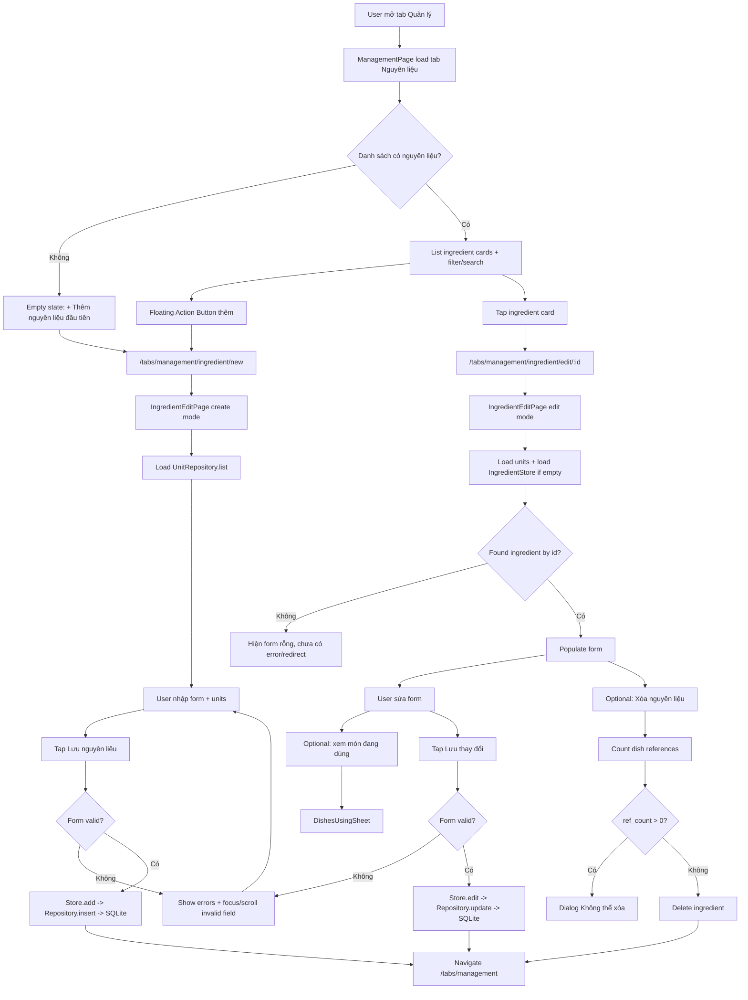
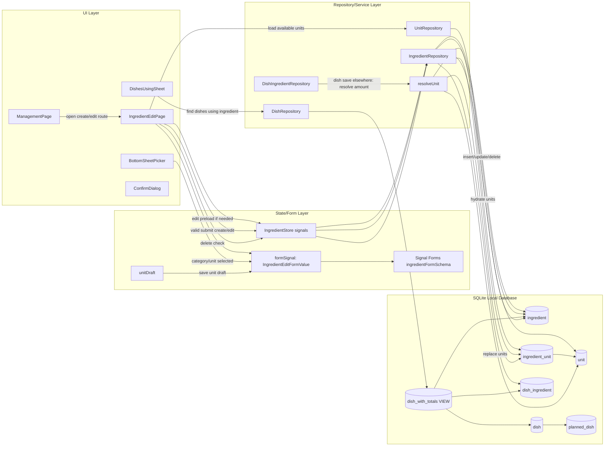
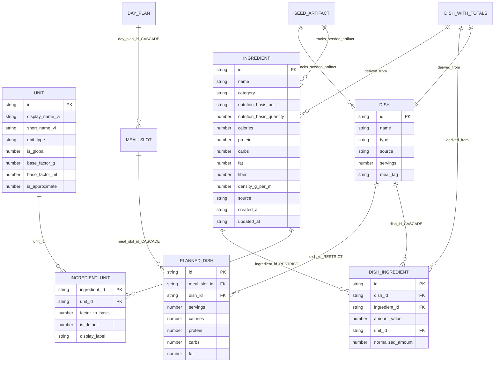
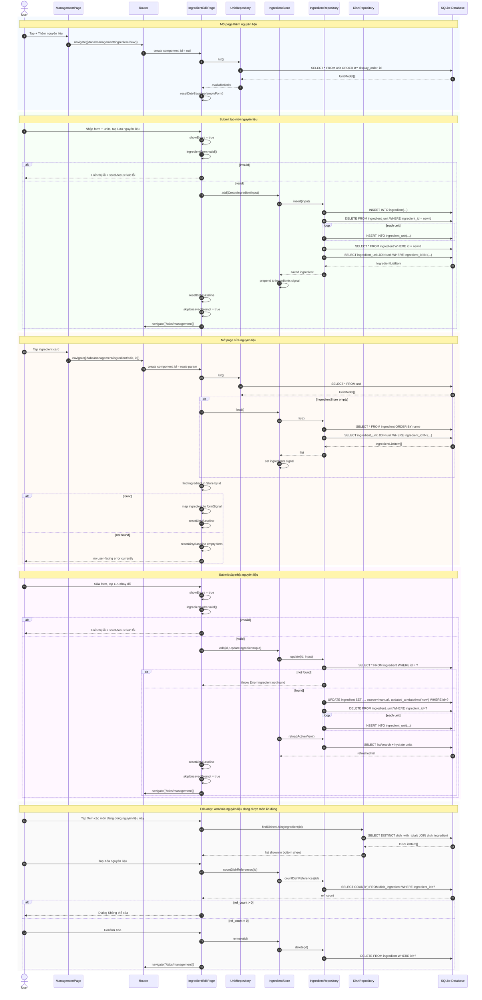

# Phân tích logic & flow Thêm/Sửa nguyên liệu

Ngày phân tích: 2026-04-29 09:37 +07  
Vai trò phân tích: Senior Business Analyst + Senior Software Architect  
Phạm vi bằng chứng: implementation hiện tại trong working tree tại `/Users/khanhhuynh/person_project/MealPlaning`.

> Lưu ý trạng thái repo: tại thời điểm phân tích có nhiều file liên quan Management đang `modified` và có file mới `src/app/core/guards/unsaved-changes-guard.ts` chưa commit. Báo cáo này phản ánh **working tree hiện tại**, không chỉ commit gần nhất.

---

## 1. Executive Summary

Page “Thêm nguyên liệu” và “Sửa nguyên liệu” hiện là cùng một routed page Angular/Ionic: `IngredientEditPage`.

- Thêm mới: route `/tabs/management/ingredient/new`, không có `id`, form khởi tạo rỗng.
- Chỉnh sửa: route `/tabs/management/ingredient/edit/:id`, lấy `id` từ route param, preload danh sách nguyên liệu qua `IngredientStore` nếu store đang rỗng, rồi tìm record theo `id` trong signal store.
- Form dùng Angular Signal Forms (`@angular/forms/signals`) với schema `ingredientFormSchema`.
- State chính của form nằm ở local signal `formSignal`; global state nằm ở `IngredientStore`; database source of truth là SQLite local qua Repository → Database abstraction.
- Không có backend server hoặc HyperText Transfer Protocol API trong flow thêm/sửa nguyên liệu. “API” thực tế là service/repository local gọi SQLite thông qua `Database` abstraction.
- Khi submit:
  - Create gọi `IngredientStore.add()` → `IngredientRepository.insert()` → `INSERT ingredient` → `INSERT ingredient_unit[]`.
  - Edit gọi `IngredientStore.edit()` → `IngredientRepository.update()` → `UPDATE ingredient` + replace toàn bộ `ingredient_unit[]`.
- Thay đổi dinh dưỡng nguyên liệu ảnh hưởng trực tiếp đến tổng dinh dưỡng món ăn vì `dish_with_totals` là SQL view derived từ `ingredient` + `dish_ingredient`.
- Xóa nguyên liệu được block ở UI nếu đang có `dish_ingredient` tham chiếu; database cũng có foreign key `ON DELETE RESTRICT` ở `dish_ingredient.ingredient_id`.

Các điểm quan trọng nhất:

1. Manual create/edit chưa kiểm tra trùng tên nguyên liệu.
2. Validation code hiện lệch tài liệu: calories trong implementation đang cho phép `null` và coerce thành `0` khi submit; tài liệu PRD yêu cầu calories bắt buộc và có max 2000.
3. Repository insert/update nguyên liệu không dùng transaction. Nếu insert/update ingredient thành công nhưng thao tác replace `ingredient_unit` lỗi, dữ liệu có thể bị partial.
4. Edit page không gọi `IngredientRepository.getById()` trực tiếp; nó dựa vào list trong `IngredientStore`. Nếu không tìm thấy `id`, page giữ form rỗng, chưa có error state hoặc redirect rõ ràng.
5. Unit conversion là dependency rất nhạy cảm: `ingredient_unit.factor_to_basis` là dữ liệu đầu vào để món ăn tính `normalized_amount`; sửa unit/factor của nguyên liệu có thể làm các lần chỉnh sửa/lưu món sau thay đổi kết quả tính.

---

## 2. Files / Modules liên quan

### 2.1 Routing & page shell

| File | Vai trò |
|---|---|
| `src/app/app.routes.ts` | Route gốc, lazy-load `/tabs`. |
| `src/app/tabs/tabs.routes.ts` | Route tab `management` → lazy-load `features/management/management.routes`. |
| `src/app/features/management/management.routes.ts` | Định nghĩa route list, create/edit ingredient, create/edit dish. Gắn `unsavedChangesGuard` cho create/edit. |
| `src/app/features/management/management.page.ts` | List page “Quản lý”: tab nguyên liệu/món ăn, search/filter, mở create/edit, delete dialog ở list. |
| `src/app/features/management/management.page.html` | UI list: card nguyên liệu, empty state, Floating Action Button, option sheet xóa. |
| `src/app/features/management/ingredient-edit/ingredient-edit.page.ts` | Core logic page thêm/sửa nguyên liệu. |
| `src/app/features/management/ingredient-edit/ingredient-edit.page.html` | Form UI thêm/sửa nguyên liệu. |
| `src/app/features/management/ingredient-edit/ingredient-edit.page.scss` | Style page. |
| `src/app/features/management/ingredient-edit/ingredient-edit.types.ts` | Type của form nguyên liệu. |
| `src/app/core/guards/unsaved-changes-guard.ts` | CanDeactivate guard hỏi bỏ thay đổi chưa lưu. |

### 2.2 Form & shared UI

| File | Vai trò |
|---|---|
| `src/app/shared/forms/schemas/ingredient-form.schema.ts` | Validation schema cho Signal Forms. |
| `src/app/shared/forms/form-field/form-field.ts` | Component `AppFormField` dùng canonical floating-label form field. |
| `src/app/shared/forms/form-field/form-field.html` | Markup `.form-field` + `.input-wrapper` + `.input-label` + `.field-error`. |
| `src/app/shared/components/bottom-sheet-picker/bottom-sheet-picker.*` | Bottom sheet chọn category và chọn unit. |
| `src/app/shared/components/confirm-dialog/confirm-dialog.*` | Confirm dialog dùng cho delete và bỏ thay đổi. |
| `src/app/shared/components/dishes-using-sheet/dishes-using-sheet.*` | Sheet “món đang dùng nguyên liệu này” trong edit mode. |

### 2.3 Store, repository, model, database

| File | Vai trò |
|---|---|
| `src/app/core/stores/ingredient.store.ts` | Global signal store cho list/search/add/edit/remove nguyên liệu. |
| `src/app/core/stores/dish.store.ts` | Store món ăn; liên quan gián tiếp qua count references và dish edit. |
| `src/app/core/repositories/ingredient.repository.ts` | Data access nguyên liệu + ingredient_unit. |
| `src/app/core/repositories/unit.repository.ts` | Load registry `unit`. |
| `src/app/core/repositories/dish.repository.ts` | Query dish, find dishes using ingredient, count planned dish references. |
| `src/app/core/repositories/dish-ingredient.repository.ts` | Lưu mapping dish ↔ ingredient, normalize amount qua unit resolver. |
| `src/app/core/services/unit-resolver.ts` | Resolve `amount_value + unit_id` về `normalized_amount`. |
| `src/app/core/models/management.model.ts` | Model `UnitModel`, `IngredientModel`, `IngredientUnitModel`, `DishModel`, `DishIngredientModel`. |
| `src/app/core/models/management.types.ts` | Type enum: unit type, source, basis unit, dish type. |
| `src/app/core/models/management.constants.ts` | `INGREDIENT_CATEGORIES`. |
| `src/app/core/services/database/database.ts` | Abstract database API. |
| `src/app/core/services/database/schema.ts` | SQLite schema + migrations. |
| `src/app/core/services/database/migrations.ts` | Migration registry version 1 → 5. |
| `src/app/core/services/database/database.provider.ts` | App initializer: initialize DB, run seed loader, load profile. |
| `src/app/core/services/seed/seed-loader.ts` | Seed nguyên liệu/món ăn từ local JSON assets lúc app bootstrap. |

### 2.4 Tests liên quan

| File | Vai trò |
|---|---|
| `src/app/features/management/ingredient-edit/ingredient-edit.page.spec.ts` | Test create mode và save new ingredient ở page. |
| `src/app/shared/forms/schemas/ingredient-form.schema.spec.ts` | Test validation schema nguyên liệu. |
| `src/app/core/repositories/ingredient.repository.spec.ts` | Test repository list/search/insert/update/delete/source flip. |
| `src/app/core/repositories/dish-ingredient.repository.spec.ts` | Test normalized amount và unit resolver ở mapping món ăn. |
| `src/app/shared/components/dishes-using-sheet/dishes-using-sheet.spec.ts` | Test sheet món đang dùng nguyên liệu. |

---

## 3. Form Fields & Validation

### 3.1 Field cấp nguyên liệu

| Field UI | Field data | Kiểu | Default create | Required theo code | Validation theo code | Ghi chú |
|---|---|---:|---|---:|---|---|
| Tên nguyên liệu | `name` | `string` | `''` | Có | trim không rỗng; max 100 ký tự | Lỗi: `Vui lòng nhập tên nguyên liệu`, `Tối đa 100 ký tự`. |
| Nhóm | `category` | `string` | `''` | Có | trim không rỗng | UI chỉ chọn từ `INGREDIENT_CATEGORIES`; DB CHECK enforce enum. |
| Tính dinh dưỡng theo | `nutrition_basis_unit` | `'g' \| 'ml'` | `'g'` | Có | Không có schema validate riêng; UI chỉ cho chọn `g/ml` | Hiển thị 100g hoặc 100ml; submit luôn `nutrition_basis_quantity = 100`. |
| Calories | `calories` | `number \| null` | `null` | Không theo code hiện tại | `null` hợp lệ; nếu number thì không được âm; `NaN` lỗi | Khi submit `null` → `0`. Lệch PRD vì PRD nói calories bắt buộc. |
| Protein | `protein` | `number \| null` | `null` | Không | `null` hợp lệ; nếu number thì không được âm | Submit `null` → `0`. |
| Carbs | `carbs` | `number \| null` | `null` | Không | `null` hợp lệ; nếu number thì không được âm | Submit `null` → `0`. |
| Fat | `fat` | `number \| null` | `null` | Không | `null` hợp lệ; nếu number thì không được âm | Submit `null` → `0`. |
| Chất xơ | `fiber` | `number \| null` | `null` | Không | `null` hợp lệ; nếu number thì không được âm | Submit `null` → `0`. |
| Mật độ (g/ml) | `density_g_per_ml` | `number \| null` | `null` | Không | Không thấy validation trong `ingredientFormSchema` | Dùng làm bridge g ↔ ml ở `resolveUnit` nếu không có ingredient-specific factor. |
| Đơn vị có thể nhập | `units[]` | array | `[]` | Có | ít nhất 1 item; đúng 1 item default | Error: `Cần ít nhất 1 đơn vị hợp lệ.`, `Chọn đúng 1 đơn vị mặc định trước khi lưu.` |

### 3.2 Field trong `units[]`

| Field UI | Field data | Kiểu | Default khi thêm unit | Required | Validation/behavior |
|---|---|---:|---|---:|---|
| Unit được chọn | `unit_id` | `string` | từ picker | Có | Picker loại các unit đã dùng khỏi danh sách; DB foreign key enforce `unit(id)`. |
| Hiển thị | `display_label` | `string` | `unit.short_name_vi` | Không | Khi submit trim; nếu rỗng → `null`. |
| 1 đơn vị = ? basis | `factor_to_basis` | `number` | global factor nếu cùng dimension; nếu không thì `1` | Có | Schema yêu cầu number finite và `> 0`. |
| Đặt làm mặc định | `is_default` | `boolean` | `true` nếu đây là unit đầu tiên | Có đúng 1 | `markDefault()` set unit được chọn thành default duy nhất. |
| Ước lượng | `is_approximate` | `boolean` UI-only từ `unit.is_approximate` | từ registry unit | Không submit | Dùng để hiển thị `≈` / `ước lượng`; không lưu trong `ingredient_unit`. |
| Tên ngắn | `short_name_vi` | `string` UI-only | từ registry unit | Không submit | Fallback label. |
| Local id | `local_id` | `string` UI-only | random | Không persist | Dùng track row và sheet edit. |

### 3.3 Điều kiện hiển thị / ẩn

| UI element | Điều kiện |
|---|---|
| Title page | `isEdit() ? 'Sửa nguyên liệu' : 'Thêm nguyên liệu'`. |
| Empty unit card | `formSignal().units.length === 0`. |
| Unit list | `formSignal().units.length > 0`. |
| Unit list errors | `showErrors() && unitListErrorMessages().length > 0`. |
| Button “Xem các món đang dùng nguyên liệu này” | Chỉ edit mode: `isEdit()`. |
| `app-dishes-using-sheet` | Chỉ render khi `isEdit()` và có `ingredientId`. |
| Button “Xóa nguyên liệu” | Chỉ edit mode. |
| Unit edit bottom sheet | `activeUnitEditLocalId() !== null`. |
| Delete confirm dialog | `pendingDeleteId() !== null`. |
| Unsaved changes confirm dialog | `discardDialogOpen()`. |
| Category picker | Mở khi click field Nhóm. |
| Unit picker | Mở khi click “+ Thêm đơn vị”. |

### 3.4 Enable / disable / readonly

| Element | Logic |
|---|---|
| Save button | `[disabled]="saving()"`; không disable khi form invalid. User bấm save mới show errors. |
| Save text | `saving()` → `Đang lưu...`; edit → `Lưu thay đổi`; create → `Lưu nguyên liệu`. |
| Unit factor input trong unit edit sheet | `[readOnly]="!draft.is_approximate"`; nếu unit không approximate thì UI không cho sửa factor. |
| “Đặt làm mặc định” | disabled khi `draft.is_default`. |
| Confirm delete | disabled khi `deleteReferenceLoading()`. |

### 3.5 Reset / clear / auto-fill / auto-calculate

| Behavior | Implementation thực tế |
|---|---|
| Create form reset | `emptyForm()` tạo form rỗng: name/category empty, basis `g`, nutrition null, density null, units empty. |
| Edit form preload | Map từ `IngredientListItem` sang form, unit `display_label` fallback `short_name_vi`, boolean hóa `is_default` / `is_approximate`. |
| Add unit auto-fill | `onUnitSelected()` lấy unit registry, set `factor_to_basis = getSuggestedFactor(unit)`, `display_label = short_name_vi`, `is_default = true` nếu unit đầu tiên. |
| Suggested factor | Nếu basis `g` và unit mass có `base_factor_g` → dùng `base_factor_g`; nếu basis `ml` và unit volume có `base_factor_ml` → dùng `base_factor_ml`; còn lại `1`. |
| Change basis unit | `setBasisUnit()` đổi `nutrition_basis_unit`; với unit global cùng dimension mới thì tự update factor theo global factor; các unit còn lại giữ factor cũ. |
| Unit edit draft | `openUnitEditSheet()` copy unit vào `unitDraft`; chỉ khi `saveUnitDraft()` mới commit vào `formSignal`; close/hủy bỏ draft. |
| Remove unit | `removeUnit()` xóa unit khỏi form; nếu còn đúng 1 unit thì tự set unit còn lại là default. |
| Delete ingredient | Nếu no dish references thì delete DB và navigate về management. |
| Unsaved baseline | `dirtyBaseline` là JSON snapshot đã normalize trim/null; reset sau bootstrap và sau save/delete. |

---

## 4. Add Ingredient Flow

### 4.1 Entry point

Các cách vào thêm nguyên liệu:

1. Từ tab `Quản lý` → tab `Nguyên liệu` → Floating Action Button.
2. Từ empty state nguyên liệu → “+ Thêm nguyên liệu đầu tiên”.

Cả hai gọi `ManagementPage.openCreateIngredient()` và navigate tới:

```ts
['/tabs/management/ingredient/new']
```

Route tương ứng:

```ts
path: 'ingredient/new'
loadComponent: () => import('./ingredient-edit/ingredient-edit.page')
canDeactivate: [unsavedChangesGuard]
```

### 4.2 Bootstrap page create

`IngredientEditPage`:

1. `ingredientId = route.snapshot.paramMap.get('id')` → `null`.
2. `isEdit()` → `false`.
3. Constructor gọi `bootstrap()`.
4. `bootstrap()` luôn gọi `unitRepository.list()` để load registry `unit`.
5. Vì không có `id`, page không load ingredient; gọi `resetDirtyBaseline()` trên empty form.

Dữ liệu fetch trước khi user nhập:

| Data | Source | Mục đích |
|---|---|---|
| Unit registry | `UnitRepository.list()` → `SELECT * FROM unit ORDER BY display_order ASC, id ASC` | Cho picker “Thêm đơn vị”. |

Không thấy gọi HTTP API hoặc AI API trong create ingredient manual flow.

### 4.3 User nhập form

User thao tác trên local `formSignal`:

- Gõ tên → Signal Forms ghi vào `formSignal.name`.
- Chọn category → `onCategorySelected(category)` update `formSignal.category`.
- Chọn basis 100g/100ml → `setBasisUnit()` update basis và một số factor.
- Nhập calories/macros/density → Signal Forms ghi vào form signal.
- Thêm unit → chọn unit từ bottom sheet → `onUnitSelected(unitId)` append vào `units[]`.
- Sửa unit → mở unit edit sheet → sửa `unitDraft` → `saveUnitDraft()` commit vào `units[]`.

Tất cả dữ liệu trước khi bấm save chỉ nằm ở memory local state, chưa persist xuống SQLite.

### 4.4 Submit create

Khi bấm “Lưu nguyên liệu”:

1. `onSave()` set `showErrors = true`.
2. Gọi `ingredientForm().valid()`.
3. Nếu invalid: focus/scroll field đầu tiên có lỗi và return.
4. Nếu đang saving thì return.
5. Set `saving = true`.
6. Build payload:
   - trim name/category.
   - `nutrition_basis_quantity = 100`.
   - nutrition null → `0`.
   - `source = 'manual'`.
   - units map về `{ unit_id, factor_to_basis, is_default: 1/0, display_label: trimmed || null }`.
7. Vì create mode không có `editingId`, gọi `ingredientStore.add(payload)`.
8. Store gọi `repo.insert(input)`.
9. Repository:
   - tạo UUID v4.
   - `INSERT INTO ingredient (...)`.
   - `replaceUnits(id, units)`:
     - `DELETE FROM ingredient_unit WHERE ingredient_id = ?`.
     - `INSERT INTO ingredient_unit (...)` cho từng unit.
   - `getById(id)` để hydrate lại ingredient + units.
10. Store prepend item mới vào `ingredients` signal: `[saved, ...ingredients()]`.
11. Page reset dirty baseline, set `skipUnsavedPrompt = true`, navigate về `/tabs/management`.
12. `finally` set `saving = false`.

### 4.5 Success / error handling create

Success hiện tại:

- Không thấy toast/snackbar success.
- Navigate về list management.
- Store local cập nhật item mới.

Error hiện tại:

- `onSave()` không catch lỗi để hiển thị message user-friendly.
- Nếu repository/SQLite throw, lỗi propagate ra ngoài; `finally` chỉ đảm bảo `saving=false`.
- Các lỗi DB có thể xảy ra: invalid category CHECK, invalid unit foreign key, duplicate ingredient_unit primary key, unique default index, NOT NULL.

---

## 5. Edit Ingredient Flow

### 5.1 Entry point

Từ `ManagementPage` list nguyên liệu:

- Tap card body của nguyên liệu gọi `openEditIngredient(ingredient.id)`.
- Navigate tới:

```ts
['/tabs/management/ingredient/edit', id]
```

Route tương ứng:

```ts
path: 'ingredient/edit/:id'
loadComponent: () => import('./ingredient-edit/ingredient-edit.page')
canDeactivate: [unsavedChangesGuard]
```

### 5.2 Bootstrap page edit

`IngredientEditPage.bootstrap()` trong edit mode:

1. Load unit registry: `unitRepository.list()`.
2. Nếu `ingredientStore.ingredients().length === 0`, gọi `ingredientStore.load()`.
3. `ingredientStore.load()` → `IngredientRepository.list()`:
   - Query `ingredient` sorted by name.
   - Hydrate `ingredient_unit` join `unit`.
4. Tìm ingredient trong `ingredientStore.ingredients()` bằng `id`.
5. Nếu tìm thấy, map vào `formSignal`.
6. Reset dirty baseline.

Điểm quan trọng: Edit page **không gọi** `IngredientRepository.getById(id)` trực tiếp để load một record. Nó phụ thuộc vào list hiện có trong `IngredientStore`.

Nếu không tìm thấy ingredient:

- Code hiện tại chỉ `resetDirtyBaseline()` và return.
- Không thấy redirect về list, không thấy thông báo “không tìm thấy nguyên liệu”.
- Form có thể ở trạng thái empty create-like dù route vẫn là edit.

### 5.3 Dữ liệu load vào form edit

Mapping thực tế:

| Form field | Nguồn |
|---|---|
| `name` | `ingredient.name` |
| `category` | `ingredient.category` |
| `nutrition_basis_unit` | `ingredient.nutrition_basis_unit` |
| `calories/protein/carbs/fat/fiber` | row ingredient |
| `density_g_per_ml` | row ingredient |
| `units[]` | `ingredient.units` đã hydrate từ `ingredient_unit` join `unit` |
| `units[].is_default` | `unit.is_default === 1` |
| `units[].is_approximate` | `unit.is_approximate === 1` từ bảng `unit` |
| `units[].display_label` | `unit.display_label ?? unit.short_name_vi` |
| `units[].short_name_vi` | từ bảng `unit` |

### 5.4 Submit update

Khi bấm “Lưu thay đổi”:

1. Flow validation giống create.
2. Build payload giống create.
3. Vì có `editingId`, gọi:

```ts
ingredientStore.edit(editingId, payload)
```

4. Store gọi `IngredientRepository.update(id, input)`.
5. Repository:
   - `getById(id)` để check tồn tại.
   - Build dynamic `fields` từ input, bỏ qua `units` và `undefined`.
   - Luôn push `['source', 'manual']`.
   - `UPDATE ingredient SET ..., source = 'manual', updated_at = datetime('now') WHERE id = ?`.
   - Nếu có `data.units`, gọi `replaceUnits(id, units)`:
     - delete toàn bộ `ingredient_unit` hiện tại của ingredient.
     - insert lại danh sách unit mới.
6. Store `reloadActiveView()`:
   - Nếu đang search query thì `searchByName(query)`.
   - Nếu không thì `list()`.
7. Page reset dirty baseline, set `skipUnsavedPrompt = true`, navigate về `/tabs/management`.

### 5.5 Các action riêng của edit mode

| Action | Logic |
|---|---|
| Xem món đang dùng nguyên liệu | `openDishesSheet()` mở `DishesUsingSheet`; sheet gọi `DishRepository.findDishesUsingIngredient(ingredientId)`. |
| Chọn một món trong sheet | Emit `dishSelected`, page navigate tới `/tabs/management/dish/edit/:dishId`. |
| Xóa nguyên liệu | `openDeleteDialog()` gọi `ingredientStore.countDishReferences(id)` trước khi cho delete. |
| Block xóa nếu đang dùng | Nếu count > 0, dialog title `Không thể xóa`, message `Nguyên liệu này đang được dùng trong N món ăn.`, confirm đóng dialog. |
| Xóa nếu không bị tham chiếu | `ingredientStore.remove(id)` → `repo.delete(id)` → navigate management. |
| Bỏ thay đổi | `unsavedChangesGuard` gọi `hasUnsavedChanges()`; nếu dirty thì mở confirm dialog “Bỏ thay đổi?”. |

---

## 6. Related Entities Analysis

### 6.1 `ingredient`

Vai trò:

- Entity trung tâm của flow thêm/sửa.
- Lưu nutrition authoritative theo 100g hoặc 100ml.

Nguồn dữ liệu:

- User tạo thủ công: `IngredientRepository.insert()`.
- Seed mặc định: `SeedLoader` từ `assets/seed/ingredients.json` và `assets/seed/composites.json` lúc app bootstrap.
- AI lookup có trong PRD/schema nhưng chưa thấy implementation trong flow manual thêm/sửa hiện tại.

Quan hệ:

- 1 ingredient có nhiều `ingredient_unit`.
- 1 ingredient có thể được nhiều `dish_ingredient` tham chiếu.
- Ingredient nutrition được `dish_with_totals` dùng để derive total món ăn.

Khi ingredient thay đổi:

- Thay đổi calories/protein/carbs/fat/fiber phản ánh ngay trong `dish_with_totals` cho mọi món đang dùng ingredient đó.
- `planned_dish` đã snapshot calories/protein/carbs/fat tại thời điểm lập kế hoạch nên không tự đổi theo ingredient.
- `source` bị set thành `manual` khi update, kể cả seed/AI ingredient.

Ràng buộc:

- DB: `id` primary key, `name` NOT NULL, `category` CHECK enum, `nutrition_basis_unit` CHECK `g/ml`, `source` CHECK `manual/ai/db`.
- Không thấy unique constraint cho `ingredient.name`.

### 6.2 `unit`

Vai trò:

- Registry các đơn vị hệ thống hiểu: `g`, `kg`, `ml`, `l`, `tbsp`, `tsp`, `cup`, `piece`, `clove`, `bunch`, `slice`, `pinch`.
- Dùng để build unit picker trong ingredient edit.

Nguồn dữ liệu:

- Seed trong migration `NUTRITION_UNITS_MIGRATION_DDL`.
- Fetch trong page bằng `UnitRepository.list()`.

Quan hệ:

- `ingredient_unit.unit_id` references `unit(id)`.
- `dish_ingredient.unit_id` references `unit(id)`.

Khi ingredient thay đổi:

- Bảng `unit` không đổi.
- Các unit được ingredient hỗ trợ nằm trong `ingredient_unit`.

Ràng buộc:

- `unit_type` CHECK `mass/volume/count/cooking`.
- `is_approximate` quyết định UI hiển thị `≈` / `ước lượng`.

### 6.3 `ingredient_unit`

Vai trò:

- Junction table giữa ingredient và unit.
- Xác định unit nào hợp lệ cho ingredient và cách convert `1 unit = factor_to_basis basis unit`.

Nguồn dữ liệu:

- Khi create/edit ingredient: từ `formSignal().units`.
- Khi seed ingredient: seed loader tạo unit basis mặc định với factor 1.

Quan hệ:

- Many-to-one tới `ingredient`.
- Many-to-one tới `unit`.
- Được `DishIngredientRepository` lookup khi lưu `dish_ingredient`.

Khi ingredient thay đổi:

- Edit ingredient hiện replace toàn bộ `ingredient_unit` bằng delete + insert.
- Existing `dish_ingredient` vẫn giữ `amount_value`, `unit_id`, `normalized_amount` cũ. Total dish hiện tại dùng `normalized_amount`, không recalculate tự động khi `ingredient_unit.factor_to_basis` thay đổi.
- Nếu user sau đó edit/save món ăn, `DishIngredientRepository.bulkInsert()` sẽ resolve lại theo factor mới.

Ràng buộc:

- Primary key `(ingredient_id, unit_id)`.
- Unique partial index: chỉ 1 default unit per ingredient.
- DB chưa thấy CHECK `factor_to_basis > 0`; validation frontend enforce.

### 6.4 `dish`

Vai trò:

- Món ăn sử dụng nguyên liệu qua `dish_ingredient`.
- Có thể bị ảnh hưởng về total nutrition khi ingredient nutrition thay đổi.

Nguồn dữ liệu:

- Seed loader từ `assets/seed/dishes.json`.
- User tạo/sửa trong Dish Edit page.

Quan hệ:

- 1 dish có nhiều `dish_ingredient`.
- 1 dish có thể được `planned_dish` tham chiếu.

Khi ingredient thay đổi:

- `dish_with_totals` của dish đổi ngay nếu ingredient nutrition đổi.
- Không có update trực tiếp vào row `dish` khi ingredient đổi.

Ràng buộc:

- `type` chỉ `ingredient_based` hoặc `ai_autofill`.
- `source` `db/custom/ai`.

### 6.5 `dish_ingredient`

Vai trò:

- Mapping dish ↔ ingredient, lưu user input amount và normalized amount.

Nguồn dữ liệu:

- Dish edit flow, không phải ingredient edit flow.
- Repository `DishIngredientRepository.bulkInsert()`.

Quan hệ:

- References `dish(id)` ON DELETE CASCADE.
- References `ingredient(id)` ON DELETE RESTRICT.
- References `unit(id)`.

Khi ingredient thay đổi:

- Nếu ingredient nutrition đổi: total dish đổi vì view dùng ingredient nutrition + `normalized_amount`.
- Nếu ingredient unit/factor đổi: existing `normalized_amount` trong `dish_ingredient` không tự đổi.
- Nếu ingredient bị xóa: DB restrict nếu còn reference; UI cũng block trước.

Ràng buộc:

- `UNIQUE(dish_id, ingredient_id)`.
- Insert/update đi qua `resolveUnit()` để compute `normalized_amount`.

### 6.6 `dish_with_totals` view

Vai trò:

- Single source of truth cho total calories/protein/carbs/fat/fiber của dish.
- Derived từ `dish`, `dish_ingredient`, `ingredient`.

Nguồn dữ liệu:

- SQL view trong migration.

Khi ingredient thay đổi:

- View phản ánh ngay cho các món dùng ingredient đó.

Ràng buộc nghiệp vụ:

- Business rule `RULE-DISH-TOTAL`: không persist total macro trên `dish`.

### 6.7 `planned_dish`, `meal_slot`, `day_plan`

Vai trò trong flow này:

- Không tham gia trực tiếp create/edit ingredient.
- `planned_dish` là dependency gián tiếp của `dish`, không trực tiếp của `ingredient`.

Ảnh hưởng khi ingredient thay đổi:

- `planned_dish` lưu snapshot calories/protein/carbs/fat khi món được thêm vào kế hoạch, nên các planned dish cũ không tự đổi theo ingredient.
- Nếu calendar sau này lấy lại dish total từ view khi thêm món mới, nó sẽ thấy total mới.

### 6.8 `seed_artifact`

Vai trò:

- Track seed artifact đã được load để tránh re-seed.
- Không tham gia trực tiếp create/edit manual ingredient.

Nguồn dữ liệu:

- `SeedLoader` insert khi load seed assets.

Ảnh hưởng:

- Edit seed ingredient không update `seed_artifact`.
- PRD nói seed dataset không tự overwrite row đã tồn tại.

---

## 7. API & Data Flow

### 7.1 API (Application Programming Interface) thực tế

Hiện flow thêm/sửa nguyên liệu **không gọi server API**. Các call thực tế là local function API:

```text
UI page → Signal Forms/local signal → Store → Repository → Database abstraction → SQLite
```

Database implementation:

- Web/dev/test: `WebDatabase` dùng sql.js WebAssembly và persist localStorage.
- Android native: `NativeDatabase` dùng `@capacitor-community/sqlite`.

HTTP (HyperText Transfer Protocol) chỉ xuất hiện ở seed loader lúc app bootstrap để fetch local assets:

- `assets/seed/ingredients.json`
- `assets/seed/composites.json`
- `assets/seed/dishes.json`

Không phải call submit khi thêm/sửa ingredient.

### 7.2 Local API / repository operations

| Trường hợp | Local API | SQL/Method | Request payload | Response | Error |
|---|---|---|---|---|---|
| Mở create/edit ingredient | `UnitRepository.list()` | `SELECT * FROM unit ORDER BY display_order ASC, id ASC` | none | `UnitModel[]` | DB not initialized/query error. |
| Mở edit nếu store rỗng | `IngredientStore.load()` → `IngredientRepository.list()` | `SELECT * FROM ingredient ORDER BY name...`; hydrate units join `ingredient_unit` + `unit` | none | `IngredientListItem[]` | DB error. |
| Search list ingredient | `IngredientStore.search(query)` → `searchByName` | `WHERE name LIKE ?` | `query` | `IngredientListItem[]` | DB error. |
| Submit create | `IngredientStore.add(input)` → `IngredientRepository.insert(input)` | `INSERT ingredient`; `DELETE ingredient_unit`; `INSERT ingredient_unit[]`; `getById` | `CreateIngredientInput` | saved `IngredientListItem` then store updated | Constraint/foreign key/unique/DB error; no UI catch. |
| Submit edit | `IngredientStore.edit(id,input)` → `IngredientRepository.update(id,input)` | `SELECT existing`; `UPDATE ingredient`; replace units; reload active view | id + `UpdateIngredientInput` | void; store list reloaded | Not found throws `Ingredient 'id' not found.`; DB constraint errors; no UI catch. |
| Delete check | `IngredientStore.countDishReferences(id)` | `SELECT COUNT(*) FROM dish_ingredient WHERE ingredient_id = ?` | ingredient id | number | DB error; delete dialog flow currently no catch in page. |
| Delete ingredient | `IngredientStore.remove(id)` → `repo.delete(id)` | `DELETE FROM ingredient WHERE id = ?` | id | void | FK restrict if still referenced; no UI catch after count race. |
| Xem món đang dùng | `DishRepository.findDishesUsingIngredient(id)` | join `dish_with_totals` + `dish_ingredient` | ingredient id | `DishListItem[]` | Sheet catches and displays message. |

### 7.3 Payload submit create/update

Payload page gửi xuống store:

```ts
{
  name: trimmedName,
  category: trimmedCategory,
  nutrition_basis_unit: 'g' | 'ml',
  nutrition_basis_quantity: 100,
  calories: value.calories ?? 0,
  protein: value.protein ?? 0,
  carbs: value.carbs ?? 0,
  fat: value.fat ?? 0,
  fiber: value.fiber ?? 0,
  density_g_per_ml: value.density_g_per_ml,
  source: 'manual',
  units: [
    {
      unit_id,
      factor_to_basis,
      is_default: 1 | 0,
      display_label: trimmedDisplayLabel || null
    }
  ]
}
```

Update repository luôn override `source = 'manual'` dù payload có gì.

### 7.4 Data flow tổng quát

1. App startup:
   - `Database.initialize()` run migrations lên `SCHEMA_VERSION = 5`.
   - `SeedLoader.run()` best-effort load seed ingredients/dishes từ assets.
   - `ProfileStore.loadProfile()`.
2. Management list:
   - `IngredientStore.load()` fetch list + units.
   - User tap create/edit.
3. Ingredient edit page:
   - Load unit registry.
   - Edit mode load ingredient từ store/list.
4. Form edit:
   - Local signal/state only.
   - Unit draft chỉ commit vào local form khi bấm “Lưu đơn vị”.
5. Save:
   - Signal Forms validation.
   - Store/repository writes to SQLite.
   - Store refresh/prepend.
   - Navigate back.

---

## 8. Diagrams

### 8.1 User Flow Diagram



### 8.2 Data Flow Diagram



### 8.3 Entity Relationship Diagram



### 8.4 Sequence Diagram



---

## 9. Add vs Edit Comparison

| Tiêu chí | Thêm mới | Chỉnh sửa |
|---|---|---|
| Route | `/tabs/management/ingredient/new` | `/tabs/management/ingredient/edit/:id` |
| Component | `IngredientEditPage` | `IngredientEditPage` |
| Mode detection | `ingredientId() === null` | `ingredientId() !== null` |
| Title | `Thêm nguyên liệu` | `Sửa nguyên liệu` |
| Preload unit registry | Có | Có |
| Preload ingredient data | Không | Có, nhưng qua `IngredientStore.ingredients()`/`load()`, không qua `getById()` trực tiếp |
| Default form | Empty form | Map từ existing ingredient nếu tìm thấy |
| Save button text | `Lưu nguyên liệu` | `Lưu thay đổi` |
| Delete button | Không | Có `Xóa nguyên liệu` |
| Dishes using sheet | Không | Có `Xem các món đang dùng nguyên liệu này` |
| Store API | `IngredientStore.add(input)` | `IngredientStore.edit(id,input)` |
| Repository API | `IngredientRepository.insert(input)` | `IngredientRepository.update(id,input)` |
| SQL chính | `INSERT INTO ingredient` + insert units | `UPDATE ingredient` + delete/insert units |
| Source | Submit payload `source='manual'` | Repository luôn set `source='manual'` |
| Store update sau save | Prepend saved item vào signal hiện tại | Reload active view/list hoặc search result |
| Validation | Dùng cùng `ingredientFormSchema` | Dùng cùng `ingredientFormSchema` |
| Unsaved guard | Có | Có |
| Edge case riêng | Insert ingredient thành công nhưng insert unit lỗi có thể để row partial vì không transaction | ID không tìm thấy hiện không có user-facing error/redirect; replace unit không transaction có thể làm mất/partial units |

Điểm giống nhau:

- Dùng cùng UI, cùng Signal Forms schema, cùng local `formSignal`.
- Không gọi server API.
- Save chỉ xảy ra khi user bấm CTA save.
- Nutrition null được coerce thành `0` khi submit.
- Unit draft chỉ commit vào form khi bấm “Lưu đơn vị”.
- Sau save thành công đều navigate về `/tabs/management`.

---

## 10. Risks, Edge Cases & Recommendations

### 10.1 Logic dễ gây bug

1. Repository insert/update ingredient không transaction.
   - Create: nếu `INSERT ingredient` thành công nhưng `INSERT ingredient_unit` fail, có thể còn ingredient không có unit.
   - Edit: nếu `UPDATE ingredient` thành công, sau đó `DELETE ingredient_unit` thành công nhưng insert unit fail, ingredient có thể mất toàn bộ/partial unit.
   - Recommendation: bọc `insert()` và `update()` trong `db.withTransaction()`.

2. Edit preload phụ thuộc vào list store.
   - Nếu route id không tồn tại hoặc list load fail, page không có error/redirect.
   - Recommendation: dùng `IngredientRepository.getById(id)` qua store method `fetchById`, hoặc xử lý not-found bằng error state + nút quay lại.

3. Validation calories lệch PRD.
   - PRD: calories required, min 0, max 2000.
   - Code: calories `null` hợp lệ, submit thành `0`, không max.
   - Recommendation: quyết định lại product rule. Nếu theo PRD thì schema phải require calories và enforce max.

4. Validation density thiếu.
   - PRD: `density_g_per_ml` optional min 0.001 max 10.
   - Code: không validate density trong schema.
   - Recommendation: thêm validation optional range.

5. Validation macro max thiếu.
   - PRD: protein/carbs/fat/fiber max 100.
   - Code: chỉ non-negative.
   - Recommendation: thêm max nếu vẫn là rule product.

6. Unit factor edit bị readonly khi unit không approximate.
   - `piece`, `clove`, `bunch`, `slice` có thể ingredient-specific nhưng `is_approximate` không nhất thiết bằng 1.
   - UI hiện `[readOnly]="!draft.is_approximate"`, có thể khiến user không sửa được `1 quả = ? g` cho unit count không approximate.
   - Recommendation: readonly nên dựa trên “global fixed conversion” thay vì `is_approximate`. Ví dụ mass/volume global có `base_factor_*` thì readonly; count/cooking ingredient-specific thì editable.

7. `setBasisUnit()` có thể giữ factor cũ cho unit khác dimension.
   - Khi đổi basis g ↔ ml, count/cooking/cross-dimension unit giữ factor cũ nhưng ý nghĩa factor đã đổi theo basis mới.
   - Recommendation: khi đổi basis, cảnh báo user hoặc reset/require review các unit không thể auto-convert.

8. Preview món ăn có thể không khớp resolver.
   - `DishEditPage.previewTotals` dùng `amount_value * ingredient_unit.factor_to_basis` trực tiếp.
   - Repository save món dùng `resolveUnit()` có logic fallback global/density.
   - Vì dish UI chọn unit từ `ingredient.units`, thường dùng ingredient_unit nên khớp; nhưng nếu future UI cho global units không nằm trong ingredient_unit, preview có thể lệch save.
   - Recommendation: dùng chung resolver hoặc helper preview cùng semantics.

### 10.2 Dependency cần cẩn thận khi chỉnh sửa

| Dependency | Cần cẩn thận vì |
|---|---|
| `ingredient_unit.factor_to_basis` | Ảnh hưởng conversion cho món ăn khi dish được save/update; semantic theo `nutrition_basis_unit`. |
| `dish_with_totals` | Total món ăn derived realtime từ ingredient nutrition; sửa macro ingredient sẽ đổi total mọi dish liên quan. |
| `dish_ingredient.normalized_amount` | Existing rows không auto-recalculate khi factor unit thay đổi. |
| `source` provenance | Code update luôn set `manual`; tài liệu business-rules còn dòng TBD cũ. |
| `seed_artifact` | Seed không overwrite row user đã edit/delete; sửa seed logic có thể gây duplicate hoặc không re-seed như mong muốn. |
| Foreign key delete restrict | UI count check có thể race; DB vẫn là lớp bảo vệ cuối. |

### 10.3 Rule chưa rõ hoặc chưa enforce nhất quán

| Rule | Trạng thái |
|---|---|
| Trùng tên nguyên liệu manual create/edit | Chưa thấy enforce. DB chỉ index name, không unique. PRD chỉ nêu duplicate handling cho AI lookup. |
| Calories required | PRD yêu cầu; implementation cho phép null → 0. |
| Macro max values | PRD yêu cầu max; implementation chưa enforce. |
| Density min/max | PRD yêu cầu; implementation chưa enforce. |
| Factor max 100000 | PRD yêu cầu; implementation chỉ enforce `>0`, không max. |
| Category enum ở frontend | UI picker đảm bảo enum; schema chỉ check non-empty; DB CHECK enforce cuối cùng. |
| Error handling submit DB fail | Chưa có user-facing error message. |
| Not-found edit route | Chưa có behavior rõ. |

### 10.4 Case đặc biệt

| Case | Behavior hiện tại |
|---|---|
| Nguyên liệu trùng tên | Vẫn có thể tạo/sửa vì không unique name và không duplicate check. |
| Nguyên liệu đang được dùng trong món | Edit vẫn cho phép; delete bị block nếu `countDishReferences > 0`; sheet cho xem món đang dùng. |
| Đơn vị không hợp lệ | UI picker chỉ chọn unit có trong registry; DB foreign key/repository có thể throw nếu invalid. |
| Thiếu tên/category/units | Signal Forms hiển thị lỗi sau khi bấm save. |
| Calories/macros để trống | Hợp lệ; submit thành 0. |
| Calories/macros âm | Lỗi frontend. |
| Density âm/0/quá lớn | Chưa thấy frontend validation; DB cũng không CHECK. |
| Unit factor <=0 | Lỗi frontend khi save form hoặc save unit draft. |
| Nhiều default unit | Schema lỗi; DB unique partial index cũng bảo vệ. |
| Không có default unit | Schema lỗi. |
| Ingredient id edit không tồn tại | Form rỗng, không có error/redirect hiện tại. |
| Save khi DB lỗi | Không có catch user-facing; saving reset trong finally. |
| Rời page khi dirty | `unsavedChangesGuard` mở confirm dialog. |

### 10.5 Test nên bổ sung

1. `IngredientRepository.insert()` atomic transaction: fail insert unit → rollback ingredient.
2. `IngredientRepository.update()` atomic transaction: fail insert unit → rollback old units + old ingredient fields.
3. Ingredient edit not found: route id không tồn tại → hiển thị error/redirect.
4. Duplicate name policy nếu product quyết định enforce.
5. Validation parity với PRD: calories required/max, macro max, density range, factor max.
6. Unit factor editable policy cho count/cooking units như `piece`, `clove`, `bunch`, `slice`, `pinch`.
7. `setBasisUnit()` khi đang có cross-dimension/count units.
8. UI error handling khi DB throw trong save/delete.
9. Existing dish total changes after ingredient nutrition update: integration test for `dish_with_totals`.
10. Existing `dish_ingredient.normalized_amount` does not recalculate after ingredient_unit factor update: document/test expected behavior.

### 10.6 Document mismatch đã phát hiện

| Chủ đề | Document | Code hiện tại | Đánh giá |
|---|---|---|---|
| Source flip seed ingredient | `business-rules.md` còn ghi seed ingredient edit source `db` → `manual` là TBD; PRD/data-model nói đổi sang manual | `IngredientRepository.update()` luôn set source manual; spec test `flips source db to manual on update` | Business rules doc có đoạn stale; implementation + PRD/data-model đã rõ hơn. |
| Calories required | PRD: required | Code: nullable, valid, coerce 0 | Mismatch product vs implementation. |
| Macro/density/factor max | PRD có max | Code chưa enforce max | Mismatch validation. |
| API/backend | User request muốn phân tích API/backend | Project hiện offline-first local SQLite, không server backend cho flow này | Cần gọi đúng là local repository/database API. |

---

## 11. Final Understanding

Nếu giải thích cho developer mới hoặc AI agent khác:

1. “Thêm nguyên liệu” và “Sửa nguyên liệu” là cùng `IngredientEditPage`; mode dựa vào route param `id`.
2. Page luôn load unit registry từ SQLite trước để build picker đơn vị.
3. Create mode dùng empty form; edit mode load ingredient từ `IngredientStore` list và map vào form.
4. Form state là local Angular signal `formSignal`, validation bằng Angular Signal Forms schema `ingredientFormSchema`.
5. User thay đổi form chưa ghi database. Unit edit sheet cũng chỉ là draft; bấm “Lưu đơn vị” mới commit vào form local. Bấm “Lưu nguyên liệu/Lưu thay đổi” mới persist SQLite.
6. Create persist qua `IngredientRepository.insert()`: insert row `ingredient`, replace/insert rows `ingredient_unit`, hydrate lại row saved.
7. Edit persist qua `IngredientRepository.update()`: check existing, update row `ingredient`, set `source='manual'`, replace toàn bộ `ingredient_unit`, reload list/search trong store.
8. Không có server API trong flow này. “Backend” hiện là repository layer + SQLite local abstraction.
9. Entity liên quan nhất là `unit`, `ingredient_unit`, `dish_ingredient`, `dish`, `dish_with_totals`, và gián tiếp `planned_dish`.
10. Khi sửa nutrition của ingredient, total món ăn đổi ngay vì `dish_with_totals` derived từ `ingredient` và `dish_ingredient.normalized_amount`.
11. Khi sửa factor trong `ingredient_unit`, existing `dish_ingredient.normalized_amount` không tự đổi; chỉ các lần save/update món sau đó mới resolve theo factor mới.
12. Delete ingredient phải check `dish_ingredient` references; UI block nếu đang dùng, DB restrict là lớp bảo vệ cuối.
13. Các rủi ro lớn hiện tại là thiếu transaction ở repository, validation lệch PRD, không duplicate name handling, không UI error handling cho DB failure, và edit not-found chưa rõ behavior.

Kết luận kiến trúc: flow hiện tại đã có layering tương đối rõ UI → Store → Repository → Database, đúng offline-first. Tuy nhiên để đạt mức production-safe, nên ưu tiên harden transaction + validation parity + not-found/error handling trước khi mở rộng thêm AI lookup hoặc sync/backend thật.
