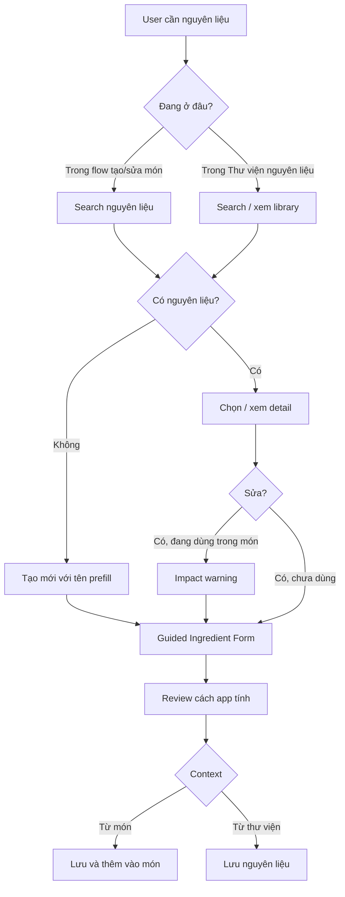

# Ingredient Add/Edit UX Redesign Research — Recipe, Pantry, Nutrition Patterns

Ngày: 2026-04-29  
Vai trò: Senior Business Analyst + Senior Software Architect + Mobile UX Architect  
Scope: research pattern chuẩn từ app/web liên quan và đề xuất redesign mockup `Ingredient Add/Edit` cho HealthMate AI.

> **Phase 1.5A sync note — 2026-04-29:** File này là **UX evidence / UX rationale**, không phải source-of-truth kỹ thuật cuối cùng. Với implementation Pantry & Measurement, ưu tiên PRD `F-02.5`, `docs/3-design/data-model.md`, `docs/4-architecture/business-rules.md`, ADR `2026-04-29-phase-1-5a-pantry-measurement.md`, và `docs/5-development/phase-1.5a-pantry-measurement.md`. Các thuật ngữ cũ kiểu `ingredient_unit.factor_to_basis` trong research ban đầu đã được diễn giải lại theo target `ingredient_measurement`; `ingredient_unit` chỉ còn là compatibility/migration layer cho Phase 1.

---

## 1. Executive Summary

Nhận xét của user là đúng: nếu nhìn từ các app nutrition/recipe/pantry lớn, việc bắt user nhìn trực tiếp section **“Tính dinh dưỡng theo 100g/100ml”** ngay trong form chính là không tự nhiên.

Điểm quan trọng cần tách bạch:

- `100g/100ml` vẫn đúng về **data model** và **business rule** của HealthMate AI.
- Nhưng `100g/100ml` không nên là **mental model chính** của user khi nhập nguyên liệu.
- Pattern chuẩn hơn là: user nhập theo **ngữ cảnh đời thực** trước, app âm thầm chuẩn hoá về canonical model sau.

Pattern tổng hợp từ evidence:

| Pattern chuẩn | Evidence | Bài học cho HealthMate AI |
|---|---|---|
| Recipe-first / dish-first | Paprika, Recipe Keeper, Crouton, Mela, MyFitnessPal, YAZIO | Nguyên liệu thường xuất hiện trong ngữ cảnh món/recipe/meal, không phải CRUD database chính. |
| Ingredient list dùng text tự nhiên | Crouton | Ingredient line nhấn mạnh amount + unit: `1 cup`, `2 eggs`, `1 tsp`; không expose conversion factor. |
| Servings/scale là action gần ingredients | Crouton, Mela | Các hành động liên quan lượng/serving nằm gần recipe ingredients, không phải form master-data dài. |
| Pantry/inventory dùng chip/search/voice | SuperCook | Quản lý nguyên liệu đời thường ưu tiên search, category chip, add/remove/paste, voice; rất ít field kỹ thuật. |
| Nutrition custom food cần preview trước save | Cronometer | Khi phải nhập dinh dưỡng, cần preview/review rõ: serving display, energy summary, macro preview, nutrition label. |
| Product/package entry nên dùng serving wording | Cronometer web | User hiểu `1 cup = 227g`, `Bar – 120g`, không hiểu `factor_to_basis`. |
| Grocery/product catalog dùng product card | Grocy/Product screenshots | Product entry có ảnh, barcode/pack size/price; phù hợp packaged food, không phù hợp làm main ingredient form V1 nếu scope là món ăn. |

Kết luận thiết kế:

> Redesign nên dùng **context-aware guided sheet/page**: cùng một form nhưng tự đổi theo ngữ cảnh `tạo từ món`, `thêm vào thư viện`, hoặc `sửa global từ thư viện`. UI hỏi user bằng ngôn ngữ đời thực, còn phần canonical `100g/100ml` chuyển xuống dạng “App sẽ chuẩn hoá để tính chính xác”.

---

## 2. Source of Truth nội bộ

### Product Vision

Product Vision xác định:

- HealthMate AI là **AI coach**, không phải app quản trị database.
- Nguyên tắc: **AI-first, không form-first**.
- Tương tác hằng ngày nên `<10 giây`.
- Beginner phải thấy đơn giản, pro vẫn có data chi tiết.

### PRD Core Nutrition

PRD F-01/F-02 xác định:

- Nguyên liệu là dữ liệu nền để tính món ăn.
- `Quản lý` mở `Món ăn` trước; `Thư viện nguyên liệu` là supporting library.
- Ingredient nutrition canonical theo `100g` hoặc `100ml`.
- Unit/serving/khẩu phần chỉ là conversion layer.
- Tạo nguyên liệu thường xảy ra trong context tạo/sửa món khi search không có.
- Sửa nguyên liệu từ thư viện là global edit và cần impact warning nếu đang dùng trong món.

### Business Rules

- Dish total luôn derived từ `dish_with_totals`.
- Không có Quick Add/manual total trong V1.
- `dish_ingredient` phải normalize amount qua resolver.
- Không silent convert `g ↔ ml` nếu thiếu `ingredient_unit.factor_to_basis` hoặc `density_g_per_ml`.
- Approximate unit được phép nhưng phải hiển thị `≈` / `ước lượng`.

---

## 3. Evidence Sources

### 3.1 Nutrition/custom food apps

| App | Source | Evidence local | Confidence | Pattern |
|---|---|---|---|---|
| Cronometer Mobile | Official support image | `docs/5-development/ingredient-uiux-evidence-assets/cronometer-mobile-create-food-step1.png` | High | Nutrient Review trước save; serving display `Bar – 120g`; CTA `Save Food` / `Save & Add to Diary`. |
| Cronometer Web | Official support image | `docs/5-development/ingredient-uiux-evidence-assets/cronometer-web-custom-food.png` | High | Custom food editor group fields + Nutrition Facts preview; serving size `1 cup — 227g`. |
| MyFitnessPal | Official marketing/App Store | `docs/5-development/ingredient-uiux-evidence-assets/play-myfitnesspal-diary-logging-01.png` | Medium–High | Meal-context `Log` buttons; food add/log nằm trong bữa ăn. |
| YAZIO/FatSecret/Lose It! | Official marketing/App Store | existing evidence folder | Medium | Diary/meal add context, macro preview, scan/photo/voice direction. |

### 3.2 Recipe manager / cooking apps

Evidence mới tải về:

`docs/5-development/ingredient-management-pattern-evidence-assets/`

| App/Web | Evidence | Confidence | Pattern nhìn thấy |
|---|---|---|---|
| Paprika | `paprika-01..05.png`, official App Store screenshots + website text | Medium–High | Recipe list/search, recipe manager; website nói ingredients tự động combine trong grocery: `1 egg + 2 eggs = 3 eggs`. |
| Recipe Keeper | `recipe-keeper-01..05.png`, official App Store screenshots + website text | Medium–High | Recipe organization, add/search; website nhấn import recipe/photo, shopping list từ ingredients. |
| Crouton | `crouton-01..05.png`, official App Store screenshots | Medium–High | Recipe detail có `Ingredients`, `Scale`, grocery action; ingredient lines như `1 cup`, `2 large eggs`, `1 tsp`. |
| Mela | `mela-01..05.png`, official App Store screenshots | Medium–High | Recipe detail có servings, Cook/Groceries/Adjust actions; action gần context recipe. |
| SuperCook | `supercook-01..04.jpg`, official App Store screenshots | Medium–High | Pantry nguyên liệu: add/remove/paste ingredients, voice input, category chips, `See Recipes`. |
| Grocy | `grocy-01..05.png`, official App Store screenshots + website | Medium | Product/grocery catalog, barcode/product lookup, stock/shopping/recipe intelligence. |
| Mealie | official docs/github text | Medium–High | Recipe manager/meal planner/shopping lists, smart/fuzzy search, import recipes. |
| Tandoor | official docs text | Medium–High | Merge/rename ingredients/tags/units, support fractions/decimals, power-user recipe manager. |

---

## 4. Những pattern chuẩn nhất cho “quản lý nguyên liệu”

### Pattern A — Ingredient không phải form đầu tiên, search/chọn trước

Evidence:

- SuperCook: ô `add/remove/paste ingredients`, category chips, voice input.
- Cronometer web: sidebar search custom foods trước khi editor.
- Mealie/Tandoor docs: smart/fuzzy search, merge/rename ingredients/units.

Áp dụng:

```text
Search nguyên liệu trước
→ Nếu có: chọn/use/edit detail
→ Nếu không có: tạo mới với tên prefill
```

Lợi ích:

- Giảm duplicate.
- Đúng mental model user: “tìm trứng” trước, không phải “mở form tạo record ingredient”.
- Dễ phát triển: có thể dùng search hiện tại, sau thêm fuzzy matching.

---

### Pattern B — Ingredient entry là “guided create”, không phải database form

Evidence:

- Recipe/cooking apps hiển thị ingredient dưới dạng text tự nhiên: `1 cup`, `2 eggs`, `1 tsp`.
- Cronometer dùng serving wording: `Bar – 120g`, `1 cup — 227g`.

Áp dụng:

Thay section:

```text
Tính dinh dưỡng theo [100g] [100ml]
Đơn vị có thể nhập khi thêm vào món
```

Bằng guided question:

```text
Bạn có thông tin dinh dưỡng từ đâu?
- AI gợi ý theo tên nguyên liệu
- Theo nhãn 100g/100ml
- Theo khẩu phần/bao bì
- Tôi chỉ biết cách đo khi nấu
```

Sau đó UI hiện đúng field cần nhập, không show toàn bộ field kỹ thuật.

---

### Pattern C — Serving/unit nên là “cách user dùng khi nấu”

Evidence:

- Crouton: ingredient list tách amount/unit rõ ràng: `1 cup`, `2`, `1 tsp`.
- Cronometer web: `Serving Size: 1 cup = 227g`.
- SuperCook: ingredient pantry dùng chip tên nguyên liệu, không bắt nhập conversion ngay.

Áp dụng:

```text
Bạn thường dùng nguyên liệu này bằng đơn vị nào?
[gram] [ml] [quả] [lát] [muỗng canh] [muỗng cà phê] [chén] [gói]

Nếu chọn quả/lát/gói:
1 quả ≈ [60] g
```

Mapping kỹ thuật:

- `1 quả ≈ 60g` → `ingredient_unit.factor_to_basis = 60`, `is_approximate = true/false` tuỳ source.
- `1 ml = 1ml` → global unit hoặc ingredient unit cùng dimension.
- `density_g_per_ml` chỉ là advanced fallback.

---

### Pattern D — Nutrition cần preview/review trước save

Evidence:

- Cronometer Mobile: `Nutrient Review`, Energy Summary, Macro Targets, CTA rõ.
- Cronometer Web: Nutrition Facts preview bên cạnh editor.

Áp dụng:

Mỗi form nên có card:

```text
Xem lại cách app sẽ tính
Dinh dưỡng lưu chuẩn: 155 kcal / 100g
Đơn vị mặc định: 1 quả ≈ 60g
Nếu thêm 2 quả vào món: khoảng 186 kcal
Protein 15.6g · Carb 1.3g · Fat 13.2g
```

Lợi ích:

- User hiểu kết quả trước khi lưu.
- Dễ phát hiện nhập sai conversion: ví dụ `1 quả = 600g` sẽ preview calories bất thường.
- Giữ canonical model nhưng không ép user hiểu model đó.

---

### Pattern E — Context-aware CTA

Evidence:

- Cronometer có `Save Food` và `Save & Add to Diary`.
- MyFitnessPal/YAZIO/FatSecret add/log theo meal context.
- Recipe apps đặt action gần recipe detail/grocery/adjust.

Áp dụng cho HealthMate AI:

| Context | CTA chính |
|---|---|
| Tạo từ món | `Lưu và thêm vào món` |
| Tạo từ thư viện | `Lưu nguyên liệu` |
| Sửa từ thư viện | `Lưu thay đổi` |
| Sửa ingredient đang dùng | `Lưu thay đổi global` + warning |

---

### Pattern F — Technical advanced fields phải ẩn

Evidence:

- Không app consumer nào expose trực tiếp `factor_to_basis` hoặc `density_g_per_ml` trên main form.
- Grocy là power-user product/stock app, nhưng cũng nhấn barcode/product lookup, không ép user tính conversion ngay.

Áp dụng:

- `density_g_per_ml` đặt trong accordion `Tuỳ chọn nâng cao`.
- `nutrition_basis_unit` không gọi là “basis” ở UI chính.
- `factor_to_basis` không xuất hiện bằng tên kỹ thuật.
- Field advanced chỉ mở khi user cần “Quy đổi g ↔ ml”.

---

## 5. Flow đề xuất cho HealthMate AI

### 5.1 Flow tổng thể



### 5.2 Cấu trúc form mới

```text
1. Header theo context
   - Từ món: “Tạo nguyên liệu cho món Cơm trứng”
   - Từ thư viện: “Thêm nguyên liệu”
   - Edit: “Sửa nguyên liệu”

2. Tên + nhóm
   - Tên nguyên liệu
   - Nhóm
   - Source chip: AI / manual / seed / package

3. Bạn có thông tin dinh dưỡng từ đâu?
   - AI gợi ý
   - Nhãn 100g/100ml
   - Khẩu phần/bao bì
   - Chưa có, nhập đơn vị trước

4. Dynamic nutrition input
   - Nếu AI: show suggested card + confirm/edit
   - Nếu 100g/100ml: show calories/macro fields
   - Nếu khẩu phần/bao bì: show “1 khẩu phần = ?g/ml” + nutrition per serving, app tự quy đổi
   - Nếu chưa có: explain cần bổ sung dinh dưỡng trước khi lưu chính thức

5. Cách bạn thường đo khi nấu
   - g/ml default
   - quick unit chips: quả/lát/muỗng/chén/gói/tép/củ/nhúm
   - conversion in human wording

6. Preview
   - Dinh dưỡng chuẩn app sẽ lưu
   - Default unit
   - Ví dụ khi thêm vào món
   - Macro preview

7. Advanced
   - Density g/ml
   - thêm unit phức tạp
   - provenance/source note

8. CTA context-aware
```

### 5.3 Vì sao flow này “world-class” hơn

| Tiêu chí | Form hiện tại | Form đề xuất |
|---|---|---|
| Mental model | Developer-first: basis/unit/density | User-first: nguồn dữ liệu + cách đo khi nấu |
| Số bước | Một form dài nhưng cognitive load cao | Một màn progressive, field hiện theo lựa chọn |
| Technical fit | Đúng schema | Vẫn đúng schema, không cần đổi DB lớn |
| Beginner | Dễ rối | Có câu hỏi dẫn đường |
| Pro user | Có đủ field | Có advanced section |
| Context | Add/Edit giống nhau | CTA/copy đổi theo context |
| Data quality | Dễ nhập sai conversion mà không biết | Preview giúp phát hiện sai |
| Future AI | AI là add-on | AI là entry option tự nhiên |

---

## 6. Mapping UI mới sang model hiện có

| UI mới | Model hiện có | Ghi chú |
|---|---|---|
| Tên nguyên liệu | `ingredient.name` | Required |
| Nhóm | `ingredient.category` | Enum PRD |
| “Nhãn 100g” | `nutrition_basis_unit = 'g'`, quantity 100 | Persist canonical |
| “Nhãn 100ml” | `nutrition_basis_unit = 'ml'`, quantity 100 | Persist canonical |
| “1 khẩu phần 30g = 120 kcal” | calories quy đổi thành 400 kcal/100g | Không persist `per serving` basis |
| “1 quả ≈ 60g” | `ingredient_unit.factor_to_basis = 60` | `unit_id='piece'`, label `quả` |
| “1 muỗng canh = 15ml” | global unit hoặc ingredient_unit | Tuỳ unit table hiện tại |
| “ước lượng” | `is_approximate = true` | UI hiển thị `≈` |
| AI gợi ý | `source='ai'` cho create | Nếu user edit sau → source policy theo business rules/PRD |
| Sửa seed/user/AI | `source` update policy | RULE-INGREDIENT-PROVENANCE còn TBD cho seed edit, cần resolve sau |
| Preview calories | derived UI helper | Không persist |

---

## 7. Recommended mockup update

Cập nhật `phase-1-ingredient-edit.html` từ 6 trạng thái cũ thành các trạng thái mới:

1. **Tạo từ món — search không có → guided create**
   - Context chip: `Đang thêm vào món: Cơm trứng`
   - CTA: `Lưu và thêm vào món`

2. **Tạo từ thư viện — manual guided**
   - Header: `Thêm nguyên liệu`
   - CTA: `Lưu nguyên liệu`

3. **Nhập từ bao bì/khẩu phần — conversion preview**
   - Ví dụ: `1 lát phô mai 20g = 65 kcal`
   - Preview: `App sẽ lưu: 325 kcal / 100g`

4. **AI suggestion — confirm/edit**
   - Card AI gợi ý nutrition + units
   - User confirm trước khi save

5. **Sửa global — impact warning**
   - Card đang dùng trong N món
   - CTA `Lưu thay đổi global`

6. **Validation & abnormal warning**
   - Thiếu calories/unit
   - Conversion bất thường: `1 quả = 600g?`

7. **Saving state**
   - Disable form + spinner.

---

## 8. Recommendation cuối cùng

Không nên hỏi user “có muốn 100g/100ml hay không” như một choice chính, vì đó là constraint kỹ thuật đã đúng theo PRD.

Choice UX đúng nên là:

> User nhập dữ liệu từ đâu, và UI giúp họ quy đổi ra chuẩn app như thế nào?

Vì vậy mockup mới nên dùng copy:

```text
App sẽ chuẩn hoá dữ liệu để tính chính xác trong món.
Bạn không cần nhớ công thức — chỉ nhập thông tin bạn đang có.
```

Thay cho:

```text
Tính dinh dưỡng theo [100g] [100ml]
```

Trên UI chính, `100g/100ml` chỉ nên xuất hiện ở review card hoặc helper text:

```text
Chuẩn app sẽ lưu: 155 kcal / 100g
```

Không nên là section title chính.
