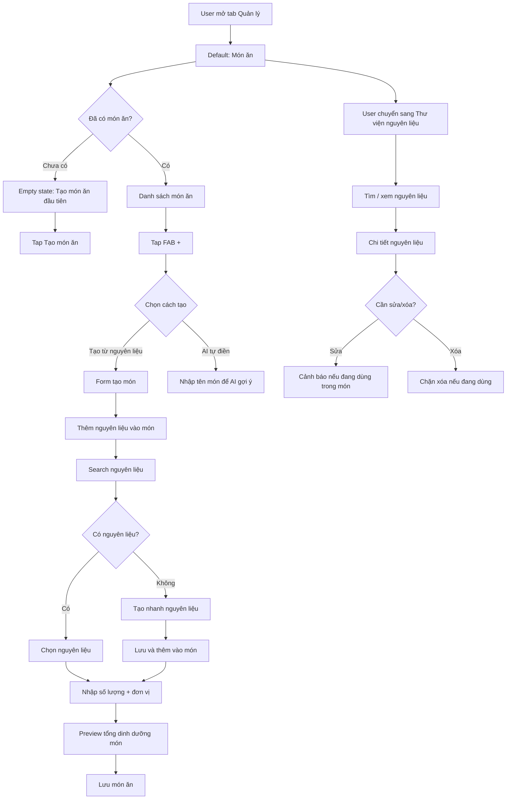
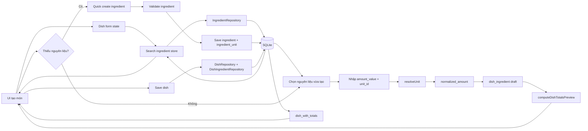

# Đề xuất redesign toàn diện flow UX tab Quản lý

> Context: hiện tại `Quản lý` mở mặc định tab `Nguyên liệu`, cạnh bên là tab `Món ăn`. Người dùng đang bị kéo vào tư duy quản trị database nguyên liệu trước khi làm mục tiêu thật là tạo/sửa món ăn và lập kế hoạch ăn.

---

## 0. Source docs đã đối chiếu lại

Sau khi rà lại document gốc, redesign này phải bám các điểm sau:

| Source | Điểm bắt buộc |
|---|---|
| `docs/1-vision/product-vision.md` | HealthMate AI là AI coach cho người Việt; nguyên tắc: **AI-first, không form-first**, tương tác hằng ngày mục tiêu **<10 giây**, beginner phải thấy đơn giản, pro vẫn có data chi tiết, local-first. |
| `docs/2-requirements/prd.md` — F-01 | `Thư viện Nguyên liệu` là supporting library; ingredient nutrition canonical theo `100g` hoặc `100ml`; unit chỉ là conversion/input layer. |
| `docs/2-requirements/prd.md` — F-02 | `Món ăn` là flow chính; total nutrition derived từ `dish_with_totals`; Quick Add/manual total bị loại khỏi V1. |
| `docs/4-architecture/business-rules.md` | Không silent convert g↔ml; resolve unit qua `ingredient_unit.factor_to_basis` → `density_g_per_ml` → reject. |
| `docs/3-design/data-model.md` | Entity nền: `ingredient`, `unit`, `ingredient_unit`, `dish`, `dish_ingredient`, `dish_with_totals`. |

Điều chỉnh quan trọng: nếu UI hỏi “khẩu phần trên bao bì”, đó chỉ là **helper nhập liệu** để quy đổi về `100g/100ml` trước khi lưu. Phase 1 không tạo nutrition basis kiểu `per serving`.

---

## 1. Kết luận đề xuất

Đề xuất redesign theo hướng:

```text
Món ăn là trung tâm.
Nguyên liệu là thư viện hỗ trợ, không phải luồng chính.
```

Cụ thể:

1. Đổi default tab trong `Quản lý` từ `Nguyên liệu` sang `Món ăn`.
2. Đổi thứ tự segment từ mô hình cũ:

   ```text
   Nguyên liệu | Món ăn
   ```

   sang mô hình mới:

   ```text
   Món ăn | Thư viện nguyên liệu
   ```

3. Flow tạo mới chính phải là `Tạo món ăn`, không phải `Thêm nguyên liệu`.
4. Nguyên liệu được tạo/chọn chủ yếu trong flow tạo món.
5. Vẫn giữ màn hình/thư viện nguyên liệu để sửa dữ liệu sai, nhưng hạ cấp vai trò và đổi wording để bớt cảm giác CRUD kỹ thuật.

---

## 2. Vì sao cần đổi?

### 2.1. Vấn đề UX hiện tại

Hiện tại user vào `Quản lý` và thấy `Nguyên liệu` đầu tiên. Điều này tạo ra mental model:

```text
Muốn dùng app → phải quản lý nguyên liệu trước → rồi mới tạo món.
```

Đây là flow nặng, vì người dùng phổ thông thường không nghĩ theo kiểu:

```text
Tôi cần tạo master data nguyên liệu.
```

Họ nghĩ:

```text
Tôi muốn lưu món cơm trứng.
Tôi muốn biết món này bao nhiêu calories.
Tôi muốn dùng món đó trong lịch ăn.
```

### 2.2. Bằng chứng implementation hiện tại

Trong code hiện tại:

- `src/app/features/management/management.page.ts`
  - `managementTabs` đang khai báo thứ tự `Nguyên liệu` trước, `Món ăn` sau.
  - `tab = signal<ManagementTab>('ingredients')` nên vào trang sẽ mở nguyên liệu trước.
- `src/app/features/management/management.page.html`
  - UI render nhánh `ingredients` trước, sau đó mới đến nhánh `dishes`.
  - Empty state của nguyên liệu nói: “Bắt đầu thêm nguyên liệu để quản lý dinh dưỡng.”

Như vậy implementation hiện tại đang đẩy người dùng vào luồng quản trị nguyên liệu trước.

### 2.3. Mâu thuẫn với mục tiêu sản phẩm

HealthMate AI là app meal planning / nutrition assistant. Primary object nên là:

```text
Món ăn / bữa ăn / lịch ăn
```

Không phải:

```text
Nguyên liệu như một database CRUD độc lập
```

Nguyên liệu vẫn rất quan trọng về data model, nhưng về UX nó nên là layer hỗ trợ.

---

## 3. Information Architecture mới

### 3.1. Trước

```text
Quản lý
├── Nguyên liệu
│   ├── Danh sách nguyên liệu
│   ├── Thêm nguyên liệu
│   └── Sửa nguyên liệu
└── Món ăn
    ├── Danh sách món ăn
    ├── Tạo từ nguyên liệu
    └── AI tự điền
```

### 3.2. Sau đề xuất

```text
Quản lý
├── Món ăn
│   ├── Danh sách món ăn
│   ├── Tạo món thủ công
│   │   ├── Thêm nguyên liệu vào món
│   │   ├── Search nguyên liệu
│   │   ├── Tạo nhanh nguyên liệu nếu thiếu
│   │   └── Review tổng dinh dưỡng món
│   ├── AI tự điền món
│   └── Sửa món ăn
└── Thư viện nguyên liệu
    ├── Tìm nguyên liệu
    ├── Xem chi tiết nguyên liệu
    ├── Sửa thông tin nguyên liệu
    └── Xóa nếu chưa được dùng
```

Điểm khác biệt chính:

```text
Nguyên liệu không biến mất.
Nhưng nguyên liệu không còn là cổng vào chính.
```

---

## 4. Flow chính mới: tạo món ăn

### 4.1. Entry point

Khi vào `Quản lý`, user thấy tab `Món ăn` đầu tiên.

Empty state nên là:

```text
Chưa có món ăn nào
Tạo món đầu tiên để dùng trong lịch ăn và theo dõi dinh dưỡng.

[ Tạo món ăn ]
```

Không nên bắt đầu bằng:

```text
Thêm nguyên liệu đầu tiên
```

### 4.2. FAB behavior

Ở tab `Món ăn`, FAB mở menu:

```text
+ Tạo món ăn
  ├── Tạo từ nguyên liệu
  │   Tự chọn nguyên liệu, app tính dinh dưỡng
  └── AI gợi ý từ tên món
      Nhập tên món, AI đề xuất nguyên liệu và lượng dùng
```

Đây là behavior hiện tại đã có một phần, nên redesign không cần phá architecture.

### 4.3. Flow tạo từ nguyên liệu

```text
Quản lý
→ Món ăn
→ +
→ Tạo từ nguyên liệu
→ Nhập tên món
→ Thêm nguyên liệu
→ Search nguyên liệu
   → Có kết quả: chọn nguyên liệu
   → Không có: tạo nhanh nguyên liệu
→ Nhập số lượng + đơn vị trong món
→ App preview calories/macro từng dòng
→ App preview tổng món
→ Lưu món
```

### 4.4. Khi thiếu nguyên liệu

Khi search không có nguyên liệu, UI nên nói:

```text
Không tìm thấy “Trứng cút”
Bạn có thể tạo nhanh nguyên liệu này rồi dùng ngay trong món.

[ Tạo nhanh và thêm vào món ]
```

Không nên điều hướng user ra một CRUD nguyên liệu độc lập rồi bỏ context món ăn. Đây là điểm bám Product Vision: user muốn hoàn tất bữa/món nhanh, không bị biến thành người quản trị database.

### 4.5. Tạo nhanh nguyên liệu trong context món

Form tạo nhanh nên chỉ hỏi đủ dữ liệu để dùng được trong món, nhưng vẫn phải lưu đúng canonical model của PRD:

```text
1. Tên / nhóm
2. Dữ liệu dinh dưỡng đang có theo gì?
   - 100g
   - 100ml
   - Khẩu phần trên bao bì → hỏi thêm khẩu phần đó nặng/đong bao nhiêu để quy đổi về 100g/100ml trước khi lưu
3. Khi nấu ăn bạn thường đo bằng gì?
   - gram
   - ml
   - quả
   - muỗng
   - cốc
4. Review app sẽ tính như sau
5. [Lưu và thêm vào món]
```

CTA phải là:

```text
Lưu và thêm vào món
```

Không phải chỉ:

```text
Lưu nguyên liệu
```

---

## 5. Flow phụ mới: Thư viện nguyên liệu

### 5.1. Vai trò mới

`Nguyên liệu` nên đổi tên thành:

```text
Thư viện nguyên liệu
```

Lý do:

- “Nguyên liệu” nghe như một tab CRUD chính.
- “Thư viện nguyên liệu” nói rõ đây là nơi lưu dữ liệu nền để dùng trong món.

### 5.2a. Flow sửa trực tiếp từ Thư viện nguyên liệu

Không giữ flow cũ kiểu tap card mở thẳng form sửa. Flow mới:

```text
Thư viện nguyên liệu
→ Tap nguyên liệu
→ Chi tiết nguyên liệu/read-only
→ Xem dinh dưỡng + đơn vị thường dùng + món đang dùng
→ [Sửa thông tin]
→ Nếu đang dùng trong món: cảnh báo impact
→ Form sửa nguyên liệu
→ Lưu thay đổi global
```

Rule V1: `Sửa nguyên liệu = sửa global`. Các món đang dùng nguyên liệu đó sẽ derive lại tổng calories/macro qua `dish_with_totals`. Không làm “chỉ sửa cho món này” ở V1 vì cần clone/version/snapshot ingredient.

### 5.2. Thư viện nguyên liệu để làm gì?

Chỉ phục vụ các nhu cầu sau:

1. Tìm nguyên liệu đã lưu.
2. Xem dinh dưỡng và đơn vị quy đổi.
3. Sửa dữ liệu nếu nhập sai.
4. Xóa nguyên liệu nếu chưa dùng ở món nào.
5. Kiểm tra nguyên liệu đang được dùng trong món nào.

### 5.3. Không nên để `Thêm nguyên liệu` là primary CTA quá mạnh

Trong tab thư viện, CTA có thể vẫn có nhưng wording nên đổi:

```text
+ Tạo nguyên liệu riêng
```

hoặc:

```text
+ Thêm vào thư viện
```

Không nên để người dùng hiểu đây là bước bắt buộc trước khi tạo món.

### 5.4. Detail-first thay vì edit-first

Khi tap vào nguyên liệu trong thư viện, không nên mở ngay form sửa dài.

Nên mở màn detail:

```text
Trứng gà

Dinh dưỡng
100g = 155 kcal
Protein 13g · Carb 1.1g · Fat 11g

Đơn vị thường dùng
1 quả ≈ 60g

Đang dùng trong 4 món
- Cơm trứng
- Bánh mì trứng
- Salad trứng
- Trứng luộc

[ Sửa thông tin ]
[ Xóa nguyên liệu ]
```

Lợi ích:

- User hiểu nguyên liệu này ảnh hưởng gì trước khi sửa.
- Giảm nguy cơ sửa nhầm dữ liệu làm đổi calories của nhiều món.

---

## 6. Quy tắc sửa/xóa nguyên liệu

### 6.1. Sửa nguyên liệu

Cho phép sửa, nhưng nếu nguyên liệu đang được dùng trong món thì phải cảnh báo impact:

```text
Nguyên liệu này đang được dùng trong 4 món.
Nếu bạn sửa dinh dưỡng hoặc đơn vị quy đổi, tổng calories của các món đó có thể thay đổi.

[Tiếp tục sửa]
[Hủy]
```

V1 nên dùng rule đơn giản:

```text
Sửa global → tất cả món dùng nguyên liệu này tự cập nhật theo dữ liệu mới.
```

Lý do: hiện architecture đã có `dish_with_totals` derive từ ingredient, nên phù hợp với rule này.

### 6.2. Xóa nguyên liệu

Nếu nguyên liệu chưa dùng:

```text
Cho xóa.
```

Nếu nguyên liệu đang dùng:

```text
Không cho xóa.
Hiển thị danh sách món đang dùng.
```

Message đề xuất:

```text
Không thể xóa “Trứng gà”
Nguyên liệu này đang được dùng trong 4 món.
Hãy gỡ nguyên liệu khỏi các món trước khi xóa.

[ Xem các món đang dùng ]
[ Đóng ]
```

---

## 7. Các màn hình nên có sau redesign

### 7.1. Quản lý / Món ăn list

```text
Header: Quản lý
Segment: Món ăn | Thư viện nguyên liệu
Search: Tìm món ăn
Filter optional: Tất cả / Bữa sáng / Bữa trưa / Bữa tối / Yêu thích
List card:
  - Tên món
  - kcal / khẩu phần
  - P/C/F
  - số phần
  - source: Gợi ý / Tự tạo
FAB: +
```

### 7.2. Tạo/Sửa món ăn

```text
Tên món
Số phần ăn
Nhóm bữa nếu có

Nguyên liệu trong món
+ Thêm nguyên liệu

Tổng dinh dưỡng preview
Calories / Protein / Carb / Fat

[ Lưu món ăn ]
```

### 7.3. Search ingredient trong món

```text
Thêm nguyên liệu vào món
Search nguyên liệu

Kết quả:
- Trứng gà
  155 kcal / 100g · 1 quả ≈ 60g

Không thấy?
[ Tạo nhanh nguyên liệu mới ]
```

### 7.4. Tạo nhanh nguyên liệu

```text
Tạo nhanh “Trứng cút”

Thông tin cơ bản
Dữ liệu dinh dưỡng bạn đang có
Khi nấu ăn bạn đo bằng gì
Review calculation

[ Lưu và thêm vào món ]
```

### 7.5. Thư viện nguyên liệu

```text
Search nguyên liệu
Filter nhóm
List nguyên liệu
Tap → detail
```

### 7.6. Chi tiết nguyên liệu

```text
Thông tin nguyên liệu
Dinh dưỡng chuẩn
Đơn vị thường dùng
Món đang dùng

[ Sửa thông tin ]
[ Xóa nguyên liệu ]
```

---

## 8. User Flow Diagram



---

## 9. Data Flow mới



---

## 10. Implementation impact mức cao

### 10.1. Thay đổi nhỏ nhưng hiệu quả lớn

Các thay đổi nên làm trước:

1. Default tab = `dishes`.
2. Đổi thứ tự segment: `Món ăn` trước, `Thư viện nguyên liệu` sau.
3. Đổi wording empty state.
4. Đổi placeholder / CTA để nhấn mạnh món ăn là flow chính.
5. Trong tab thư viện, đổi `Nguyên liệu` thành `Thư viện nguyên liệu`.

### 10.2. Thay đổi trung bình

1. Tạo ingredient từ context dish với CTA `Lưu và thêm vào món`.
2. Khi tạo ingredient từ dish, sau save tự động quay lại dish form và thêm vào draft.
3. Ingredient search trong dish có empty state tạo nhanh.
4. Ingredient row trong dish hiển thị calories contribution.

### 10.3. Thay đổi lớn

1. Tách màn `Ingredient detail` khỏi `Ingredient edit`.
2. Thêm impact preview khi sửa ingredient đang được dùng.
3. Có flow “sửa global” hoặc “tạo bản sao riêng cho món này”.
4. Thêm policy versioning/snapshot nếu sau này cần giữ calories lịch sử.

---

## 11. Roadmap đề xuất

### Phase UX-1: Reframe Quản lý thành Món ăn-first

Mục tiêu: đổi mental model ngay, ít rủi ro kỹ thuật.

Tasks:

1. Đổi default tab sang `dishes`.
2. Đổi thứ tự tab sang `Món ăn | Thư viện nguyên liệu`.
3. Đổi copy empty state.
4. Đổi FAB label/aria label nếu cần.
5. Đảm bảo list, search, delete dialog vẫn hoạt động.

Done khi:

- Vào `Quản lý` thấy `Món ăn` trước.
- Empty state hướng user tạo món ăn.
- User vẫn có thể chuyển sang thư viện nguyên liệu.

### Phase UX-2: Contextual ingredient creation trong tạo món

Mục tiêu: user tạo món mà thiếu nguyên liệu thì tạo nhanh và dùng ngay.

Tasks:

1. Trong dish edit, ingredient picker có search-first UX.
2. Empty result có CTA `Tạo nhanh nguyên liệu`.
3. Quick-create ingredient nhận context `returnToDish`.
4. Save ingredient xong tự chọn nguyên liệu vừa tạo trong dish draft.
5. CTA là `Lưu và thêm vào món`.

Done khi:

- User không phải rời context món khi thiếu nguyên liệu.
- Nguyên liệu mới được lưu vào DB và xuất hiện trong thư viện.
- Dish draft nhận ingredient mới ngay.

### Phase UX-3: Ingredient detail & impact guard

Mục tiêu: vẫn cho quản lý nguyên liệu nhưng an toàn, dễ hiểu.

Tasks:

1. Tap ingredient mở detail read-only.
2. Detail hiển thị nutrition, units, dishes using ingredient.
3. Nút `Sửa thông tin` mở edit form.
4. Nếu ingredient đang dùng, hiện impact warning trước khi edit/save.
5. Delete blocked nếu đang dùng.

Done khi:

- User hiểu sửa nguyên liệu sẽ ảnh hưởng món nào.
- Không xóa nhầm nguyên liệu đang được dùng.

---

## 12. Recommendation cuối cùng

Nên giải quyết triệt để theo hướng:

```text
Không bỏ nguyên liệu.
Không để nguyên liệu làm flow chính.
Đưa Món ăn lên làm trung tâm.
Biến Nguyên liệu thành Thư viện hỗ trợ + tạo nhanh trong context món.
```

Đây là hướng cân bằng nhất vì:

1. UX tự nhiên như app lớn: user tạo/log món trước.
2. Vẫn giữ data model đúng: ingredient là source of truth cho nutrition.
3. Không làm user bị kẹt khi nhập sai nguyên liệu.
4. Không biến app thành database manager.
5. Ít phá architecture hiện tại vì code đã có `dish`, `ingredient`, `dish_ingredient`, `resolveUnit`, `dish_with_totals`.

---

## 13. Decision cần chốt trước khi implement

Khuyến nghị chọn mặc định:

```text
Option C — Hybrid món ăn-first
```

Chi tiết:

```text
Quản lý mở Món ăn trước.
Segment: Món ăn | Thư viện nguyên liệu.
Tạo nguyên liệu chủ yếu từ flow tạo món.
Thư viện nguyên liệu vẫn tồn tại để xem/sửa/xóa có kiểm soát.
```

Nếu đã chốt hướng này, bước tiếp theo nên là dựng UX demo riêng cho `Quản lý` mới với 4 màn:

1. Món ăn list default.
2. Tạo món ăn.
3. Search/tạo nhanh nguyên liệu trong món.
4. Thư viện nguyên liệu detail.
