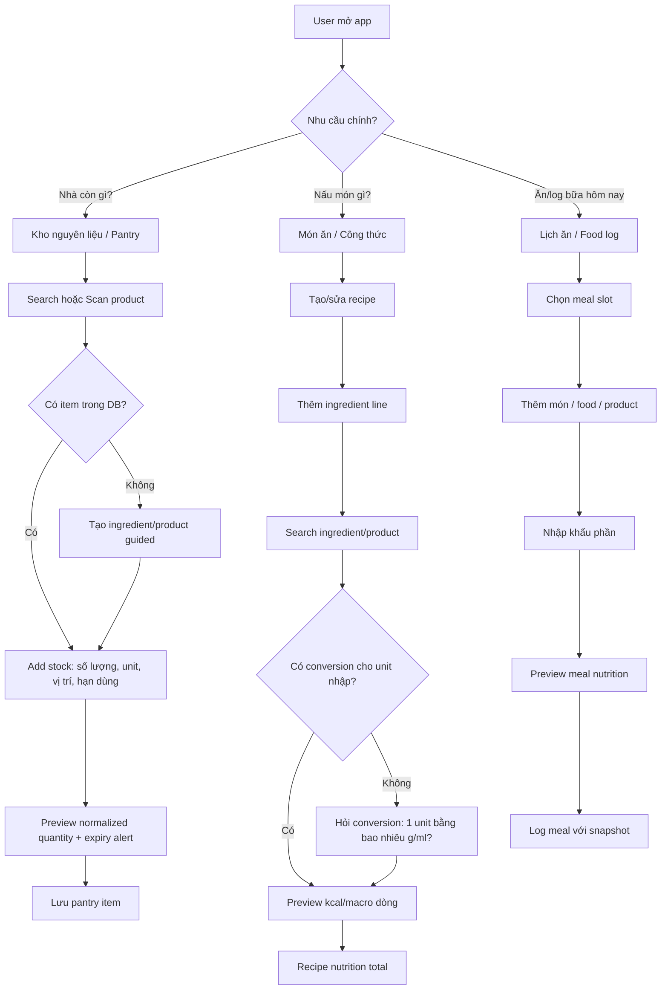
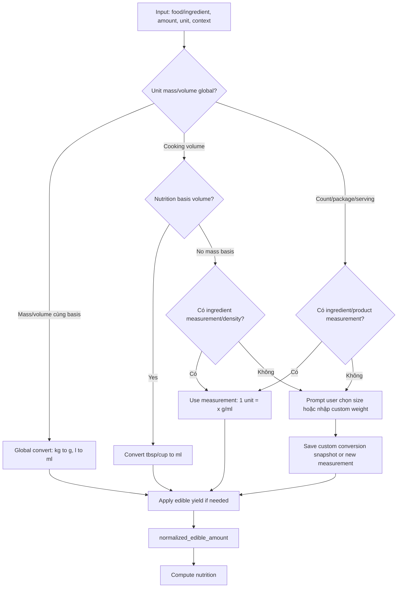
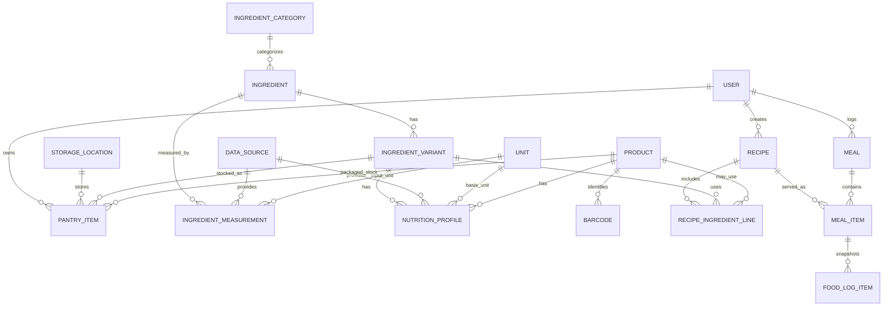

# Flow UX + Data Model chuẩn cho Meal / Recipe / Pantry / Ingredient / Nutrition

Ngày: 2026-04-29  
Vai trò: Senior Business Analyst + Senior Software Architect + UX Flow Architect  
Scope: nghiên cứu pattern từ recipe app, meal planning app, pantry app, grocery list app, nutrition tracking app; đề xuất UX flow + data model chuẩn cho app quản lý bữa ăn, món ăn, công thức nấu ăn, nguyên liệu hằng ngày, tồn kho, hạn dùng, vị trí lưu trữ, đơn vị và dinh dưỡng.

---

## 1. Executive Summary

Bài toán này không nên thiết kế theo kiểu một bảng `Ingredient` đơn giản rồi cố nhét mọi thứ vào đó. Một app quản lý ăn uống hằng ngày cần tách rõ 5 lớp:

| Lớp | Câu hỏi user | Entity chính | Ghi chú |
|---|---|---|---|
| **Food identity** | Đây là thực phẩm/nguyên liệu gì? | `ingredient`, `product`, `ingredient_variant` | Ví dụ: cà chua, trứng gà, sữa Vinamilk 1L. |
| **Nutrition profile** | Dinh dưỡng tính theo chuẩn nào? | `nutrition_profile` | Có thể per `100g`, `100ml`, `1 piece`, `serving`, nhưng nên normalize về mass/volume khi có thể. |
| **Measurement/conversion** | User đo bằng gì? | `ingredient_measurement` | `1 quả cà chua ≈ 120g`, `1 cup bột mì ≈ 120g`, `1 cup sữa ≈ 240ml`. Conversion phải theo từng ingredient/variant/state. |
| **Pantry stock** | Nhà mình đang có bao nhiêu, để ở đâu, hạn khi nào? | `pantry_item`, `storage_location`, `stock_lot` | Lưu input gốc + normalized quantity + expiry. |
| **Usage in recipe/meal/log** | Món/bữa này dùng bao nhiêu? | `recipe_ingredient_line`, `meal_item`, `food_log_item` | Lưu quantity + unit + conversion snapshot + nutrition snapshot tùy context. |

Điểm quan trọng nhất:

> Các đơn vị như `piece/quả/trái/củ/tép/cup/tbsp/tsp/pack/bottle/serving` **không thể dùng conversion global**. Chúng phải là measurement riêng theo từng ingredient, trạng thái, size và đôi khi theo product/package.

Ví dụ:

- `1 piece` cà chua ≈ 120g, nhưng `1 piece` dưa hấu có thể 4–6kg gross.
- `1 clove/tép` tỏi ≈ 3g, nhưng `1 tuber/củ` khoai tây medium ≈ 213g.
- `1 cup` bột mì ≈ 120g, nhưng `1 cup` sữa ≈ 240ml.
- `1 serving` cereal, protein bar, sữa chua, mì gói đều phụ thuộc package/product.

Do đó data model chuẩn nên có:

1. `unit` global chỉ định nghĩa loại đơn vị và global factor cho mass/volume thật sự (`g`, `kg`, `ml`, `l`) và có thể cho cooking volume (`tsp`, `tbsp`, `cup`) nếu dùng như volume; nhưng conversion sang gram vẫn cần ingredient-specific density/measurement.
2. `ingredient_measurement` / `ingredient_unit_conversion` theo từng ingredient + state + size option + unit.
3. `conversion_snapshot` trên recipe line / pantry item / food log để giữ lại quy đổi tại thời điểm user nhập.
4. `nutrition_snapshot` cho food log / historical meal; recipe/dish đang active có thể derive live, nhưng log lịch sử nên snapshot.
5. `edible_yield_ratio` để phân biệt gross weight và edible weight.
6. `ingredient_variant/state` để phân biệt raw/cooked/peeled/chopped/canned/dried vì dinh dưỡng và conversion có thể khác nhau.

---

## 2. Pattern tổng hợp từ app/web liên quan

### 2.1 Nguồn tham khảo đã đối chiếu

| Nhóm | App/Web | Evidence / pattern | Confidence |
|---|---|---|---|
| Nutrition tracker | Cronometer | Custom food có serving size, nutrition review, Nutrition Facts preview | High |
| Nutrition tracker | MyFitnessPal, YAZIO, FatSecret, Lose It! | Add/log theo meal context, barcode/photo/scan, macro preview | Medium–High |
| Nutrition database/API | USDA FoodData Central | Food portions có gram weight theo modifier: egg small/medium/large, watermelon cup/wedge, potato small/medium/large | High |
| Product/barcode database | Open Food Facts | Product có `quantity`, `serving_size`, `serving_quantity`, nutriments `_100g` và `_serving` | High |
| Recipe manager | Paprika, Recipe Keeper, Crouton, Mela | Recipe-first, ingredient lines tự nhiên, grocery list từ recipe, serving/scale gần ingredient | Medium–High |
| Pantry/ingredient discovery | SuperCook | Pantry dùng search/chip/category/voice; ingredient inventory tối giản field kỹ thuật | Medium–High |
| Grocery/stock | Grocy | Product/stock/barcode, quantity, location, shopping list, recipe integration | Medium |
| Open-source recipe | Mealie, Tandoor | Recipe manager, meal planner, shopping list, smart search, merge/rename ingredients/units | Medium–High |

### 2.2 Pattern tốt nhất rút ra

| Pattern | Vì sao quan trọng | Cách áp dụng |
|---|---|---|
| **Search/scan trước, create sau** | Giảm duplicate, giảm nhập tay | Search ingredient/product DB → scan barcode → nếu không có mới tạo custom. |
| **Recipe/dish-first** | User thường nghĩ “tôi nấu món gì” trước, không nghĩ “tôi quản trị database ingredient” | Trong flow tạo món, thiếu ingredient thì tạo nhanh rồi quay lại món. |
| **Pantry là stock, không phải nutrition source** | Nhà còn bao nhiêu là một vấn đề khác với dinh dưỡng chuẩn | `pantry_item` lưu lot, quantity, expiry, location; không trộn vào `ingredient`. |
| **Serving/unit là measurement layer** | `cup`, `piece`, `serving` phụ thuộc ingredient/product | Dùng `ingredient_measurement` thay vì global factor. |
| **Preview trước khi save** | User phát hiện conversion/nutrition sai | Sau khi nhập amount/unit, show kcal/macro preview và normalized quantity. |
| **Advanced fields ẩn** | Beginner không nên thấy `density`, `factor`, `yield` ngay | UI nói “1 quả ≈ 120g”, “phần ăn được 60%”. Technical field nằm trong advanced/details. |
| **Snapshot cho lịch sử** | Dinh dưỡng ingredient có thể sửa sau; log bữa cũ không nên thay đổi tùy tiện | `food_log_item`/`meal_item` nên lưu nutrition snapshot; recipe active có thể derive live. |
| **State/variant tách riêng** | Raw vs cooked/dried/canned khác nutrition và conversion | Có `ingredient_variant` hoặc `food_state` trong nutrition/conversion. |

---

## 3. Flow UX tổng quan

### 3.1 Information Architecture đề xuất

```text
Dashboard
├─ Hôm nay ăn gì / meal plan
├─ Pantry alerts: sắp hết, sắp hết hạn
└─ Quick actions: scan, thêm món, thêm nguyên liệu đang có

Quản lý
├─ Món ăn / Công thức
│  ├─ Danh sách món
│  ├─ Tạo món
│  └─ Recipe detail + ingredient lines + nutrition preview
├─ Kho nguyên liệu
│  ├─ Đang có
│  ├─ Sắp hết hạn
│  ├─ Theo vị trí: Tủ lạnh / Tủ đông / Kệ bếp
│  └─ Add stock: search / scan / manual
└─ Thư viện dữ liệu
   ├─ Nguyên liệu chuẩn
   ├─ Product đóng gói / barcode
   └─ Unit & conversion review

Lịch ăn / Food log
├─ Ngày / Tuần
├─ Bữa sáng / trưa / tối / phụ
├─ Thêm món đã lưu
└─ Log nhanh food/product/ingredient
```

### 3.2 User Flow Diagram tổng quan



---

## 4. Wireflow / màn hình chính

### 4.1 Pantry list — “Nhà mình đang có gì?”

```text
Kho nguyên liệu
[Search: cà chua, trứng, sữa...] [Scan barcode]

Sắp hết hạn
- Sữa tươi · 500ml còn lại · Tủ lạnh · hết hạn 2 ngày nữa
- Cà chua · 4 quả ≈ 480g · Tủ lạnh · hết hạn 3 ngày nữa

Theo vị trí
[Tủ lạnh] [Tủ đông] [Kệ bếp] [Gia vị]

Cards:
Cà chua
4 quả ≈ 480g còn lại
Dùng được cho: Salad, Canh chua
[+ Nhập thêm] [Dùng trong món]
```

### 4.2 Add pantry item — search/scan/manual

```text
Thêm nguyên liệu đang có
Bạn muốn thêm gì?
[Search tên hoặc scan barcode]

Kết quả:
- Cà chua · Rau củ · 18 kcal/100g
- Cà chua bi · Rau củ · 27 kcal/100g
- Tomato canned product · Barcode verified

Không thấy?
[+ Tạo nguyên liệu/product mới]
```

### 4.3 Guided ingredient/product create

```text
Tạo nguyên liệu
1. Đây là gì?
Tên, category, trạng thái: raw/cooked/peeled/chopped/canned/dried

2. Bạn có dữ liệu dinh dưỡng từ đâu?
[AI gợi ý] [Nhãn 100g/100ml] [Bao bì/khẩu phần] [Tôi chỉ biết cách đo]

3. Dinh dưỡng
Calories / Protein / Carbs / Fat / Fiber
hoặc nhập serving: 1 gói 52g = 200 kcal

4. Bạn thường đo bằng gì?
[g] [ml] [quả] [củ] [tép] [cup] [tbsp] [tsp] [serving]
Nếu unit phụ thuộc ingredient:
1 quả medium ≈ 120g
1 cup chopped ≈ 180g

5. Phần ăn được nếu có
Gross: 1 trái ≈ 5kg
Edible yield: 60%
App dùng edible ≈ 3kg để tính dinh dưỡng

6. Review
Chuẩn app sẽ lưu: 18 kcal/100g edible raw
Nếu nhập 2 quả medium: 240g gross → 240g edible nếu yield áp dụng theo piece đã edible / hoặc 144g edible nếu piece là gross
```

### 4.4 Recipe editor

```text
Tạo món: Salad cà chua trứng
Servings: [2]

Nguyên liệu
+ Cà chua 2 quả medium ≈ 240g → 43 kcal
+ Trứng gà 2 quả large ≈ 100g edible → 143 kcal
+ Dầu olive 1 tbsp = 15ml → 133 kcal

Tổng món: 319 kcal
Mỗi phần: 160 kcal
Protein 13g · Carbs 12g · Fat 24g

[+ Thêm nguyên liệu]
[Lưu món]
```

### 4.5 Add ingredient line to recipe

```text
Thêm vào món
[Search ingredient]
Chọn: Cà chua · raw · 18 kcal/100g

Số lượng
[2] [quả medium]
App hiểu: 2 × 120g = 240g edible
Preview: 43 kcal · P 2.2g · C 9.4g · F 0.5g

Nếu thiếu conversion:
App hỏi: “1 quả cà chua của bạn khoảng bao nhiêu gram?”
[80g nhỏ] [120g vừa] [180g lớn] [Tự nhập]
```

### 4.6 Meal planning / food log

```text
Thứ Tư, 29/04
Sáng · 420 / 500 kcal
+ Trứng ốp la · 1 phần · 220 kcal
+ Sữa tươi · 250ml · 155 kcal
[+ Thêm món]

Trưa · 650 / 700 kcal
[+ Thêm món từ thư viện] [AI gợi ý từ pantry]

Khi log:
- Chọn món Salad cà chua trứng
- Servings ăn: 1.5
- Preview: 240 kcal
- Save food log snapshot
```

---

## 5. Form nhập nguyên liệu / pantry item

Cần tách **Ingredient Master Form** và **Pantry Stock Form**.

### 5.1 Ingredient Master Form — dữ liệu chuẩn

| Field | Required | Loại | Ý nghĩa | Ghi chú UX |
|---|---:|---|---|---|
| `name` | ✅ | text | Tên nguyên liệu | Search duplicate trước khi tạo. |
| `category_id` | ✅ | FK | Nhóm nguyên liệu | Rau củ, trái cây, thịt, trứng sữa... |
| `state` | ✅ | enum | raw/cooked/peeled/chopped/canned/dried/frozen | Nên có variant thay vì chỉ field text nếu nutrition khác. |
| `default_nutrition_profile_id` | ✅ | FK | Profile mặc định để tính | Có thể đổi khi user chọn raw/cooked. |
| `default_measurement_id` | ✅ | FK | Unit hay dùng | Ví dụ cà chua default “quả medium”. |
| `source_confidence` | ✅ | enum | verified/estimated/user_custom/ai_estimated | Dùng badge tin cậy. |
| `data_source_id` | optional | FK | USDA/OFF/AI/manual | Traceability. |
| `notes` | optional | text | Ghi chú user | Không đưa vào MVP nếu muốn gọn. |

### 5.2 Nutrition Profile Form

| Field | Required | Loại | Ý nghĩa | Rule |
|---|---:|---|---|---|
| `basis_type` | ✅ | enum | `per_100g`, `per_100ml`, `per_piece`, `per_serving` | Internal có thể nhận nhiều loại, nhưng calculation cần normalize. |
| `basis_quantity` | ✅ | number | 100 hoặc serving amount | Nếu per serving phải có serving gram/ml. |
| `basis_unit_id` | ✅ | FK unit | g/ml/piece/serving | `piece/serving` phải có conversion. |
| `calories` | ✅ | number | kcal per basis | Min 0. |
| `protein_g` | optional | number | g per basis | Min 0. |
| `carbs_g` | optional | number | g per basis | Min 0. |
| `fat_g` | optional | number | g per basis | Min 0. |
| `fiber_g` | optional | number | g per basis | Min 0. |
| `sugar_g` | advanced | number | g per basis | Useful later. |
| `sodium_mg` | advanced | number | mg per basis | Useful later. |
| `serving_size_value` | conditional | number | 1 serving = ? | Required nếu basis per serving/piece. |
| `serving_size_unit_id` | conditional | FK unit | g/ml/piece | Required nếu basis per serving/piece. |
| `normalized_basis_unit` | derived | g/ml | Unit canonical | Derived after conversion. |
| `normalized_calories_per_100` | derived | number | kcal/100g hoặc kcal/100ml | Dễ query/compute. |

Khuyến nghị architecture:

- Cho phép lưu raw source `basis_type = per_serving/per_piece` để provenance.
- Đồng thời lưu normalized values `*_per_100g` hoặc `*_per_100ml` để tính nhanh, nhất quán.
- Nếu không có conversion từ serving/piece sang g/ml thì profile không được dùng cho precise calculation; chỉ dùng estimated/manual prompt.

### 5.3 Measurement / Unit Conversion Form

| Field | Required | Loại | Ý nghĩa | Ví dụ |
|---|---:|---|---|---|
| `unit_id` | ✅ | FK unit | Unit user nhập | piece, cup, tbsp, serving |
| `display_label` | optional | text | Nhãn Việt | quả, trái, củ, tép |
| `state` | optional | enum | raw/chopped/peeled/cooked | `cup chopped` khác `cup whole`. |
| `size_option` | optional | enum | small/medium/large/custom | Egg/potato/tomato. |
| `quantity_per_unit` | ✅ | number | 1 unit = ? | 120 |
| `quantity_unit_id` | ✅ | g/ml | Convert sang mass/volume | 120g |
| `applies_to` | ✅ | enum | gross/edible | Conversion là gross hay phần ăn được. |
| `edible_yield_ratio` | optional | 0–1 | Nếu conversion gross, phần ăn được | Watermelon 0.6. |
| `is_default` | ✅ | boolean | Unit mặc định | 1 medium tomato. |
| `is_approximate` | ✅ | boolean | Có ước lượng không | true nếu average. |
| `confidence` | ✅ | enum | verified/estimated/user_custom | Badge. |
| `source_id` | optional | FK | USDA/user/OFF | Trace. |

### 5.4 Pantry Stock Form — nhà đang có gì

| Field | Required | Loại | Ý nghĩa |
|---|---:|---|---|
| `ingredient_id` hoặc `product_id` | ✅ | FK | Item đang có. |
| `variant/state` | conditional | FK/enum | Nếu item có raw/cooked/frozen. |
| `input_quantity_value` | ✅ | number | User nhập gốc: 4. |
| `input_unit_id` | ✅ | FK unit | quả, g, ml, bottle. |
| `measurement_id` | conditional | FK | Conversion được dùng. |
| `size_option` | optional | enum | small/medium/large/custom. |
| `gross_quantity` | derived | number | Tổng gross g/ml nếu có. |
| `edible_quantity` | derived | number | Phần ăn được để tính dinh dưỡng. |
| `remaining_quantity` | ✅ | number | Còn lại bao nhiêu theo normalized basis. |
| `storage_location_id` | ✅ | FK | Tủ lạnh, tủ đông, kệ bếp. |
| `expiry_date` | optional | date | Hạn dùng. |
| `purchase_date` | optional | date | Ngày mua. |
| `opened_at` | optional | datetime | Mở bao bì. |
| `lot_status` | ✅ | enum | active/consumed/expired/discarded. |
| `conversion_snapshot_json` | ✅ | JSON | Quy đổi đã dùng lúc nhập. |

---

## 6. Quản lý đơn vị tính và quy đổi

### 6.1 Phân loại unit

| Unit type | Ví dụ | Global conversion? | Ghi chú |
|---|---|---:|---|
| Mass | g, kg, oz, lb | ✅ | Convert về g. |
| Volume | ml, l, fl oz | ✅ | Convert về ml. |
| Cooking volume | tsp, tbsp, cup | ✅ sang ml, ❌ sang g | `1 cup = 240ml`, nhưng gram phụ thuộc ingredient/density. |
| Count | piece, quả, trái, củ, tép, slice | ❌ | Phải theo ingredient + size/state. |
| Package | pack, bottle, can, jar, box | ❌ | Phải theo product/packaging. |
| Serving | serving, portion, bar | ❌ | Phải theo product/nutrition profile. |
| Approximate | pinch, handful, bunch | ❌ | Cho phép nhưng phải mark `≈`. |

### 6.2 Resolver chuẩn



### 6.3 Conversion snapshot

Mỗi lần user dùng một conversion vào stock/recipe/log, nên lưu snapshot:

```json
{
  "input_quantity": 2,
  "input_unit_id": "piece",
  "display_label": "quả medium",
  "measurement_id": "tomato_piece_medium_raw",
  "measurement_version": 3,
  "quantity_per_unit": 120,
  "quantity_unit_id": "g",
  "applies_to": "edible",
  "edible_yield_ratio": 1,
  "is_approximate": true,
  "source": "USDA/user_estimate",
  "normalized_edible_amount": 240,
  "normalized_unit_id": "g"
}
```

Tại sao cần snapshot:

- Nếu sau này user sửa `1 quả cà chua medium` từ 120g thành 130g, recipe/log cũ có thể giữ số cũ nếu cần lịch sử chính xác.
- Recipe template có thể chọn update live hoặc freeze theo version.
- Food log lịch sử nên freeze.

### 6.4 Khi thiếu conversion

UX rule:

```text
App không đoán âm thầm.
App hỏi user bằng câu đơn giản:
“1 quả cà chua của bạn khoảng bao nhiêu gram?”
[Nhỏ 80g] [Vừa 120g] [Lớn 180g] [Tự nhập]
```

System rule:

- Không lưu recipe line/stock precise nếu không resolve được normalized amount.
- Có thể cho lưu draft với status `needs_conversion`, nhưng không tính nutrition authoritative.
- Nếu user nhập custom weight một lần, hỏi:
  - “Chỉ dùng lần này” → lưu snapshot only.
  - “Nhớ cho cà chua medium” → tạo/update `ingredient_measurement`.

### 6.5 Gross weight vs edible weight

Cần tách 2 câu hỏi:

1. “Bạn đang có/mua bao nhiêu?” → gross stock.
2. “Phần ăn được để tính dinh dưỡng là bao nhiêu?” → edible amount.

Ví dụ dưa hấu:

```text
Bạn mua: 1 trái ≈ 5kg gross
Phần ăn được: khoảng 60%
App tính dinh dưỡng: 3kg edible
```

Rule:

```text
edible_amount = gross_amount × edible_yield_ratio
nutrition_amount = edible_amount
stock_remaining có thể tracking gross hoặc edible tùy product policy, nhưng phải ghi rõ basis.
```

---

## 7. Data model / database schema đề xuất

> Đây là model đích đầy đủ hơn Phase 1 hiện tại. Có thể implement theo từng giai đoạn; không nhất thiết thay toàn bộ ngay.

### 7.1 Entity Relationship Diagram



### 7.2 Core tables

#### user

```sql
CREATE TABLE user (
  id TEXT PRIMARY KEY,
  display_name TEXT,
  locale TEXT NOT NULL DEFAULT 'vi-VN',
  created_at TEXT NOT NULL,
  updated_at TEXT
);
```

#### ingredient_category

```sql
CREATE TABLE ingredient_category (
  id TEXT PRIMARY KEY,
  name_vi TEXT NOT NULL,
  name_en TEXT,
  parent_id TEXT REFERENCES ingredient_category(id),
  display_order INTEGER NOT NULL DEFAULT 0
);
```

#### ingredient

```sql
CREATE TABLE ingredient (
  id TEXT PRIMARY KEY,
  name TEXT NOT NULL,
  canonical_name TEXT,
  category_id TEXT NOT NULL REFERENCES ingredient_category(id),
  default_variant_id TEXT,
  source_type TEXT NOT NULL CHECK (source_type IN ('verified_db','open_data','ai_estimated','user_custom')),
  confidence TEXT NOT NULL CHECK (confidence IN ('verified','estimated','user_custom')),
  created_by_user_id TEXT REFERENCES user(id),
  created_at TEXT NOT NULL,
  updated_at TEXT,
  UNIQUE(canonical_name, category_id)
);
```

#### ingredient_variant

```sql
CREATE TABLE ingredient_variant (
  id TEXT PRIMARY KEY,
  ingredient_id TEXT NOT NULL REFERENCES ingredient(id) ON DELETE CASCADE,
  state TEXT NOT NULL CHECK (state IN ('raw','cooked','peeled','chopped','canned','dried','frozen','drained','roasted','boiled')),
  form TEXT,                         -- whole, diced, sliced, minced, powder...
  preparation_note TEXT,
  default_nutrition_profile_id TEXT,
  default_measurement_id TEXT,
  is_default INTEGER NOT NULL DEFAULT 0,
  created_at TEXT NOT NULL,
  updated_at TEXT,
  UNIQUE(ingredient_id, state, form)
);
```

#### unit

```sql
CREATE TABLE unit (
  id TEXT PRIMARY KEY,                -- g, kg, ml, l, tsp, tbsp, cup, piece, clove, tuber, pack, bottle, serving
  name_vi TEXT NOT NULL,
  short_name_vi TEXT NOT NULL,
  unit_type TEXT NOT NULL CHECK (unit_type IN ('mass','volume','cooking_volume','count','package','serving','approximate')),
  base_unit_id TEXT,                  -- g hoặc ml nếu global convert được
  base_factor REAL,                   -- kg=1000g, l=1000ml, tbsp=15ml, tsp=5ml, cup=240ml
  is_global_convertible INTEGER NOT NULL DEFAULT 0,
  requires_food_specific_conversion INTEGER NOT NULL DEFAULT 0,
  is_approximate INTEGER NOT NULL DEFAULT 0,
  display_order INTEGER NOT NULL DEFAULT 0
);
```

#### ingredient_measurement

```sql
CREATE TABLE ingredient_measurement (
  id TEXT PRIMARY KEY,
  ingredient_id TEXT NOT NULL REFERENCES ingredient(id) ON DELETE CASCADE,
  variant_id TEXT REFERENCES ingredient_variant(id) ON DELETE CASCADE,
  unit_id TEXT NOT NULL REFERENCES unit(id),
  display_label TEXT,                 -- quả medium, củ nhỏ, cup chopped, lát, serving
  size_option TEXT CHECK (size_option IN ('small','medium','large','custom','not_applicable')),
  quantity_per_unit REAL NOT NULL,    -- 1 unit = ?
  quantity_unit_id TEXT NOT NULL REFERENCES unit(id), -- g hoặc ml
  applies_to TEXT NOT NULL CHECK (applies_to IN ('gross','edible')),
  edible_yield_ratio REAL CHECK (edible_yield_ratio > 0 AND edible_yield_ratio <= 1),
  is_default INTEGER NOT NULL DEFAULT 0,
  is_approximate INTEGER NOT NULL DEFAULT 1,
  confidence TEXT NOT NULL CHECK (confidence IN ('verified','estimated','user_custom')),
  data_source_id TEXT REFERENCES data_source(id),
  version INTEGER NOT NULL DEFAULT 1,
  created_at TEXT NOT NULL,
  updated_at TEXT
);
```

#### nutrition_profile

```sql
CREATE TABLE nutrition_profile (
  id TEXT PRIMARY KEY,
  ingredient_variant_id TEXT REFERENCES ingredient_variant(id) ON DELETE CASCADE,
  product_id TEXT REFERENCES product(id) ON DELETE CASCADE,

  basis_type TEXT NOT NULL CHECK (basis_type IN ('per_100g','per_100ml','per_piece','per_serving')),
  basis_quantity REAL NOT NULL,
  basis_unit_id TEXT NOT NULL REFERENCES unit(id),

  -- source values as provided
  calories REAL NOT NULL,
  protein_g REAL NOT NULL DEFAULT 0,
  carbs_g REAL NOT NULL DEFAULT 0,
  fat_g REAL NOT NULL DEFAULT 0,
  fiber_g REAL NOT NULL DEFAULT 0,
  sugar_g REAL,
  sodium_mg REAL,

  -- normalized for calculation when resolvable
  normalized_basis_unit_id TEXT CHECK (normalized_basis_unit_id IN ('g','ml')),
  calories_per_100 REAL,
  protein_per_100 REAL,
  carbs_per_100 REAL,
  fat_per_100 REAL,
  fiber_per_100 REAL,

  serving_size_value REAL,
  serving_size_unit_id TEXT REFERENCES unit(id),
  serving_measurement_id TEXT REFERENCES ingredient_measurement(id),

  data_source_id TEXT REFERENCES data_source(id),
  confidence TEXT NOT NULL CHECK (confidence IN ('verified','estimated','user_custom','ai_estimated')),
  is_default INTEGER NOT NULL DEFAULT 0,
  created_at TEXT NOT NULL,
  updated_at TEXT,
  CHECK ((ingredient_variant_id IS NOT NULL) OR (product_id IS NOT NULL))
);
```

#### product + barcode

```sql
CREATE TABLE product (
  id TEXT PRIMARY KEY,
  ingredient_id TEXT REFERENCES ingredient(id),
  name TEXT NOT NULL,
  brand TEXT,
  package_quantity REAL,
  package_unit_id TEXT REFERENCES unit(id),
  serving_size_text TEXT,             -- "0.333 package (52 g)"
  data_source_id TEXT REFERENCES data_source(id),
  confidence TEXT NOT NULL,
  created_at TEXT NOT NULL,
  updated_at TEXT
);

CREATE TABLE barcode (
  id TEXT PRIMARY KEY,
  product_id TEXT NOT NULL REFERENCES product(id) ON DELETE CASCADE,
  barcode_value TEXT NOT NULL UNIQUE,
  barcode_type TEXT CHECK (barcode_type IN ('EAN','UPC','QR','OTHER'))
);
```

#### storage_location

```sql
CREATE TABLE storage_location (
  id TEXT PRIMARY KEY,
  user_id TEXT REFERENCES user(id),
  name TEXT NOT NULL,                 -- Tủ lạnh, Tủ đông, Kệ bếp
  type TEXT CHECK (type IN ('fridge','freezer','pantry','spice_rack','custom')),
  display_order INTEGER NOT NULL DEFAULT 0
);
```

#### pantry_item / stock_lot

```sql
CREATE TABLE pantry_item (
  id TEXT PRIMARY KEY,
  user_id TEXT NOT NULL REFERENCES user(id),
  ingredient_variant_id TEXT REFERENCES ingredient_variant(id),
  product_id TEXT REFERENCES product(id),
  storage_location_id TEXT NOT NULL REFERENCES storage_location(id),

  input_quantity_value REAL NOT NULL,
  input_unit_id TEXT NOT NULL REFERENCES unit(id),
  measurement_id TEXT REFERENCES ingredient_measurement(id),
  size_option TEXT,

  gross_quantity REAL,
  gross_unit_id TEXT REFERENCES unit(id),
  edible_quantity REAL,
  edible_unit_id TEXT REFERENCES unit(id),
  remaining_edible_quantity REAL,

  conversion_snapshot_json TEXT NOT NULL,
  purchase_date TEXT,
  opened_at TEXT,
  expiry_date TEXT,
  status TEXT NOT NULL CHECK (status IN ('active','consumed','expired','discarded')) DEFAULT 'active',
  created_at TEXT NOT NULL,
  updated_at TEXT,
  CHECK ((ingredient_variant_id IS NOT NULL) OR (product_id IS NOT NULL))
);
```

#### recipe + recipe_ingredient_line

```sql
CREATE TABLE recipe (
  id TEXT PRIMARY KEY,
  user_id TEXT REFERENCES user(id),
  name TEXT NOT NULL,
  description TEXT,
  servings REAL NOT NULL DEFAULT 1,
  source_type TEXT CHECK (source_type IN ('manual','ai','imported','db')),
  instructions TEXT,
  image_url TEXT,
  created_at TEXT NOT NULL,
  updated_at TEXT
);

CREATE TABLE recipe_ingredient_line (
  id TEXT PRIMARY KEY,
  recipe_id TEXT NOT NULL REFERENCES recipe(id) ON DELETE CASCADE,
  ingredient_variant_id TEXT REFERENCES ingredient_variant(id),
  product_id TEXT REFERENCES product(id),
  pantry_item_id TEXT REFERENCES pantry_item(id),

  input_text TEXT,                    -- "2 quả cà chua medium"
  quantity_value REAL NOT NULL,
  unit_id TEXT NOT NULL REFERENCES unit(id),
  measurement_id TEXT REFERENCES ingredient_measurement(id),
  size_option TEXT,

  normalized_edible_quantity REAL NOT NULL,
  normalized_unit_id TEXT NOT NULL CHECK (normalized_unit_id IN ('g','ml')),
  conversion_snapshot_json TEXT NOT NULL,

  -- optional: freeze if recipe versioning desired
  nutrition_snapshot_json TEXT,
  sort_order INTEGER NOT NULL DEFAULT 0,
  CHECK ((ingredient_variant_id IS NOT NULL) OR (product_id IS NOT NULL))
);
```

#### meal + meal_item + food_log_item

```sql
CREATE TABLE meal (
  id TEXT PRIMARY KEY,
  user_id TEXT NOT NULL REFERENCES user(id),
  date TEXT NOT NULL,
  meal_type TEXT NOT NULL CHECK (meal_type IN ('breakfast','lunch','dinner','snack')),
  created_at TEXT NOT NULL,
  UNIQUE(user_id, date, meal_type)
);

CREATE TABLE meal_item (
  id TEXT PRIMARY KEY,
  meal_id TEXT NOT NULL REFERENCES meal(id) ON DELETE CASCADE,
  recipe_id TEXT REFERENCES recipe(id),
  ingredient_variant_id TEXT REFERENCES ingredient_variant(id),
  product_id TEXT REFERENCES product(id),
  servings REAL,
  quantity_value REAL,
  unit_id TEXT REFERENCES unit(id),
  conversion_snapshot_json TEXT,
  nutrition_snapshot_json TEXT NOT NULL,
  created_at TEXT NOT NULL,
  CHECK ((recipe_id IS NOT NULL) OR (ingredient_variant_id IS NOT NULL) OR (product_id IS NOT NULL))
);
```

#### data_source

```sql
CREATE TABLE data_source (
  id TEXT PRIMARY KEY,
  source_type TEXT NOT NULL CHECK (source_type IN ('USDA','OpenFoodFacts','Nutritionix','AI','User','CuratedDB')),
  external_id TEXT,
  source_url TEXT,
  license TEXT,
  fetched_at TEXT,
  raw_payload_json TEXT
);
```

---

## 8. Quy tắc tính dinh dưỡng

### 8.1 Công thức chung

```text
normalized_edible_amount = resolve(amount, unit, ingredient/product, state, size)

nutrition_factor = normalized_edible_amount / normalized_profile_basis_quantity

calories = profile.calories_normalized * nutrition_factor
protein = profile.protein_normalized * nutrition_factor
carbs = profile.carbs_normalized * nutrition_factor
fat = profile.fat_normalized * nutrition_factor
```

Nếu profile normalized per 100g/100ml:

```text
calories = calories_per_100 × normalized_edible_amount / 100
```

### 8.2 Case nutrition per 100g

Ví dụ cà chua raw:

```text
Profile: 18 kcal / 100g edible raw
Input: 2 quả medium
Measurement: 1 quả medium = 120g edible
normalized = 2 × 120 = 240g
Calories = 18 × 240 / 100 = 43.2 kcal
```

### 8.3 Case nutrition per 100ml

Ví dụ sữa:

```text
Profile: 62 kcal / 100ml
Input: 1 cup
Global volume: 1 cup = 240ml
Calories = 62 × 240 / 100 = 148.8 kcal
```

Nếu user nhập `g` cho sữa:

```text
Cần density hoặc measurement: 1g ≈ 0.97ml, hoặc reject.
Không được tự đoán 1g = 1ml nếu chưa có source/policy.
```

### 8.4 Case nutrition per 1 piece

Ví dụ trứng gà:

Có 2 cách lưu hợp lệ:

**Cách A — raw source per piece, normalized song song**

```text
Source: 1 large egg = 50g edible = 72 kcal
Store source basis: per_piece
Normalize: 72 / 50 × 100 = 144 kcal/100g
Measurement: 1 large egg = 50g edible
```

**Cách B — chỉ store canonical per 100g**

```text
Profile: 143 kcal/100g
Measurement: 1 large egg = 50g edible
Input 2 eggs: 100g → 143 kcal
```

Khuyến nghị:

- MVP: store canonical per 100g + measurement.
- Advanced: lưu source profile per piece để trace và display, nhưng calculation dùng normalized.

### 8.5 Case nutrition per serving/package

Ví dụ product Open Food Facts:

```text
Serving: 0.333 package = 52g
Nutrition source: 200 kcal / serving
Normalize: 200 / 52 × 100 = 384.6 kcal/100g
Package: 155g
```

Nếu user log `1 package`:

```text
1 package = 155g
Calories = 384.6 × 155 / 100 = 596 kcal
```

### 8.6 User nhập unit khác basis

| Input | Basis | Resolver cần gì | Action |
|---|---|---|---|
| `150g` | per 100g | global mass | OK |
| `1 cup flour` | per 100g | flour cup → grams | Need ingredient measurement; if missing ask. |
| `1 cup milk` | per 100ml | cup → ml global | OK if treating cup as volume; if product-specific bottle/cup label, use measurement. |
| `2 eggs` | per 100g | egg size → grams edible | Need measurement small/medium/large/default. |
| `1 tbsp oil` | per 100ml | tbsp → ml global | OK for volume basis; for mass basis need density/measurement. |
| `1 pack noodles` | per 100g | package product quantity | Need product/package measurement. |

### 8.7 Edible yield

```text
gross_amount = input_quantity × gross_weight_per_unit
edible_amount = gross_amount × edible_yield_ratio
nutrition uses edible_amount
```

Ví dụ dưa hấu:

```text
1 trái = 5kg gross
edible_yield = 60%
edible = 3000g
Profile watermelon flesh raw = 30 kcal/100g
Calories = 30 × 3000 / 100 = 900 kcal
```

Rule UX:

- Nếu user nhập “1 trái dưa hấu” cho pantry, show both:
  - `Bạn mua: khoảng 5kg`
  - `Phần ăn được để tính: khoảng 3kg`
- Nếu user nhập “300g dưa hấu đã cắt”, edible yield = 1 vì input đã là edible portion.

---

## 9. Ví dụ dữ liệu mẫu

> Số nutrition/weight dưới đây dùng để minh hoạ model; khi implement cần lấy từ nguồn verified hoặc user-confirmed. USDA evidence đã xác nhận có food portions cho egg small/medium/large, watermelon cup/wedge, potato small/medium/large.

### 9.1 Cà chua

```json
{
  "ingredient": {"id":"ing_tomato", "name":"Cà chua", "category":"Rau củ"},
  "variant": {"id":"var_tomato_raw", "state":"raw", "form":"whole"},
  "nutrition_profile": {
    "basis_type":"per_100g",
    "calories_per_100":18,
    "protein_per_100":0.9,
    "carbs_per_100":3.9,
    "fat_per_100":0.2,
    "normalized_basis_unit_id":"g",
    "confidence":"verified"
  },
  "measurements": [
    {"unit":"g", "quantity_per_unit":1, "quantity_unit":"g", "applies_to":"edible", "is_default":false},
    {"unit":"piece", "display_label":"quả vừa", "size_option":"medium", "quantity_per_unit":120, "quantity_unit":"g", "applies_to":"edible", "is_default":true, "is_approximate":true}
  ]
}
```

Flow:

```text
User nhập: 2 quả vừa
Normalized: 2 × 120g = 240g edible
Calories: 18 × 240 / 100 = 43.2 kcal
```

### 9.2 Trứng gà

```json
{
  "ingredient": {"id":"ing_egg", "name":"Trứng gà", "category":"Trứng & Sữa"},
  "variant": {"id":"var_egg_raw", "state":"raw", "form":"whole"},
  "nutrition_profile": {
    "basis_type":"per_100g",
    "calories_per_100":143,
    "protein_per_100":12.6,
    "carbs_per_100":0.7,
    "fat_per_100":9.5,
    "normalized_basis_unit_id":"g",
    "data_source":"USDA SR Legacy evidence: egg portions small/medium/large"
  },
  "measurements": [
    {"unit":"piece", "display_label":"quả nhỏ", "size_option":"small", "quantity_per_unit":38, "quantity_unit":"g", "applies_to":"edible"},
    {"unit":"piece", "display_label":"quả vừa", "size_option":"medium", "quantity_per_unit":44, "quantity_unit":"g", "applies_to":"edible"},
    {"unit":"piece", "display_label":"quả lớn", "size_option":"large", "quantity_per_unit":50, "quantity_unit":"g", "applies_to":"edible", "is_default":true},
    {"unit":"dozen", "display_label":"vỉ 12 quả lớn", "quantity_per_unit":600, "quantity_unit":"g", "applies_to":"edible", "is_approximate":true}
  ]
}
```

Flow:

```text
User nhập: 2 quả lớn
Normalized: 2 × 50g = 100g
Calories: 143 kcal
```

### 9.3 Dưa hấu

```json
{
  "ingredient": {"id":"ing_watermelon", "name":"Dưa hấu", "category":"Trái cây"},
  "variant": {"id":"var_watermelon_raw_flesh", "state":"raw", "form":"flesh"},
  "nutrition_profile": {
    "basis_type":"per_100g",
    "calories_per_100":30,
    "protein_per_100":0.6,
    "carbs_per_100":7.6,
    "fat_per_100":0.2,
    "normalized_basis_unit_id":"g"
  },
  "measurements": [
    {"unit":"g", "quantity_per_unit":1, "quantity_unit":"g", "applies_to":"edible"},
    {"unit":"cup", "display_label":"cup cắt hạt lựu", "quantity_per_unit":152, "quantity_unit":"g", "applies_to":"edible", "data_source":"USDA portion evidence"},
    {"unit":"wedge", "display_label":"miếng 1/16 trái", "quantity_per_unit":286, "quantity_unit":"g", "applies_to":"edible", "data_source":"USDA portion evidence"},
    {"unit":"piece", "display_label":"1 trái vừa", "quantity_per_unit":5000, "quantity_unit":"g", "applies_to":"gross", "edible_yield_ratio":0.6, "is_approximate":true}
  ]
}
```

Flow:

```text
User thêm pantry: 1 trái vừa
Gross: 5000g
Edible: 5000 × 0.6 = 3000g
Calories edible: 30 × 3000 / 100 = 900 kcal
```

### 9.4 Khoai tây

```json
{
  "ingredient": {"id":"ing_potato", "name":"Khoai tây", "category":"Rau củ"},
  "variant": {"id":"var_potato_raw", "state":"raw", "form":"flesh_and_skin"},
  "nutrition_profile": {"basis_type":"per_100g", "calories_per_100":77, "protein_per_100":2, "carbs_per_100":17, "fat_per_100":0.1, "normalized_basis_unit_id":"g"},
  "measurements": [
    {"unit":"tuber", "display_label":"củ nhỏ", "size_option":"small", "quantity_per_unit":170, "quantity_unit":"g", "applies_to":"gross", "edible_yield_ratio":0.9},
    {"unit":"tuber", "display_label":"củ vừa", "size_option":"medium", "quantity_per_unit":213, "quantity_unit":"g", "applies_to":"gross", "edible_yield_ratio":0.9, "is_default":true},
    {"unit":"tuber", "display_label":"củ lớn", "size_option":"large", "quantity_per_unit":369, "quantity_unit":"g", "applies_to":"gross", "edible_yield_ratio":0.9},
    {"unit":"cup", "display_label":"1/2 cup cắt hạt lựu", "quantity_per_unit":75, "quantity_unit":"g", "applies_to":"edible"}
  ]
}
```

Flow:

```text
User nhập: 2 củ vừa, gọt vỏ
Gross: 2 × 213 = 426g
Edible yield: 90%
Edible: 383.4g
Calories: 77 × 383.4 / 100 = 295.2 kcal
```

### 9.5 Bột mì

```json
{
  "ingredient": {"id":"ing_flour", "name":"Bột mì", "category":"Ngũ cốc & Tinh bột"},
  "variant": {"id":"var_flour_dry", "state":"dried", "form":"powder"},
  "nutrition_profile": {"basis_type":"per_100g", "calories_per_100":364, "protein_per_100":10, "carbs_per_100":76, "fat_per_100":1, "normalized_basis_unit_id":"g"},
  "measurements": [
    {"unit":"g", "quantity_per_unit":1, "quantity_unit":"g", "applies_to":"edible", "is_default":true},
    {"unit":"cup", "display_label":"cup bột mì", "quantity_per_unit":120, "quantity_unit":"g", "applies_to":"edible", "is_approximate":true},
    {"unit":"tbsp", "display_label":"muỗng canh", "quantity_per_unit":7.5, "quantity_unit":"g", "applies_to":"edible", "is_approximate":true}
  ]
}
```

Flow:

```text
1 cup flour = 120g
Calories = 364 × 120 / 100 = 436.8 kcal
```

### 9.6 Sữa

```json
{
  "ingredient": {"id":"ing_milk", "name":"Sữa tươi", "category":"Trứng & Sữa"},
  "variant": {"id":"var_milk_liquid", "state":"raw", "form":"liquid"},
  "nutrition_profile": {"basis_type":"per_100ml", "calories_per_100":62, "protein_per_100":3.2, "carbs_per_100":4.8, "fat_per_100":3.5, "normalized_basis_unit_id":"ml"},
  "measurements": [
    {"unit":"ml", "quantity_per_unit":1, "quantity_unit":"ml", "applies_to":"edible", "is_default":true},
    {"unit":"l", "quantity_per_unit":1000, "quantity_unit":"ml", "applies_to":"edible"},
    {"unit":"cup", "display_label":"cup", "quantity_per_unit":240, "quantity_unit":"ml", "applies_to":"edible"},
    {"unit":"bottle", "display_label":"chai 1 lít", "quantity_per_unit":1000, "quantity_unit":"ml", "applies_to":"edible"}
  ]
}
```

Flow:

```text
User nhập: 1 cup
Normalized: 240ml
Calories: 62 × 240 / 100 = 148.8 kcal
```

---

## 10. Edge cases và rule quan trọng

### 10.1 Unit/conversion

| Edge case | Rule |
|---|---|
| `piece` không có conversion | Không tính nutrition; hỏi size/weight. |
| `cup` cho ingredient basis `g` nhưng không có density/measurement | Không silent convert; hỏi `1 cup ... bằng bao nhiêu g?`. |
| `serving` không có serving weight | Không cho dùng làm precise calculation. |
| User đổi measurement master sau khi recipe/log đã tồn tại | Recipe có policy update live/version; food log giữ snapshot. |
| Unit approximate như pinch/handful | Cho phép nhưng hiển thị `≈`, confidence thấp. |
| Có nhiều measurement cùng unit | Bắt user chọn size/form: small/medium/large/chopped/sliced. |
| Product barcode có serving và per 100g khác nhau | Lưu source values + normalized; preview cả serving nếu user log theo serving. |

### 10.2 Nutrition/data quality

| Edge case | Rule |
|---|---|
| Calories quá cao/thấp bất thường | Warning mềm, không block nếu user xác nhận. |
| Macro tổng gram > 100g per 100g | Warning/block tùy mức độ. |
| Protein/carbs/fat missing | Cho phép 0 nếu source không có, nhưng badge “thiếu macro”. |
| AI estimated data | Badge “ước lượng bằng AI”, user confirm trước save. |
| Verified vs user custom conflict | Ưu tiên user custom trong pantry/recipe cá nhân; giữ source trace. |

### 10.3 Pantry/stock

| Edge case | Rule |
|---|---|
| Same ingredient nhiều hạn dùng | Tách `pantry_item/stock_lot`, không gộp mất expiry. |
| Dùng recipe trừ stock | Trừ theo edible amount hoặc gross policy phải nhất quán. |
| Item đã mở bao bì | Expiry sau mở có thể khác expiry in trên bao bì — advanced. |
| Frozen/cooked leftovers | Nên là variant/state hoặc prepared food item riêng. |

### 10.4 Recipe/meal/log

| Edge case | Rule |
|---|---|
| Recipe dùng product cụ thể | Line có thể reference `product_id`, không chỉ ingredient. |
| Recipe dùng ingredient chung | Reference `ingredient_variant_id` + measurement. |
| User log 0.5 serving recipe | Nutrition = recipe total per serving × 0.5; snapshot vào meal log. |
| Ingredient nutrition sửa sau | Active recipe có thể update live; historical food log không tự thay đổi. |
| Recipe scale servings | Ingredient line amount scale theo ratio; measurement snapshot vẫn giữ. |

---

## 11. MVP nên làm trước vs nâng cao

### 11.1 MVP — nên làm trước

| Ưu tiên | Hạng mục | Lý do |
|---|---|---|
| P0 | Ingredient canonical per 100g/100ml | Nền tính nutrition đơn giản, đúng PRD hiện tại. |
| P0 | Unit global cho `g/kg/ml/l` | Bắt buộc. |
| P0 | Ingredient-specific conversion cho `piece/củ/tép/lát/cup/tbsp/tsp/serving` | Giải quyết core problem user nêu. |
| P0 | Dish/recipe ingredient line lưu input + normalized amount | Cần để tính món. |
| P0 | Preview kcal/macro sau khi nhập amount/unit | Giảm nhập sai. |
| P0 | Search-first create ingredient | Giảm duplicate. |
| P1 | Pantry item: quantity, unit, normalized, location, expiry | Đáp ứng quản lý nguyên liệu đang có. |
| P1 | Storage location: fridge/freezer/pantry | Đúng mục tiêu hằng ngày. |
| P1 | Data source/confidence badge | Tránh user tin nhầm data estimated. |
| P1 | Conversion snapshot cho recipe line/pantry item | Tránh drift khi sửa conversion. |
| P1 | Size options small/medium/large/custom | Cần cho egg/potato/tomato. |

### 11.2 Advanced — để sau MVP

| Hạng mục | Khi nào làm |
|---|---|
| Barcode scan + Open Food Facts import | Sau khi manual/product data model ổn. |
| USDA/Open Food Facts sync/cache đầy đủ | Sau MVP local-first. |
| Edible yield chi tiết theo prep/cooking loss | Khi pantry/recipe core ổn. |
| Recipe import từ website | Sau khi recipe model ổn. |
| OCR nhãn dinh dưỡng / AI parse package | Sau khi guided package form ổn. |
| Multi-user/shared pantry | Sau local-first sync/backup. |
| Cost/price tracking | Sau grocery/stock MVP. |
| Inventory decrement tự động theo recipe | Sau pantry stock lots ổn. |
| Recipe versioning nâng cao | Khi cần giữ lịch sử nhiều bản recipe. |
| Micronutrients/full nutrition label | Sau macro core stable. |

---

## 12. Recommendation cho HealthMate AI hiện tại

### 12.1 Không nên mở rộng Phase 1 bằng cách nhét mọi field vào form hiện tại

Nếu thêm ngay các field như gross weight, edible yield, raw/cooked, barcode, serving, product, stock location vào cùng form `Thêm nguyên liệu`, UX sẽ quá nặng.

Nên tách thành 3 flow:

```text
1. Tạo dữ liệu nguyên liệu chuẩn
   → name/category/state/nutrition/conversion

2. Thêm nguyên liệu đang có vào kho
   → quantity/unit/location/expiry

3. Dùng nguyên liệu trong món/bữa
   → amount/unit/preview nutrition
```

### 12.2 Model tối thiểu cần bổ sung so với Phase 1 hiện tại

Hiện Phase 1 đã có:

- `ingredient`
- `unit`
- `ingredient_unit`
- `dish`
- `dish_ingredient`
- `planned_dish` / meal plan entities

Để đạt mục tiêu user nêu, cần bổ sung theo thứ tự:

1. `ingredient_variant` hoặc ít nhất field `state/form` có strategy rõ.
2. Mở rộng `ingredient_unit` thành `ingredient_measurement` với:
   - `size_option`
   - `quantity_unit_id`
   - `applies_to`
   - `edible_yield_ratio`
   - `confidence`
   - `version`
3. `pantry_item` + `storage_location`.
4. `conversion_snapshot_json` trên `dish_ingredient` hoặc recipe line equivalent.
5. `nutrition_profile` nếu muốn support nhiều source basis `per_piece/per_serving` mà vẫn normalize.
6. `product` + `barcode` nếu làm scan packaged food.

### 12.3 UX nên ưu tiên

```text
Search / Scan
→ Chọn existing ingredient/product
→ Nhập số lượng bằng đơn vị đời thực
→ Nếu thiếu conversion thì hỏi đúng một câu
→ Preview normalized quantity + nutrition
→ Save vào đúng context: pantry / recipe / meal log
```

Không nên bắt user tự hiểu trước các khái niệm:

- `factor_to_basis`
- `density_g_per_ml`
- `normalized_amount`
- `nutrition_basis_unit`
- `edible_yield_ratio`

UI chỉ nên nói:

```text
1 quả vừa ≈ 120g
Phần ăn được khoảng 60%
App sẽ tính trên khoảng 72g phần ăn được
```

---

## 13. Final Understanding

Một app meal/recipe/pantry/nutrition tốt cần xem nguyên liệu theo 3 vai trò khác nhau:

1. **Nguyên liệu chuẩn** — dữ liệu dinh dưỡng và cách đo.
2. **Nguyên liệu đang có trong nhà** — stock, số lượng, vị trí, hạn dùng.
3. **Nguyên liệu được dùng trong món/bữa** — amount cụ thể, conversion cụ thể, nutrition cụ thể tại thời điểm dùng.

Nếu gộp 3 vai trò này vào một form, UX sẽ phức tạp và data dễ sai.

Data model đúng nên cho phép:

- Một ingredient có nhiều variant/state.
- Một variant có nhiều nutrition profile.
- Một ingredient/variant có nhiều measurement riêng.
- Một pantry item lưu input gốc và normalized quantity.
- Một recipe line lưu input gốc, conversion snapshot và normalized edible amount.
- Một meal/food log lưu nutrition snapshot để lịch sử không bị drift.
- Product/barcode là lớp riêng cho packaged food, không ép vào ingredient thuần.

Rule cốt lõi:

```text
Nutrition calculation = nutrition profile × normalized edible amount
normalized edible amount = user input amount × unit conversion × edible yield
```

Và rule UX cốt lõi:

```text
Đừng bắt user hiểu conversion model.
Hãy hỏi user bằng ngôn ngữ đời thực, preview kết quả, và chỉ lưu khi hệ thống biết cách quy đổi.
```
