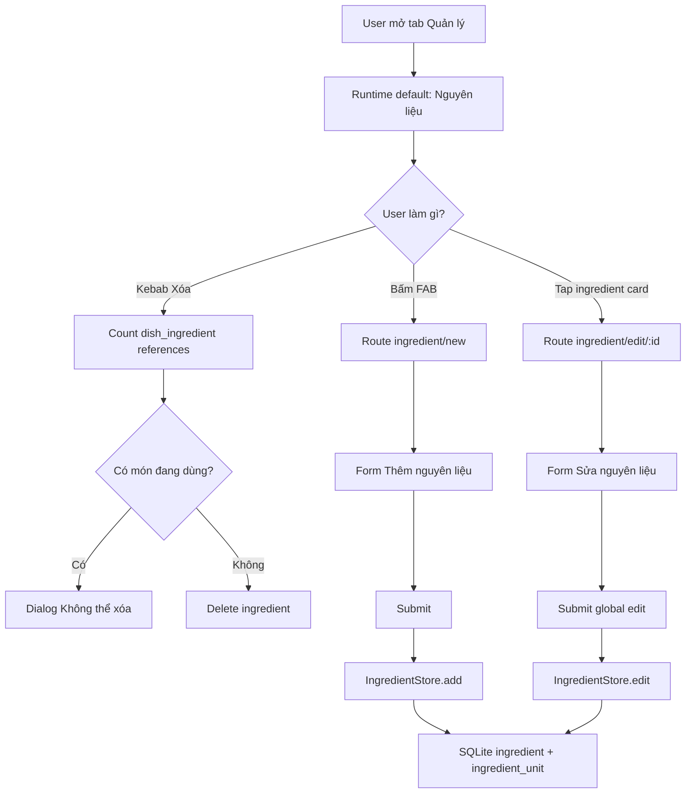
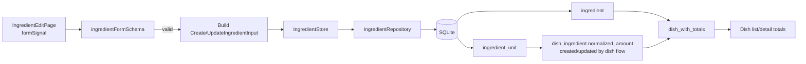
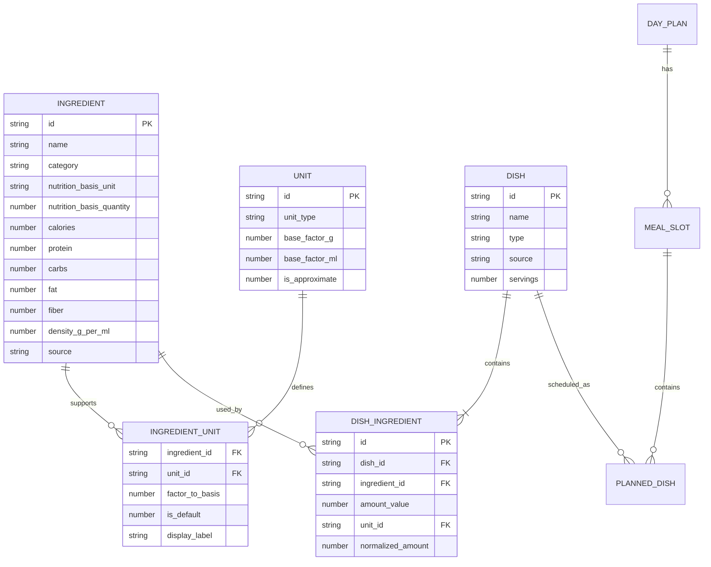
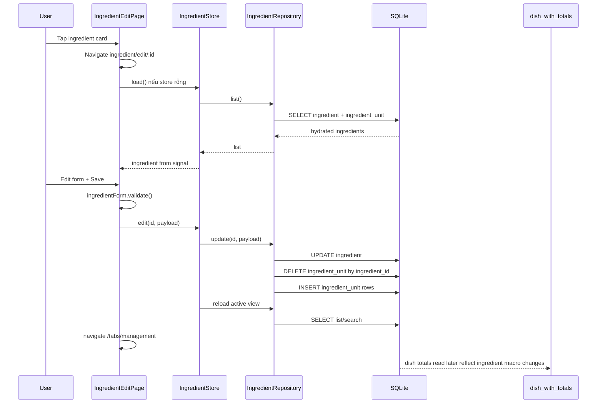

# Runtime Audit — Management / Ingredient Add-Edit Drift

**Ngày:** 2026-04-29  
**Scope:** runtime code hiện tại của tab `Quản lý`, flow `Thêm nguyên liệu`, `Sửa nguyên liệu`, entity liên quan và đối chiếu với Product Vision / PRD / Business Rules / Data Model.  
**Vai trò:** Senior Business Analyst + Senior Software Architect.

---

## 1. Executive Summary

Runtime hiện tại **chưa align hoàn toàn** với docs source-of-truth mới nhất.

Điểm đúng / đã có:

- App đang đi theo kiến trúc offline-first: Angular/Ionic UI → Signal store → Repository → SQLite local. Không có HTTP API/backend trong flow này.
- Ingredient data model runtime đã có `ingredient`, `unit`, `ingredient_unit`, `dish`, `dish_ingredient`, `dish_with_totals`.
- Dish total đang đọc từ `dish_with_totals`, đúng rule `RULE-DISH-TOTAL`.
- Delete ingredient đã có check reference qua `dish_ingredient` và chặn xóa nếu đang được dùng.
- Edit ingredient hiện đổi `source` về `manual`, phù hợp PRD/Data Model mới; tuy nhiên Business Rules còn ghi một điểm `TBD` cũ cho seed ingredient.

Drift quan trọng:

1. Tab `Quản lý` runtime vẫn mở `Nguyên liệu` trước và segment order là `Nguyên liệu | Món ăn`, trong khi Product Vision/PRD/design mới yêu cầu `Món ăn | Thư viện nguyên liệu` và mở `Món ăn` trước.
2. Tap ingredient card runtime đang mở thẳng form `Sửa nguyên liệu`, trong khi PRD yêu cầu detail/read-only trước rồi mới `Sửa thông tin`.
3. Runtime chưa có route/page `ingredient-detail`.
4. Edit ingredient có button xem món đang dùng, nhưng **chưa có impact warning bắt buộc** trước khi sửa/lưu nếu ingredient đang được dùng trong dish.
5. Validation runtime chưa enforce đủ PRD Phase 1: `calories` đang optional ở form rồi fallback `0`, chưa enforce max values, chưa validate `density_g_per_ml` min/max, chưa validate duplicate name.
6. Repository insert/update ingredient + replace units hiện chưa wrap transaction. Nếu insert/update ingredient thành công nhưng replace `ingredient_unit` lỗi, DB có thể bị lệch.
7. Nếu đổi `ingredient_unit.factor_to_basis` hoặc `nutrition_basis_unit`, `dish_ingredient.normalized_amount` cũ **không tự recalculate**; `dish_with_totals` chỉ auto-reflect nutrition macro thay đổi trên ingredient, không auto-reflect conversion thay đổi cho dish rows đã lưu.

Kết luận: model nền tương đối đúng, nhưng flow runtime vẫn còn developer-first/CRUD-first và cần implement theo Slice detail-first đã thống nhất.

---

## 2. Source of Truth đã đối chiếu

| Source | Bằng chứng chính | Ý nghĩa với runtime |
|---|---|---|
| `docs/1-vision/product-vision.md` | AI-first, không form-first; thao tác hằng ngày `< 10 giây`; beginner-friendly | `Nguyên liệu` không nên là default CRUD flow; món ăn/AI/context phải là chính |
| `docs/2-requirements/prd.md` §F-01/F-02 | `Quản lý` mở `Món ăn`; segment `Món ăn | Thư viện nguyên liệu`; ingredient library detail-first; edit global có warning | Runtime tab/order/card action hiện sai hướng |
| `docs/4-architecture/business-rules.md` | `dish_with_totals` là single source of truth; no Quick Add/manual total; normalize unit qua resolver | Runtime dish totals đang đúng, nhưng cần cẩn thận khi đổi unit conversion của ingredient |
| `docs/3-design/data-model.md` | `ingredient`, `unit`, `ingredient_unit`, `dish`, `dish_ingredient`, `dish_with_totals` | Runtime schema/migration đã có phần lớn entity cần thiết |

---

## 3. Runtime Files / Modules liên quan

### 3.1 UI / Routes

| File | Vai trò hiện tại | Nhận xét |
|---|---|---|
| `src/app/features/management/management.routes.ts` | Routes: `ingredient/new`, `ingredient/edit/:id`, `dish/new`, `dish/edit/:id` | Chưa có `ingredient/:id` hoặc `ingredient/detail/:id` |
| `src/app/features/management/management.page.ts` | Tab Quản lý, search/filter, navigation, delete dialog | Đang default `ingredients`; segment order cũ |
| `src/app/features/management/management.page.html` | Render list ingredients/dishes, floating action button, option sheets | Ingredient card click đang gọi `openEditIngredient(id)` |
| `src/app/features/management/ingredient-edit/ingredient-edit.page.ts` | Shared add/edit ingredient form | Edit preload từ `IngredientStore.ingredients()`; nếu không thấy id thì silent no-op |
| `src/app/features/management/ingredient-edit/ingredient-edit.page.html` | Form add/edit ingredient | Có button `Xem các món đang dùng...`; chưa có warning trước sửa/lưu |
| `src/app/features/management/dish-edit/dish-edit.page.ts/html` | Add/edit dish, chọn ingredient, preview totals | Dùng ingredient/unit data để tính preview và submit dish ingredients |

### 3.2 State / Repository / Schema

| File | Vai trò hiện tại | Nhận xét |
|---|---|---|
| `src/app/core/stores/ingredient.store.ts` | Signal store: `ingredients`, `loading`, `searchQuery`; add/edit/remove/count references | Không có selected ingredient/detail state |
| `src/app/core/stores/dish.store.ts` | Signal store dish list, add/edit/remove/count planned references | Dish totals từ repository |
| `src/app/core/repositories/ingredient.repository.ts` | CRUD ingredient + hydrate units + count dish references | Insert/update chưa transaction; update luôn push `source='manual'` |
| `src/app/core/repositories/unit.repository.ts` | List `unit` | Dùng cho ingredient form unit picker |
| `src/app/core/repositories/dish.repository.ts` | CRUD dish, query `dish_with_totals`, find dishes using ingredient | Có method hỗ trợ ingredient impact sheet |
| `src/app/core/repositories/dish-ingredient.repository.ts` | Insert dish ingredients, resolve unit → normalized amount | Có resolver đúng hướng, nhưng normalized amount không tự update khi ingredient unit factor đổi |
| `src/app/core/services/unit-resolver.ts` | Conversion rule ingredient/unit/density | Implement rõ reject khi không resolve được |
| `src/app/core/services/database/schema.ts` | SQLite DDL + migrations | Initial schema có dấu vết cũ, migration v3 mới là model final |

---

## 4. Runtime Flow hiện tại

### 4.1 Mở tab Quản lý

Hiện tại:

```ts
readonly managementTabs = [
  { value: 'ingredients', label: 'Nguyên liệu' },
  { value: 'dishes', label: 'Món ăn' },
];
readonly tab = signal<ManagementTab>('ingredients');
```

Effect runtime:

```ts
effect(() => {
  const activeTab = this.tab();
  if (activeTab === 'ingredients') {
    void this.ingredientStore.load();
  } else {
    void this.dishStore.load();
  }
});
```

Ý nghĩa:

- Mở `Quản lý` sẽ load ingredient list trước.
- Dish list chỉ load khi user đổi sang tab `Món ăn`.
- Đây là drift với PRD/Product Vision mới vì `Món ăn` phải là entry chính.

### 4.2 Tap ingredient card

Runtime HTML:

```html
(click)="openEditIngredient(ingredient.id)"
```

Runtime TS:

```ts
openEditIngredient(id: string): void {
  void this.router.navigate(['/tabs/management/ingredient/edit', id]);
}
```

Ý nghĩa:

- Runtime đang edit-first.
- Không có detail/read-only page.
- Không có bước xem impact trước khi vào form.

### 4.3 Add ingredient

Route:

```ts
path: 'ingredient/new'
```

Form default:

```ts
{
  name: '',
  category: '',
  nutrition_basis_unit: 'g',
  calories: null,
  protein: null,
  carbs: null,
  fat: null,
  fiber: null,
  density_g_per_ml: null,
  units: [],
}
```

Submit:

```ts
await this.ingredientStore.add({
  name: trimmedName,
  category: trimmedCategory,
  nutrition_basis_unit: value.nutrition_basis_unit,
  nutrition_basis_quantity: 100,
  calories: value.calories ?? 0,
  protein: value.protein ?? 0,
  carbs: value.carbs ?? 0,
  fat: value.fat ?? 0,
  fiber: value.fiber ?? 0,
  density_g_per_ml: value.density_g_per_ml,
  source: 'manual',
  units,
});
```

Data path:

```text
IngredientEditPage → IngredientStore.add() → IngredientRepository.insert() → SQLite ingredient + ingredient_unit
```

### 4.4 Edit ingredient

Route:

```ts
path: 'ingredient/edit/:id'
```

Preload logic:

```ts
if (this.ingredientStore.ingredients().length === 0) {
  await this.ingredientStore.load();
}
const ingredient = this.ingredientStore.ingredients().find((item) => item.id === id);
if (!ingredient) {
  this.resetDirtyBaseline();
  return;
}
```

Submit:

```ts
await this.ingredientStore.edit(editingId, {
  name: trimmedName,
  category: trimmedCategory,
  nutrition_basis_unit: value.nutrition_basis_unit,
  nutrition_basis_quantity: 100,
  ...nutrition,
  density_g_per_ml: value.density_g_per_ml,
  source: 'manual',
  units,
});
```

Repository update:

```ts
fields.push(['source', 'manual']);
UPDATE ingredient SET ..., updated_at = datetime('now') WHERE id = ?
DELETE FROM ingredient_unit WHERE ingredient_id = ?
INSERT INTO ingredient_unit (...)
```

Ý nghĩa:

- Edit global: mọi dish đọc macro từ ingredient sẽ thấy macro mới qua `dish_with_totals`.
- Nhưng conversion factor đã được snapshot thành `dish_ingredient.normalized_amount` lúc tạo món; đổi `factor_to_basis` không tự tính lại các dish ingredient cũ.

---

## 5. Form Fields & Validation runtime

| Field | Runtime default | Required runtime | PRD required | Runtime validation | Drift / note |
|---|---:|:---:|:---:|---|---|
| `name` | `''` | Có | Có | trim non-empty, max 100 | Đúng cơ bản |
| `category` | `''` | Có | Có | non-empty | DB CHECK enum; form picker dùng enum |
| `nutrition_basis_unit` | `'g'` | Có | Có | UI segment `100g/100ml` | Đúng hướng |
| `nutrition_basis_quantity` | hard-code `100` | Có | Có | Không cho user edit | Đúng theo canonical basis |
| `calories` | `null` | Không thật sự | Có | optional non-negative; submit fallback `0` | Drift: PRD yêu cầu required và max 2000 |
| `protein` | `null` | Optional | Optional | optional non-negative; fallback `0` | Thiếu max 100 |
| `carbs` | `null` | Optional | Optional | optional non-negative; fallback `0` | Thiếu max 100 |
| `fat` | `null` | Optional | Optional | optional non-negative; fallback `0` | Thiếu max 100 |
| `fiber` | `null` | Optional | Optional | optional non-negative; fallback `0` | Thiếu max 100 |
| `density_g_per_ml` | `null` | Optional | Optional | Không thấy validation min/max trong schema | Drift: PRD min 0.001 max 10 nếu nhập |
| `units[]` | `[]` | Có | Có | length > 0; đúng 1 default | Đúng cơ bản |
| `units[].factor_to_basis` | suggested factor hoặc `1` | Có | Có | finite > 0 | Thiếu PRD min 0.001 max 100000 |
| `units[].display_label` | unit short name | Optional | Optional | trim empty → null | OK |
| duplicate name | — | — | Cần check cho AI lookup; nên check cả manual | Chưa thấy check | Rủi ro tạo trùng ingredient |

---

## 6. Entity Dependency Analysis

### 6.1 Ingredient

- Là nutrition source of truth theo `100g/100ml`.
- Được list/search/edit/delete qua `IngredientRepository`.
- Khi macro thay đổi, `dish_with_totals` phản ánh lại cho dish đang dùng ingredient đó.
- Khi xóa, DB FK `dish_ingredient.ingredient_id REFERENCES ingredient(id) ON DELETE RESTRICT` và UI cũng count reference để block.

### 6.2 Unit

- Registry global: `g`, `kg`, `ml`, `l`, `tbsp`, `tsp`, `cup`, `piece`, `clove`, `bunch`, `slice`, `pinch`.
- Ingredient form fetch từ `UnitRepository.list()`.
- Unit bản thân không chứa nutrition; chỉ hỗ trợ conversion.

### 6.3 IngredientUnit

- Junction ingredient ↔ unit.
- Chứa `factor_to_basis`, `is_default`, `display_label`.
- Runtime replace toàn bộ units khi edit ingredient.
- Rủi ro lớn: nếu thay đổi factor, các existing `dish_ingredient.normalized_amount` không recalculate.

### 6.4 Dish

- Flow chính theo Product Vision/PRD, nhưng runtime đang đặt sau ingredient.
- Dish list đọc `dish_with_totals` qua repository.
- Dish edit dùng ingredients + units để preview và submit dish ingredients.

### 6.5 DishIngredient

- Mapping dish ↔ ingredient.
- Lưu `amount_value`, `unit_id`, `normalized_amount`.
- `normalized_amount` được tính lúc insert/update dish bằng `resolveUnit()`.
- Đây là dependency trực tiếp bị ảnh hưởng khi ingredient unit conversion thay đổi.

### 6.6 PlannedDish / MealSlot / DayPlan

- Không nằm trực tiếp trong add/edit ingredient form.
- Nhưng `planned_dish` lưu snapshot calories/protein/carbs/fat tại thời điểm lên lịch. Theo Business Rules, snapshot lịch sử ở planned dish không tự đổi theo ingredient.
- Dish delete đang count `planned_dish`, ingredient delete thì count `dish_ingredient`.

---

## 7. API & Data Flow

Không có HTTP API/backend trong flow add/edit ingredient hiện tại.

| “API” nội bộ | Method | Payload | Response | Khi gọi |
|---|---|---|---|---|
| `UnitRepository.list()` | SQLite query | none | `UnitModel[]` | Mở ingredient add/edit |
| `IngredientStore.load()` | Store → repo list | none | set signal `ingredients` | Mở tab ingredient hoặc edit ingredient khi store rỗng |
| `IngredientStore.add(input)` | Store → repo insert | `CreateIngredientInput` | update signal list | Submit thêm mới |
| `IngredientStore.edit(id,input)` | Store → repo update | `UpdateIngredientInput` | reload active view | Submit sửa |
| `IngredientStore.remove(id)` | Store → repo delete | id | update signal list | Confirm xóa |
| `IngredientStore.countDishReferences(id)` | Store → repo count | id | number | Trước khi xóa ingredient |
| `DishRepository.findDishesUsingIngredient(id)` | SQLite query view + mapping | id | `DishListItem[]` | Sheet “Xem các món đang dùng...” |

Data flow add/edit:

```text
UI form signal
  → Angular Signal Forms validation
  → build payload
  → IngredientStore.add/edit
  → IngredientRepository.insert/update
  → SQLite ingredient
  → SQLite ingredient_unit
  → reload/list signal
  → navigate /tabs/management
```

---

## 8. Diagrams

### 8.1 Runtime user flow hiện tại



### 8.2 Desired PRD user flow

```mermaid
flowchart TD
  A[User mở tab Quản lý] --> B[PRD default: Món ăn]
  B --> C[Segment: Món ăn | Thư viện nguyên liệu]
  C -->|Thư viện nguyên liệu| D[List supporting library]
  D -->|Tap ingredient| E[Ingredient detail read-only]
  E --> F[Xem nutrition, units, món đang dùng]
  F -->|Sửa thông tin| G{Ingredient đang dùng trong món?}
  G -->|Có| H[Impact warning]
  G -->|Không| I[Open edit form]
  H -->|Tiếp tục sửa| I
  I --> J[Submit global edit]
  J --> K[Update ingredient + units]
  K --> L[Dish totals reflect per rules]
```

### 8.3 Data flow



### 8.4 Entity relationship



### 8.5 Sequence — submit edit hiện tại



---

## 9. Drift Matrix

| Area | Runtime hiện tại | Source of truth | Impact | Recommendation |
|---|---|---|---|---|
| Default tab | `ingredients` | `dishes` | User bị dẫn vào master data CRUD, trái Product Vision | Change default signal + tab order |
| Segment label | `Nguyên liệu | Món ăn` | `Món ăn | Thư viện nguyên liệu` | Wording developer-first | Rename/reorder segment |
| Ingredient card action | Open edit form | Open detail/read-only | User sửa global quá dễ, không thấy impact | Add ingredient detail page/route |
| Edit impact warning | Optional sheet inside edit | Warning before edit/save if referenced | Sửa macro/unit có thể đổi món liên quan mà user không nhận biết | Count refs before edit or save; show dialog |
| Add ingredient placement | First-class FAB in default tab | Supporting/advanced; primary creation in dish context | Flow chưa beginner-friendly | Move ingredient library behind secondary tab, later add create-from-dish |
| Calories validation | Optional, fallback 0 | Required, max 2000 | Có thể lưu ingredient 0 kcal do bỏ trống | Enforce required + max |
| Macro max | Only non-negative | Max 100g | Có thể nhập số vô lý | Add max validators |
| Density validation | None | 0.001–10 if provided | Conversion sai lệch | Add optional range validator |
| Duplicate name | None | AI lookup duplicate handling; manual should also be guarded | Ingredient trùng làm user chọn nhầm | Add normalized-name check |
| Transaction | Insert/update + replace units separate | Data consistency expected | Partial write risk | Wrap in `db.withTransaction()` |
| Unit conversion edit | Replace units; old `normalized_amount` unchanged | Business impact not fully documented | Dish totals may not reflect intended new conversion | Warn stronger; decide recalc policy |
| Not found edit | Silent empty form baseline | Should show not-found/redirect | User có thể thấy form trống và lưu nhầm | Add not-found state |
| AI auto-fill runtime | Button navigates same `dish/new` | AI Auto-fill distinct behavior | AI path not implemented yet | Separate mode/query param/page state |

---

## 10. Recommended implementation slices

### Slice 0 — Runtime guardrail audit committed as report

- Keep this report as baseline.
- Confirm source of truth: Product Vision → PRD → Business Rules/Data Model → Design/Plan → Runtime.

### Slice 1 — Dish-first runtime shell

- Change `ManagementPage` default tab to `dishes`.
- Reorder segment options to `Món ăn | Thư viện nguyên liệu`.
- Update aria labels, empty copy, FAB label.
- Verify dish list loads first.

### Slice 2 — Ingredient detail page

- Add route `ingredient/:id` or `ingredient/detail/:id`.
- Add standalone `ingredient-detail` page with external template/style.
- Fetch ingredient by repository/store.
- Show canonical nutrition, units, source, created/updated, dishes using ingredient.

### Slice 3 — Detail-first navigation

- Change ingredient card click from `openEditIngredient()` to `openIngredientDetail()`.
- Keep edit route only behind CTA `Sửa thông tin` in detail page.

### Slice 4 — Impact warning

- Before opening edit or before saving edit, count `dish_ingredient` references.
- If count > 0, show warning:
  - Editing macro affects `dish_with_totals` immediately.
  - Editing unit conversion may affect future dish entries and may require recalc decision for old rows.

### Slice 5 — Validation/data integrity fixes

- calories required + max 2000.
- protein/carbs/fat/fiber max 100.
- density optional 0.001–10.
- factor min/max 0.001–100000.
- duplicate normalized-name guard.
- not-found state.

### Slice 6 — Repository transaction

- Wrap ingredient insert/update + replaceUnits in `db.withTransaction()`.
- Add tests if existing test infra supports repository/service tests.

### Slice 7 — Unit conversion recalc decision

Need product/architecture decision:

- Option A: Editing ingredient unit factor only affects future dish entries; old `dish_ingredient.normalized_amount` remains snapshot. Must clearly warn.
- Option B: Recalculate all `dish_ingredient.normalized_amount` rows that use this ingredient + changed unit_id. More consistent but potentially changes many dishes.
- Option C: Block editing factor when ingredient is referenced; require clone/new ingredient. Safest but less flexible.

---

## 11. Final Understanding

Runtime hiện tại có model kỹ thuật đúng nền tảng nhưng UX vẫn là mô hình cũ: `Nguyên liệu` là tab đầu tiên, tap là sửa ngay. Docs mới đã chuyển rõ sang mô hình `Món ăn` là flow chính, ingredient chỉ là thư viện hỗ trợ và phải detail-first để tránh user vô tình sửa dữ liệu global.

Về dữ liệu, `ingredient` là nguồn dinh dưỡng canonical `100g/100ml`; `ingredient_unit` chỉ là layer quy đổi; `dish_ingredient.normalized_amount` là snapshot lượng đã quy đổi khi lưu món; `dish_with_totals` tính tổng món realtime từ ingredient macro + normalized amount. Vì vậy, sửa macro ingredient là global và tự ảnh hưởng dish totals; sửa unit conversion là case nguy hiểm hơn vì existing normalized amount không tự đổi.

Action runtime tiếp theo nên bắt đầu bằng Slice 1 + Slice 2: đổi Quản lý sang dish-first và thêm ingredient detail page, sau đó mới chuyển card click sang detail-first và thêm warning impact.
