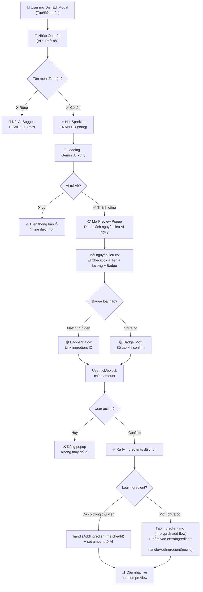
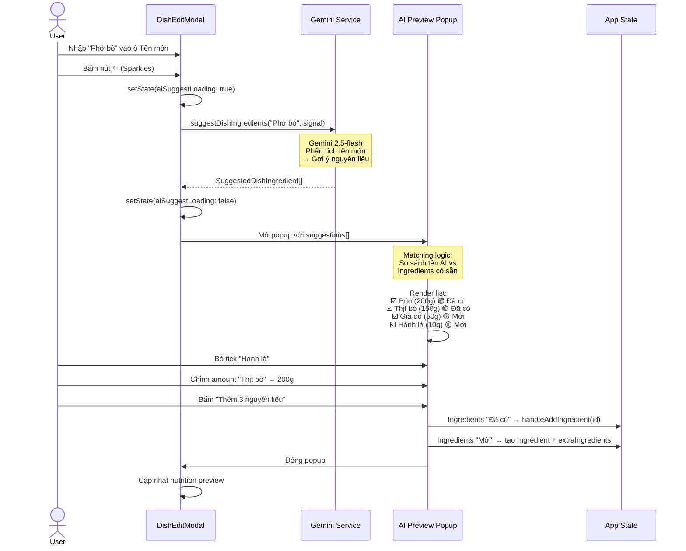

# Plan: AI Suggest Ingredients for Dish

**TL;DR**: Thêm nút **Sparkles "AI Gợi ý"** cạnh ô nhập tên món trong `DishEditModal`. Khi user đã nhập tên món (VD: "Phở bò"), bấm nút → AI trả về danh sách nguyên liệu kèm lượng & dinh dưỡng → hiện **Preview popup** cho user tick chọn từng cái → confirm thêm vào món.

---

## Flow Diagram



---

## Interaction Flow chi tiết



---

## UI Layout chi tiết

### 1. Nút AI Suggest trên DishEditModal

| Element | Mô tả | Vị trí |
|---------|--------|--------|
| Input `dish-name` | Text input tên món | Chiếm ~90% width |
| Nút ✨ Sparkles | Icon button 40x40px, rounded-xl | Phải input, cùng hàng (flex) |
| State: Disabled | Mờ 40%, cursor not-allowed | Khi `namePrimary` rỗng |
| State: Enabled | Indigo bg, hover effect | Khi `namePrimary` có giá trị |
| State: Loading | Loader2 spin thay Sparkles | Đang chờ AI response |
| Error inline | Text rose-500 nhỏ dưới input | Khi AI gọi thất bại |

```
┌─────────────────────────────────────────────────────┐
│  TÊN MÓN ĂN *                                       │
│  ┌─────────────────────────────────────┐ ┌────┐     │
│  │ Phở bò                             │ │ ✨ │     │
│  └─────────────────────────────────────┘ └────┘     │
│                                                       │
│  Loading state:                                       │
│  ┌─────────────────────────────────────┐ ┌────┐     │
│  │ Phở bò                             │ │ 🔄 │     │
│  └─────────────────────────────────────┘ └────┘     │
│  ⚠️ AI đang gợi ý nguyên liệu...                   │
└─────────────────────────────────────────────────────┘
```

### 2. Preview Popup

| Element | Mô tả |
|---------|--------|
| Header | "AI Gợi ý nguyên liệu cho: **Phở bò**" + nút X đóng |
| List items | Mỗi item: Checkbox + Tên + Amount input + Unit + Badge |
| Badge "Đã có" | `bg-emerald-100 text-emerald-700` pill |
| Badge "Mới" | `bg-amber-100 text-amber-700` pill |
| Nutrition row | Text nhỏ: "120cal · 8g pro · 15g carb · 2g fat" |
| Footer | Nút "Huỷ" (secondary) + "Thêm {n} nguyên liệu" (primary emerald) |
| Empty state | Nếu AI trả về mảng rỗng: "Không tìm thấy nguyên liệu phù hợp" |

```
┌──────────────────────────────────────────────────────────┐
│  ✨ AI Gợi ý nguyên liệu cho: Phở bò               [X] │
├──────────────────────────────────────────────────────────┤
│                                                          │
│  ☑️  Bánh phở         ┌─────┐ g        🟢 Đã có        │
│      356cal · 3g pro  │ 250 │                            │
│                       └─────┘                            │
│  ────────────────────────────────────────────────         │
│  ☑️  Thịt bò          ┌─────┐ g        🟢 Đã có        │
│      250cal · 26g pro │ 150 │                            │
│                       └─────┘                            │
│  ────────────────────────────────────────────────         │
│  ☑️  Giá đỗ           ┌─────┐ g        🟡 Mới          │
│      31cal · 3g pro   │  50 │                            │
│                       └─────┘                            │
│  ────────────────────────────────────────────────         │
│  ☐  Hành lá           ┌─────┐ g        🟡 Mới          │
│      30cal · 2g pro   │  10 │                            │
│                       └─────┘                            │
│                                                          │
├──────────────────────────────────────────────────────────┤
│  ┌──────────┐  ┌────────────────────────────────────┐   │
│  │   Huỷ    │  │  ✅ Thêm 3 nguyên liệu đã chọn    │   │
│  └──────────┘  └────────────────────────────────────┘   │
└──────────────────────────────────────────────────────────┘
```

---

## Bảng UI State chi tiết

| State | Sparkles Button | Input | Preview | Error |
|-------|----------------|-------|---------|-------|
| **Initial** (name rỗng) | Disabled, opacity-40 | Empty | Hidden | None |
| **Name entered** | Enabled, indigo bg | "Phở bò" | Hidden | None |
| **Loading** | Loader2 spinning | "Phở bò" (readonly) | Hidden | "AI đang gợi ý..." |
| **Success** | Reset to Enabled | "Phở bò" | Open với list | None |
| **Error** | Reset to Enabled | "Phở bò" | Hidden | "Không thể gợi ý, vui lòng thử lại" |
| **Preview open** | Hidden/disabled | "Phở bò" | Visible | None |
| **After confirm** | Enabled | "Phở bò" | Closed | None, ingredients added |

---

## Implementation Steps

### Phase 1: Backend — Gemini Service Function

**Step 1.** Thêm type `SuggestedDishIngredient` vào `types.ts`
- Fields: `name: string`, `amount: number`, `unit: string`, `nutrition: IngredientSuggestion` (calories, protein, carbs, fat, fiber)
- Kết quả: `SuggestedDishIngredient[]`

**Step 2.** Thêm function `suggestDishIngredients(dishName: string, signal?: AbortSignal): Promise<SuggestedDishIngredient[]>` vào `geminiService.ts`
- Prompt: Dựa trên tên món → trả về danh sách nguyên liệu phổ biến kèm lượng & dinh dưỡng per 100g/1 đơn vị
- Reuse: `sanitizeForPrompt()`, `callWithTimeout()`, `withRetry()`, `parseJSON()`, abort/timeout pattern (lấy template từ `suggestIngredientInfo`)
- responseSchema: Array of objects `{ name, amount, unit, calories, protein, carbs, fat, fiber }`
- Validator: `isSuggestedDishIngredients()` — array check + field type checks

**Step 3.** Thêm unit test cho `suggestDishIngredients` trong test file service hiện có
- Mock Gemini response
- Test: valid response, empty array, AbortError, timeout, invalid JSON

---

### Phase 2: Preview UI Component

**Step 4.** Tạo component `AISuggestIngredientsPreview` (inline trong DishEditModal hoặc file riêng nếu >100 lines)
- Input props: `suggestions: SuggestedDishIngredient[]`, `existingIngredients: Ingredient[]`, `onConfirm(selected)`, `onClose()`
- Layout: ModalBackdrop → list of suggested ingredients
- Mỗi ingredient row:
  - Checkbox (mặc định checked)
  - Tên nguyên liệu + lượng + đơn vị
  - Badge: "Đã có" (green) nếu match thư viện, "Mới" (amber) nếu chưa có
  - Dinh dưỡng tóm tắt (cal/pro/carb/fat)
  - Nút chỉnh amount (editable)
- Matching logic: fuzzy match tên nguyên liệu AI vs `existingIngredients` (lowercase, trim, contains)
- Footer: "Thêm {n} nguyên liệu đã chọn" button + "Huỷ"
- Nguyên liệu "Mới" → khi confirm, tự động tạo Ingredient mới (như quick-add flow) với dinh dưỡng AI gợi ý

**Step 5.** i18n keys cho vi.json + en.json
- `dish.aiSuggestButton` / `dish.aiSuggestLoading` / `dish.aiSuggestTitle`
- `dish.aiSuggestExisting` / `dish.aiSuggestNew`
- `dish.aiSuggestConfirm` / `dish.aiSuggestCancel`
- `dish.aiSuggestEmpty` / `dish.aiSuggestError`
- `dish.aiSuggestNameRequired`

---

### Phase 3: Integration với DishEditModal

**Step 6.** Thêm nút Sparkles cạnh input tên món trong DishEditModal
- Vị trí: phải input `dish-name`, cùng hàng (flex row)
- Disabled: khi `namePrimary.trim()` rỗng
- Loading state: Loader2 spinner thay Sparkles icon
- onClick: gọi `suggestDishIngredients(namePrimary)` → mở AISuggestIngredientsPreview
- State mới: `aiSuggestLoading: boolean`, `aiSuggestions: SuggestedDishIngredient[] | null`
- AbortController: cancel khi modal close hoặc user bấm lại

**Step 7.** Xử lý kết quả từ Preview
- `onConfirm(selectedItems)`:
  - Với mỗi item đã có trong thư viện → `handleAddIngredient(matchedId)` + set amount
  - Với mỗi item MỚI → tạo `Ingredient` object (như `handleQuickCreate`) → `setExtraIngredients` → `handleAddIngredient(newId)` + set amount
  - Đóng preview
- `onClose()`: đóng preview, không làm gì

**Step 8.** Cleanup & abort
- Abort AI call khi modal đóng (thêm vào cleanup effect)
- Abort AI call khi user bấm Sparkles lần 2 (cancel call cũ)

---

### Phase 4: Tests

**Step 9.** Unit tests cho Preview component (*parallel with Step 10*)
- Render với mixed suggestions (có sẵn + mới)
- Toggle checkbox
- Badge hiển thị đúng
- Confirm chỉ trả về items checked
- Cancel không gọi onConfirm

**Step 10.** Unit tests cho DishEditModal integration (*parallel with Step 9*)
- Nút AI suggest disabled khi name rỗng
- Nút AI suggest enabled khi có name
- Loading state hiển thị
- Preview mở sau khi AI trả về
- Confirm thêm ingredients vào list
- Error handling (AI fail → toast/inline error)

**Step 11.** Unit tests cho geminiService.suggestDishIngredients (*depends on Step 2*)
- Valid response parse
- AbortError
- Retry logic
- Invalid JSON fallback

---

### Phase 5: QA Pipeline

**Step 12.** Run ESLint, SonarLint, Coverage, SonarQube (*depends on Steps 9-11*)
**Step 13.** Commit + Build APK (*depends on Step 12*)

---

## Relevant files

- `src/types.ts` — thêm `SuggestedDishIngredient` type
- `src/services/geminiService.ts` — thêm `suggestDishIngredients()`, reuse `sanitizeForPrompt` (line 74), `callWithTimeout` (line 28), `withRetry` (line 52), `parseJSON` (line 85)
- `src/components/modals/DishEditModal.tsx` — thêm Sparkles button cạnh name input (sau line 228), state management, preview integration
- `src/locales/vi.json` + `src/locales/en.json` — i18n keys
- `src/__tests__/dishEditModal.test.tsx` — tests cho AI suggest flow
- File test geminiService hiện có — tests cho `suggestDishIngredients`

---

## Verification

1. `npx eslint src/` → 0 errors
2. SonarLint trên tất cả files thay đổi → 0 issues
3. `npx vitest run --coverage` → all pass, 100% Lines
4. `npx sonar-scanner` → EXECUTION SUCCESS, 0 issues
5. Manual: localhost → Tạo món → nhập "Phở bò" → bấm ✨ → preview → tick chọn → confirm → ingredients added

---

## Decisions

- **Vị trí nút**: Cạnh ô nhập tên món (user confirmed)
- **Hành vi**: Preview trước → user tick chọn từng cái (user confirmed)
- **Nguyên liệu mới**: Badge "Mới" + checkbox — user quyết định bao gồm hay bỏ (user confirmed)
- **Matching**: Fuzzy match tên (lowercase contains), có thể nâng cấp Levenshtein sau
- **Amount**: Lấy amount từ AI suggestion, user có thể chỉnh trong preview
- **Cache**: Không cache kết quả suggest (mỗi lần bấm gọi AI mới)
- **Scope**: Chỉ tính năng suggest ingredients. KHÔNG bao gồm: suggest tags, suggest amount tự động, suggest dinh dưỡng tổng
